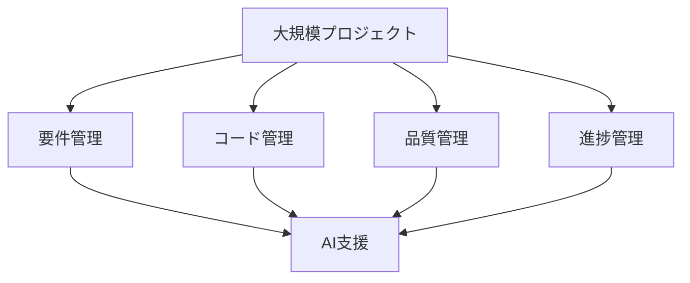

# 大規模プロジェクトでの活用

## 大規模プロジェクトの特徴

### プロジェクトの複雑性

大規模プロジェクトには以下のような特徴があります：

- 多数の開発者
- 複雑な要件
- 長期的な開発期間
- 高い品質要求

### 開発プロセスの課題

## AIの活用方法

### 1. 要件管理の効率化

AIを活用した要件管理の効率化：

- 要件の自動分析
- 依存関係の可視化
- リスクの自動検出
- 変更影響の予測

### 2. コード管理の最適化

AIを活用したコード管理の最適化：

- コード生成の自動化
- リファクタリングの支援
- パフォーマンス最適化
- セキュリティ強化

### 3. 品質管理の強化

AIを活用した品質管理の強化：

- テストケースの自動生成
- バグの自動検出
- コードレビューの効率化
- 品質メトリクスの分析

## 実践的な手法

### プロジェクト計画

AIを活用したプロジェクト計画：

- スケジュールの最適化
- リソース配分の効率化
- リスク予測
- 進捗管理の自動化

### チーム管理

AIを活用したチーム管理：

- タスクの自動割り当て
- スキルマッチング
- コミュニケーションの効率化
- ナレッジ共有の促進

## 成功のポイント

### 導入の準備

AI導入に向けた準備：

- プロジェクト分析
- 目標設定
- ツール選択
- プロセス確立

### 継続的な改善

AIを活用した継続的な改善：

- パフォーマンスモニタリング
- フィードバックの収集
- プロセスの最適化
- スキルアップの促進

## 実践的なアドバイス

### 導入のステップ

AIを大規模プロジェクトに導入するステップ：

1. 現状分析
2. 目標設定
3. ツール選択
4. プロセス確立
5. 評価と改善

### 成功への道筋

大規模プロジェクトでの AI活用を成功させるポイント：

- 明確な目標設定
- 段階的な導入
- チームの理解と協力
- 継続的な改善

## まとめ

AIを活用した大規模プロジェクトの管理は、開発効率と品質を大幅に向上させる可能性を秘めています。適切な導入と継続的な改善が重要です。
