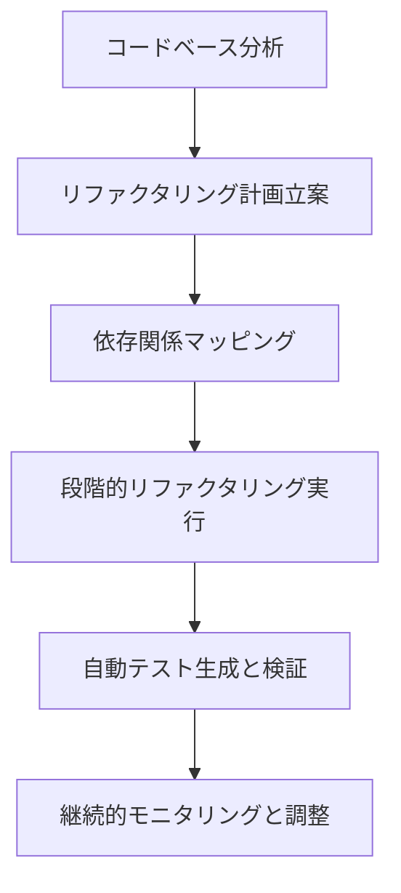
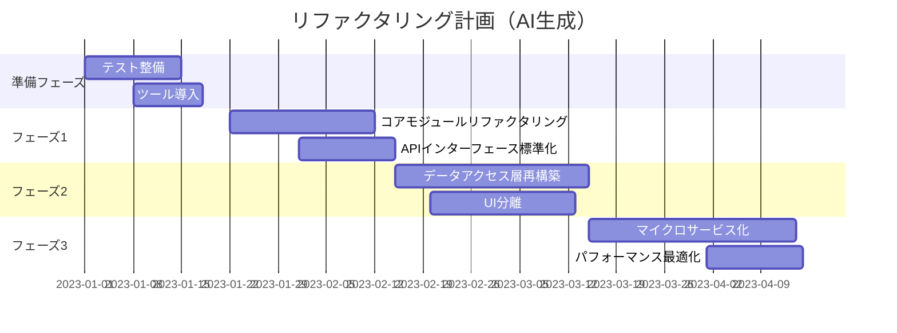
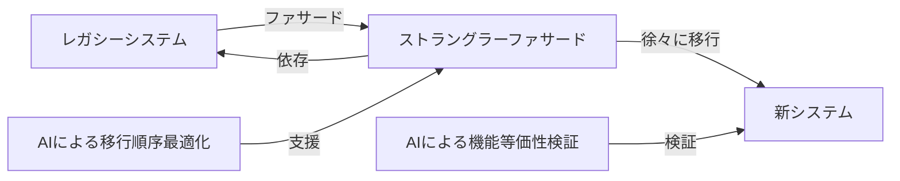

# 大規模リファクタリングプロジェクト

## 大規模リファクタリングの必要性と課題

大規模なソフトウェアプロジェクトでは、時間の経過とともに技術的負債が蓄積され、コードベースの保守性や拡張性が低下することがあります。このような状況で大規模リファクタリングが必要になりますが、従来の手法では多くの課題がありました。

**従来の大規模リファクタリングの課題**:

- 膨大な時間とリソースが必要
- リファクタリング中の新機能開発の停滞
- リグレッションリスクの増大
- チーム間の調整の複雑さ
- ビジネス価値の説明の難しさ

AIを活用することで、これらの課題を克服し、より効率的かつ安全な大規模リファクタリングを実現できるようになりました。

## AIを活用した大規模リファクタリングの進め方



### 1. AIによるコードベース分析

大規模リファクタリングの第一歩は、現状のコードベースを詳細に分析することです。AIツールを活用することで、従来は数週間かかっていた分析作業を数時間や数日に短縮できます。

**AIによる分析ポイント**:

- **技術的負債の特定**: 重複コード、複雑度の高い部分、アンチパターンの検出
- **モジュール間の依存関係**: 密結合している箇所や循環依存の特定
- **ホットスポットの特定**: 頻繁に変更が発生する箇所や不具合の多い領域
- **コードの一貫性評価**: 命名規則やアーキテクチャパターンの一貫性チェック
- **使用技術の分析**: 古いライブラリやフレームワークの特定

**分析例**:

```python
# AIを使用したコード分析の例
def analyze_codebase(repo_path):
    # コードベース全体をAIで分析
    analysis_result = ai_tool.analyze_repository(
        path=repo_path,
        analysis_types=[
            "code_smells",
            "complexity",
            "dependencies",
            "change_frequency",
            "architecture_compliance"
        ]
    )

    # 技術的負債のホットスポットを視覚化
    visualize_technical_debt_map(analysis_result)

    # リファクタリング優先度の提案
    return generate_refactoring_priorities(analysis_result)
```

### 2. リファクタリング計画の自動生成

AIは分析結果に基づいて、効果的なリファクタリング計画を提案することができます。これには段階的なアプローチやリスク評価が含まれます。

**AIによる計画生成のポイント**:

- **優先順位の最適化**: ビジネスインパクトとテクニカルリスクのバランス考慮
- **段階的アプローチ**: 依存関係を考慮した実行順序の提案
- **リソース見積もり**: 各フェーズに必要な時間とリソースの予測
- **並行作業の特定**: 同時に進められるリファクタリング作業の特定
- **ビジネスメトリクス連携**: 各リファクタリングステップのビジネス価値の明確化



### 3. 依存関係の自動マッピングと管理

大規模リファクタリングでは、コンポーネント間の複雑な依存関係を理解し管理することが重要です。AIは膨大な依存関係を可視化し、リファクタリングの影響範囲を予測します。

**AIによる依存関係管理**:

- **動的依存関係の検出**: 静的解析では見つけにくい実行時依存関係の特定
- **変更影響分析**: コード変更による影響範囲の予測
- **依存関係グラフ生成**: 視覚的に理解しやすい依存関係マップの作成
- **リファクタリング順序の最適化**: 依存関係に基づく最適な実行順序の提案
- **依存関係削減戦略**: 密結合を解消するための具体的な方法の提案

**コード例**:

```javascript
// AIを利用した依存関係影響分析の例
async function analyzeRefactoringImpact(targetModules, codebaseGraph) {
  // 影響を受ける可能性のあるモジュールを特定
  const impactAnalysis = await ai.analyzeImpact({
    targetModules,
    dependencyGraph: codebaseGraph,
    analyzeRuntimeDependencies: true,
    considerTestCoverage: true,
  });

  // 影響度によるリスク評価
  const riskAssessment = impactAnalysis.modules.map((module) => ({
    name: module.name,
    riskLevel: calculateRiskLevel(module.impactScore, module.testCoverage),
    requiredTests: module.suggestedTestCases,
    dependents: module.dependentModules.length,
  }));

  return {
    highRiskModules: riskAssessment.filter((m) => m.riskLevel === "HIGH"),
    suggestedTestingOrder: impactAnalysis.suggestedTestingSequence,
    estimatedValidationEffort: impactAnalysis.estimatedValidationHours,
  };
}
```

### 4. AIアシスタントによるコード変換

AIは大規模なコード変換作業を支援し、開発者の労力を大幅に削減できます。

**AIによるコード変換の活用例**:

- **デザインパターンの適用**: 既存コードへの適切なデザインパターン導入
- **フレームワーク移行**: 古いフレームワークから新しいフレームワークへの移行支援
- **コード構造の最適化**: クラス分割や責務の適切な分離
- **インターフェース設計**: 明確で一貫性のある API の設計
- **レガシーコードの現代化**: 古い言語機能から最新機能への移行

**具体例**:

```java
// リファクタリング前: 単一責任の原則に違反した大きなクラス
public class UserManager {
    private Database db;

    public User authenticateUser(String username, String password) {
        // 認証ロジック (100行)
    }

    public void updateUserProfile(User user, UserProfile profile) {
        // プロファイル更新ロジック (80行)
    }

    public List<Transaction> getUserTransactions(User user) {
        // トランザクション取得ロジック (120行)
    }

    public void sendNotification(User user, String message) {
        // 通知ロジック (70行)
    }
}

// AIによるリファクタリング後: 責務ごとに分離された複数のクラス
public class AuthenticationService {
    private Database db;

    public User authenticateUser(String username, String password) {
        // 最適化された認証ロジック (40行)
    }
}

public class UserProfileManager {
    private Database db;

    public void updateUserProfile(User user, UserProfile profile) {
        // 最適化されたプロファイル更新ロジック (30行)
    }
}

public class TransactionService {
    private Database db;

    public List<Transaction> getUserTransactions(User user) {
        // 最適化されたトランザクション取得ロジック (50行)
    }
}

public class NotificationService {
    public void sendNotification(User user, String message) {
        // 最適化された通知ロジック (25行)
    }
}
```

### 5. 自動テスト生成と検証

大規模リファクタリングにおける最大のリスクは、機能退行（リグレッション）です。AIを活用した自動テスト生成と検証により、このリスクを大幅に低減できます。

**AIによるテスト強化**:

- **テストカバレッジ分析**: カバレッジギャップの特定と優先順位付け
- **テストケース自動生成**: リファクタリング対象領域の網羅的なテスト作成
- **エッジケース探索**: 人間が見落としがちな境界条件のテスト生成
- **回帰テスト強化**: リファクタリングの影響を受ける可能性のある機能のテスト強化
- **テスト結果分析**: 失敗テストの根本原因分析と修正提案

**テスト生成例**:

```python
# AIを使用した自動テスト生成の例
def generate_tests_for_refactoring(target_modules, existing_tests):
    # 既存テストの分析
    test_coverage = analyze_test_coverage(target_modules, existing_tests)

    # カバレッジギャップの特定
    coverage_gaps = identify_coverage_gaps(test_coverage)

    # 追加テストの生成
    generated_tests = ai_test_generator.generate_tests(
        modules=target_modules,
        coverage_gaps=coverage_gaps,
        include_edge_cases=True,
        focus_on_business_critical=True
    )

    # 生成テストの検証と最適化
    validated_tests = validate_and_optimize_tests(generated_tests)

    return validated_tests
```

## 大規模リファクタリングの実践パターン

### パターン 1: ストラングラーフィグパターンと AI

大規模システムのリファクタリングにおいて、ストラングラーフィグパターン（既存システムを少しずつ新システムに置き換えていく手法）はよく使われます。AIはこのプロセスを加速します。

**AIによるストラングラーフィグパターンの強化**:

1. **移行対象の特定**: AIが最適な移行順序と粒度を提案
2. **ファサードインターフェースの設計**: 新旧システム間のインターフェース自動生成
3. **機能等価性の検証**: 移行した機能が元の機能と同じ動作をすることを自動検証
4. **トラフィック移行の最適化**: ユーザーへの影響を最小化する移行計画の提案



### パターン 2: 段階的モジュール再構築

大きなモノリシックアプリケーションを一度に再構築するのではなく、モジュールごとに段階的に再構築する方法です。AIはこのプロセスを支援します。

**AI活用のポイント**:

1. **モジュール境界の最適化**: 適切なモジュール分割を AIが提案
2. **インターフェース設計**: モジュール間のクリーンなインターフェースを AIが設計
3. **実装変換**: 既存実装から新しいアーキテクチャへの変換を AIが支援
4. **並行開発戦略**: チーム間の並行作業を最適化する戦略を AIが提案

### パターン 3: ビジネスルールの抽出と再構成

多くのレガシーシステムでは、ビジネスルールがコード全体に散らばっています。AIを活用して、これらのルールを抽出し、整理することができます。

**AI活用のポイント**:

1. **ビジネスルールの特定**: コードベース全体からビジネスロジックを AIが特定
2. **ルール表現の標準化**: 異なる形式で表現されたルールを統一形式に AIが変換
3. **ルールエンジンの構築**: 抽出したルールを管理するシステムの設計を AIが支援
4. **一貫性検証**: 抽出したルールの一貫性と完全性を AIが検証

## 成功事例と学びの共有

### 事例 1: 金融機関のコアバンキングシステムリファクタリング

ある大手金融機関では、20 年以上前から運用されていた COBOL ベースのコアバンキングシステムを現代的なマイクロサービスアーキテクチャに移行しました。

**AIの活用ポイント**:

- COBOL コードの自動解析と構造マッピング
- ビジネスロジックの抽出と可視化
- マイクロサービス境界の最適設計
- テスト自動生成による機能等価性の保証

**成果**:

- 移行期間を当初計画の 3 年から 1.5 年に短縮
- 開発コストを 40%削減
- システムパフォーマンスが 5 倍向上
- 新機能の導入サイクルを月次から週次に短縮

### 事例 2: E コマースプラットフォームのモノリスからマイクロサービスへの移行

急成長中の E コマース企業が、モノリシックアプリケーションをマイクロサービスアーキテクチャに移行した事例です。

**AIの活用ポイント**:

- トランザクションフローの自動分析とサービス境界の提案
- データアクセスパターンの最適化
- 段階的移行計画の自動生成
- サービス間通信の設計と最適化

**成果**:

- システムのスケーラビリティが 10 倍向上
- デプロイ頻度が日 3 回から時間単位に向上
- 新入社員のオンボーディング期間が 1/3 に短縮
- 運用コストが年間 30%削減

## 大規模リファクタリングの組織的側面

技術的な側面だけでなく、組織的な側面も大規模リファクタリングの成功に重要です。AIはこの面でも支援できます。

### チームの編成と協業モデル

**AI活用のポイント**:

- **スキルマップ分析**: チームメンバーのスキルと経験を AIが分析し、最適な役割配分を提案
- **協業パターン提案**: リファクタリングに最適な協業モデルとコミュニケーションパターンの提案
- **進捗予測と調整**: リファクタリング作業の進捗を予測し、リソース調整を提案
- **知識移転の最適化**: レガシーシステムの知識を効率的に共有するための戦略提案

### ステークホルダーマネジメント

**AI活用のポイント**:

- **コミュニケーション戦略**: 各ステークホルダーに最適なコミュニケーション方法の提案
- **進捗の可視化**: 技術的な進捗を非技術者にもわかりやすく可視化
- **ビジネス価値のマッピング**: 技術的な改善とビジネス指標の関連付け
- **リスク予測と対策**: 想定されるリスクとその対策の提案

## リファクタリング後の継続的改善

大規模リファクタリングは、一度行って終わりではなく、継続的な改善プロセスの一部として位置づけることが重要です。

### 技術的負債の継続的監視

**AI活用のポイント**:

- **コード品質メトリクスの自動監視**: リファクタリング後のコード品質を継続的に監視
- **新たな技術的負債の早期発見**: 新たに導入される技術的負債を早期に検出
- **改善提案の自動生成**: 検出された問題に対する改善提案を自動生成
- **トレンド分析**: 時間経過に伴うコード品質の変化を分析

### 組織的学習のサポート

**AI活用のポイント**:

- **ベストプラクティスの抽出**: リファクタリングプロセスから学んだ教訓の整理
- **知識ベースの構築**: 組織的知識の蓄積と共有を支援
- **トレーニング材料の自動生成**: 新しいアーキテクチャや設計パターンの学習材料作成
- **メンタリングサポート**: 開発者のスキルアップを支援する個別ガイダンスの提供

## まとめ

大規模リファクタリングは、従来は非常にリスクが高く、多大なリソースを必要とする取り組みでした。しかし、AIを活用することで、より効率的かつ安全に大規模リファクタリングを実行できるようになっています。

AIの支援により:

- コードベースの詳細な分析が短時間で可能に
- リファクタリング計画の最適化と影響分析の精度向上
- コード変換作業の大幅な効率化
- テスト生成と検証の自動化によるリスク低減
- 組織的な側面も含めた総合的なリファクタリング支援

大規模リファクタリングプロジェクトを AIと協働で進めることで、より短期間で質の高い成果を上げることができます。また、一度きりのプロジェクトではなく、継続的な改善のサイクルとして捉えることで、長期的に健全なコードベースを維持することが可能になります。
