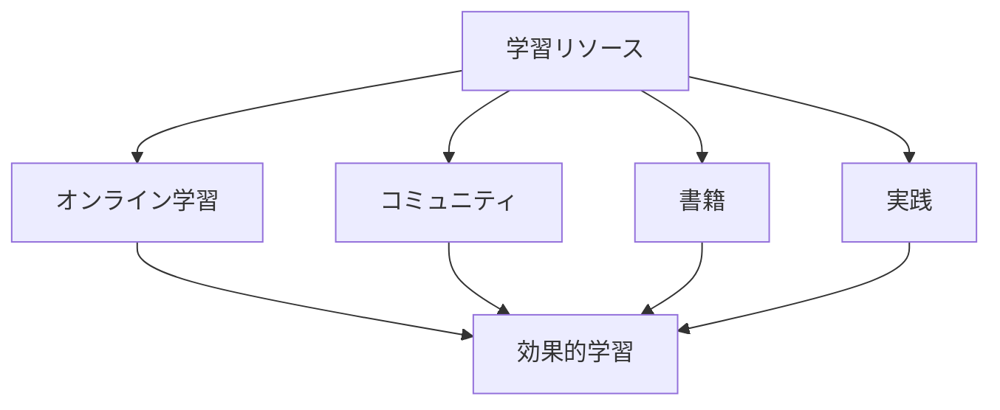

# 学習リソースの活用

## 学習リソースの種類

### オンライン学習プラットフォーム

AI 駆動開発の学習に役立つオンライン学習プラットフォーム：

- プログラミング学習サイト
- オンラインコース
- チュートリアル
- ハンズオン演習

### コミュニティリソース

## 効果的な活用方法

### 1. オンライン学習

オンライン学習の効果的な活用方法：

- 体系的な学習計画
- 実践的な演習
- フィードバックの活用
- 継続的な学習

### 2. コミュニティの活用

コミュニティを活用した学習方法：

- ディスカッションへの参加
- コードレビュー
- ベストプラクティスの共有
- メンタリング

### 3. 実践的な学習

実践的な学習の重要性：

- プロジェクトへの参加
- オープンソースへの貢献
- ハンズオン演習
- 実務経験の積み重ね

## 実践的なアプローチ

### 学習計画

効果的な学習計画の立て方：

- 目標の設定
- リソースの選択
- スケジュールの作成
- 進捗の管理

### 継続的な学習

継続的な学習の維持方法：

- 習慣化
- モチベーションの維持
- フィードバックの活用
- 目標の更新

## 成功のポイント

### リソースの選択

適切なリソース選択のポイント：

- 目的に合致
- 質の高い内容
- 実践的な要素
- 継続的な更新

### 学習の最適化

学習効果を最大化するポイント：

- 集中学習
- 実践的な演習
- フィードバックの活用
- 継続的な改善

## 実践的なアドバイス

### 学習の進め方

効果的な学習の進め方：

1. 目標の設定
2. リソースの選択
3. 学習計画の作成
4. 実践的な演習
5. フィードバックの活用

### 成功への道筋

学習を成功させるポイント：

- 明確な目標設定
- 計画的なアプローチ
- 継続的な学習
- 実践的な経験

## まとめ

効果的な学習リソースの活用は、AI 駆動開発のスキル向上に不可欠です。適切なリソースの選択、計画的な学習、そして継続的な実践が重要です。
