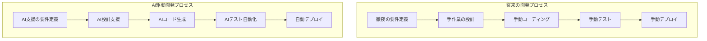
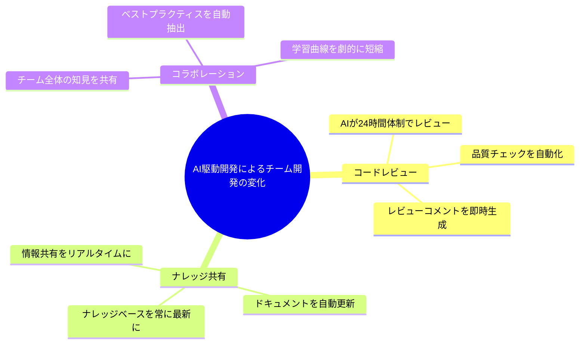
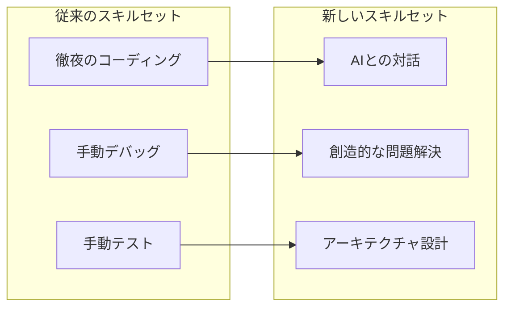
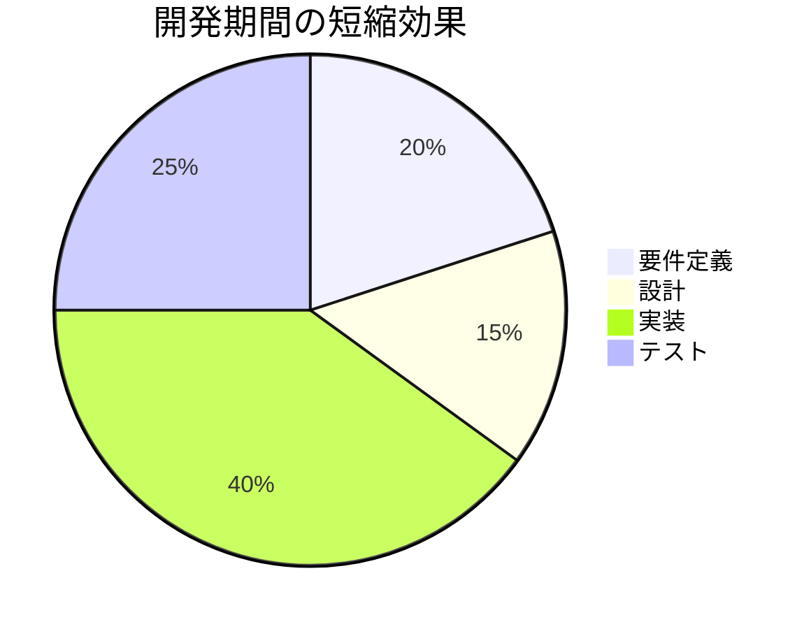
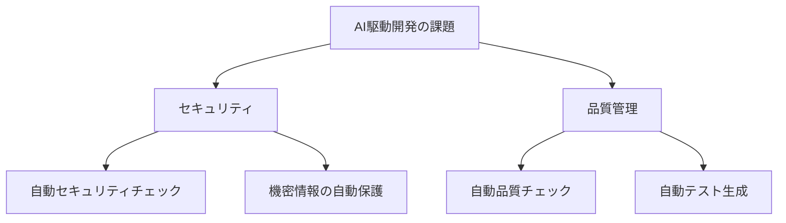

# 実際の現場で起きている変化

## はじめに

「また徹夜でコードを書いている...」
「このバグ、どこから来ているんだろう...」
「ドキュメント作成、いつも後回しになっている...」

開発者の皆さん、こんな経験はありませんか？AI駆動開発は、これらの日常的な課題を解決し、開発の未来を大きく変えようとしています。この章では、実際の開発現場で起きている変化と、そこから見えてくる明るい未来について解説していきます。

## 開発プロセスの変化

### 1. 要件定義フェーズ

従来の苦労：

- 深夜まで続く要件定義書との格闘
- 「あの要件、忘れていた...」という後悔
- ステークホルダーとの無限ループの会議

AIによる変革：

- AIが要件を整理し、矛盾点を自動検出
- プロトタイプを数分で作成し、即座にフィードバック
- 要件の漏れを自動的にチェック

### 2. 設計フェーズ

従来の苦労：

- 設計書作成に追われる日々
- 「この設計、本当に最適なのか...」という不安
- パフォーマンス問題の後付け対応

AIによる変革：

- AIが最適な設計パターンを提案
- 設計書を自動生成し、レビュー時間を大幅削減
- パフォーマンスとスケーラビリティを事前に分析

### 3. 実装フェーズ

従来の苦労：

- 同じようなコードを何度も書く退屈な作業
- エラーハンドリングの実装で消耗する時間
- コードの最適化に悩む日々

AIによる変革：

- ボイラープレートコードを自動生成
- エラーハンドリングを自動実装
- AIがコードの最適化を提案

## チーム開発の変化

### 1. コードレビュー

従来の苦労：

- 深夜まで続くコードレビュー
- 「このレビュー、本当に必要だったのか...」
- レビューの品質にばらつきがある不安

AIによる変革：

- AIが24時間体制でコードをチェック
- 品質基準を自動的に検証
- レビューコメントを即時生成

### 2. ナレッジ共有

従来の苦労：

- ドキュメント作成に追われる日々
- 「この情報、もう古いかも...」という不安
- 情報共有の非効率さ

AIによる変革：

- ドキュメントを自動生成・更新
- ナレッジベースを常に最新に
- チーム内での情報共有をリアルタイムに

## 開発者の変化

### 1. スキルセット

従来の苦労：

- 新しい言語やフレームワークの習得に時間を要する
- アルゴリズムの実装に悩む
- 常に最新技術を追いかける必要がある

AIによる変革：

- AIと対話しながら効率的に学習
- 創造的な問題解決に集中
- アーキテクチャ設計に注力

### 2. 作業効率

従来の苦労：

- 手動でのコーディングに時間を取られる
- デバッグで消耗する時間
- テストの手動実行の煩雑さ

AIによる変革：

- コード生成を自動化し、創造的な作業に集中
- デバッグを効率化し、問題解決に注力
- テストを自動化し、品質向上に集中

## 実際の事例

### ケーススタディ 1：スタートアップ企業

背景：

- 新規 Web アプリケーションの開発
- 限られたリソースと時間
- 経験の浅い開発チーム

変革：

- 開発期間を50%短縮し、市場投入を加速
- コード品質を自動的に向上
- チームの学習曲線を劇的に短縮

### ケーススタディ 2：大企業の既存システム

背景：

- レガシーシステムの保守に追われる日々
- 複雑なコードベースとの格闘
- 限られた開発リソース

変革：

- コード理解を自動化し、保守作業を効率化
- バグ修正を迅速化し、安定性を向上
- ドキュメントを自動更新し、知識を常に最新に

## 課題と対策

### 1. セキュリティ

課題：

- AI生成コードの脆弱性
- 機密情報の取り扱い
- コンプライアンス対応

対策：

- セキュリティチェックを自動化し、安心を確保
- 機密情報を自動的に保護
- コンプライアンスを自動的に検証

### 2. 品質管理

課題：

- AI生成コードの品質
- テストの網羅性
- パフォーマンスの確保

対策：

- 品質チェックを自動化し、信頼性を確保
- テストケースを自動生成し、網羅性を向上
- パフォーマンスを自動的に最適化

## まとめ

AI駆動開発は、開発者の日常的な課題を解決し、より創造的で充実した開発環境を実現します：

- 退屈な作業を自動化し、創造的な作業に集中
- チーム開発を効率化し、コラボレーションを促進
- 開発者のスキルを最大限に活かす環境を提供
- 品質管理を自動化し、信頼性を向上

これらの変革は、単なる効率化だけでなく、開発の本質的な価値を高めることにつながっています。AIと共に働く未来は、より創造的で充実した開発環境を約束します。
