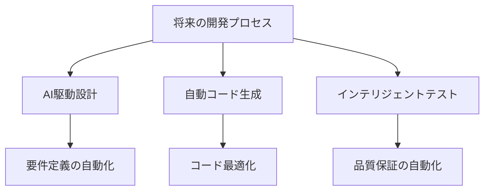

# 将来の可能性

## AI駆動開発の進化

### 技術の進化

AI駆動開発は、以下のような方向で進化すると予想されます：

- より高度なコード生成
- 自律的な問題解決
- 人間との協業の深化
- 開発プロセスの革新

### 開発プロセスの変革

## 主要な可能性

### 1. 開発効率の飛躍的な向上

AIを活用することで、以下のような効率化が期待されます：

- コード生成の自動化
- バグの早期発見
- テストの自動化
- ドキュメント生成の自動化

### 2. 新しい開発手法の確立

AIを活用した新しい開発手法が確立されると予想されます：

- AI駆動のアーキテクチャ設計
- 自動化されたリファクタリング
- インテリジェントなコードレビュー
- パフォーマンス最適化の自動化

### 3. 開発者の役割の変化

開発者の役割は以下のように変化すると予想されます：

- より創造的な作業への集中
- システム設計の重点化
- AIとの効果的な協業
- 品質管理の高度化

## 実践的な応用

### コード生成と最適化

AIによるコード生成と最適化は、以下のような可能性を秘めています：

- 複雑なアルゴリズムの自動生成
- パフォーマンスの自動最適化
- セキュリティの自動強化
- コードの自動リファクタリング

### テストと品質管理

テストと品質管理の分野でも、以下のような革新が期待されます：

- テストケースの自動生成
- バグの自動検出と修正
- 品質メトリクスの自動分析
- 継続的な品質向上

## 将来の展望

### 2025 年以降の予測

AI駆動開発は、以下のような形で進化すると予想されます：

1. 基本的な自動化の実現
2. 高度な問題解決能力の獲得
3. 人間との協業システムの確立

### 開発者への影響

AI駆動開発の進化により、開発者には以下のような新しいスキルが求められます：

- AIシステムの設計と制御
- 倫理的・法的な考慮
- 進化の方向性の管理
- 人間-AI協業の最適化

## まとめ

AI駆動開発は、ソフトウェア開発の未来を大きく変える可能性を秘めています。開発者として、これらの変化に対応し、適切に活用していくことが重要です。
