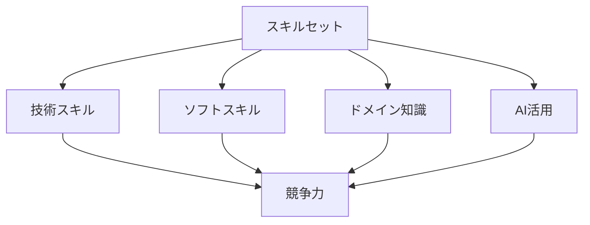

# 将来求められるスキルセット

## AI時代のスキル要件

### 技術スキル

AI時代において求められる主要な技術スキル：

- AI/ML の実践的な知識
- クラウド技術
- セキュリティ
- パフォーマンス最適化

### スキルセットの構成

## 主要なスキル領域

### 1. AI/ML スキル

AI/ML に関する重要なスキル：

- 機械学習の基礎
- ディープラーニング
- 自然言語処理
- コンピュータビジョン

### 2. クラウド技術

クラウド技術に関する重要なスキル：

- クラウドアーキテクチャ
- コンテナ技術
- サーバーレス
- マイクロサービス

### 3. セキュリティ

セキュリティに関する重要なスキル：

- セキュリティ設計
- 脆弱性対策
- コンプライアンス
- プライバシー保護

## 実践的なスキル開発

### 技術スキルの習得

効果的な技術スキル習得の方法：

- 実践的なプロジェクト
- ハンズオン演習
- コードレビュー
- 継続的な学習

### ソフトスキルの向上

重要なソフトスキル：

- コミュニケーション能力
- リーダーシップ
- 問題解決能力
- チームワーク

## 成功のポイント

### スキル開発の最適化

スキル開発を最適化するポイント：

- 目標の明確化
- 計画的な学習
- 実践的な経験
- 継続的な改善

### スキルの応用

スキルを効果的に応用するポイント：

- 実務での活用
- プロジェクトへの貢献
- チームでの共有
- 継続的な成長

## 実践的なアドバイス

### スキル開発のステップ

効果的なスキル開発のステップ：

1. 目標の設定
2. 学習計画の作成
3. 実践的な演習
4. フィードバックの活用
5. 継続的な改善

### 成功への道筋

スキル開発を成功させるポイント：

- 明確な目標設定
- 計画的なアプローチ
- 継続的な学習
- 実践的な経験

## まとめ

AI時代において、適切なスキルセットの開発は、エンジニアの競争力と成長の鍵となります。技術スキルとソフトスキルの両方をバランスよく習得し、継続的に成長していくことが重要です。
