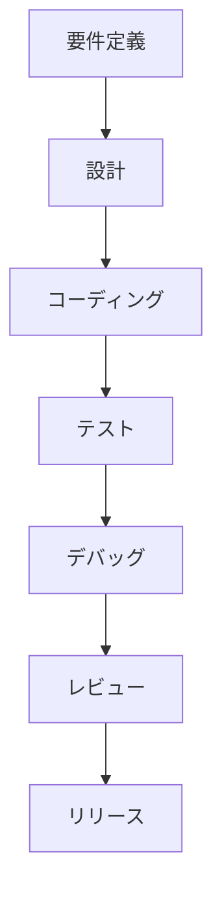
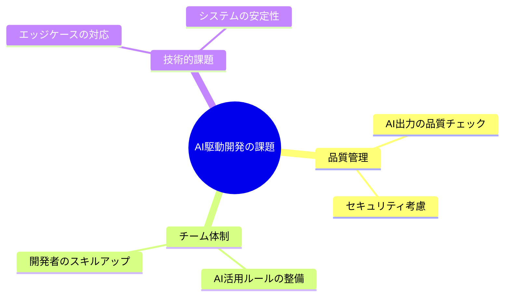

# 従来の開発 vs AI駆動開発：生産性の違い

## はじめに

従来の開発手法と、AI駆動開発は何が違うのでしょうか？
この章では、具体的な例を交えながら説明していきます。

## 従来の開発プロセス

従来のソフトウェア開発では、以下のような流れで作業が進められていました：

このプロセスは、人間の開発者がすべての作業を手動で行う必要があり、特に以下の点で時間と労力がかかっていました：

- コーディング
- エラーハンドリングの実装
- テストケースの作成
- ドキュメントの作成
- コードレビュー

## AI駆動開発の特徴

AI駆動開発では、AIツールを活用することで、以下のような効率化が実現できます：

1. ソースコードの自動作成
2. テストケースの自動作成
3. バグの自動検出
4. ドキュメントの自動生成
5. コードレビューの効率化

| 開発フェーズ | 従来の開発 |      AI駆動開発      |
| :----------: | :--------: | :-------------------: |
|   要件定義   |    手動    |         手動          |
|     設計     |    手動    |   AIによる設計支援   |
| コーディング |    手動    |   AIによる半自動化   |
|    テスト    |    手動    |  AIによるテスト生成  |
|   デバッグ   |    手動    | AIによるデバッグ支援 |

## 具体的な生産性の違い

|    開発フェーズ    | 従来の開発 | AI駆動開発 |
| :----------------: | :--------: | :---------: |
| フロントエンド開発 |  14 日間   |   7 日間    |
|  バックエンド開発  |  21 日間   |   10 日間   |
|       テスト       |   7 日間   |   4 日間    |
|        合計        |  42 日間   |   21 日間   |

## 注意点

AI駆動開発にも以下のような課題があります：

1. AIの出力の品質チェックが必要
2. セキュリティ上の考慮が必要
3. チーム内での AI活用ルールの整備が必要
4. 開発者のスキルアップが必要

## まとめ

AI駆動開発は、従来の開発手法と比較して、以下の点で大きな生産性向上が期待できます：

- 開発時間の短縮
- コード品質の向上
- テストの効率化
- デバッグの効率化

ただし、AIを適切に活用するためには、開発者自身のスキルと知識が重要です。AIはあくまでツールであり、それを効果的に使いこなすことが求められます。
