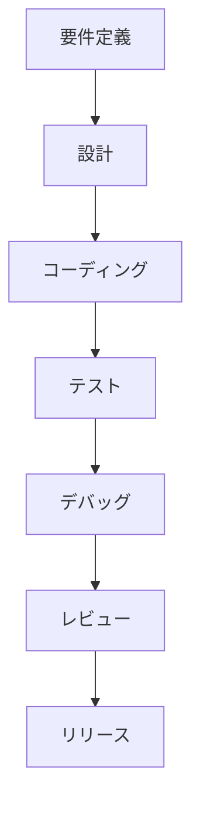
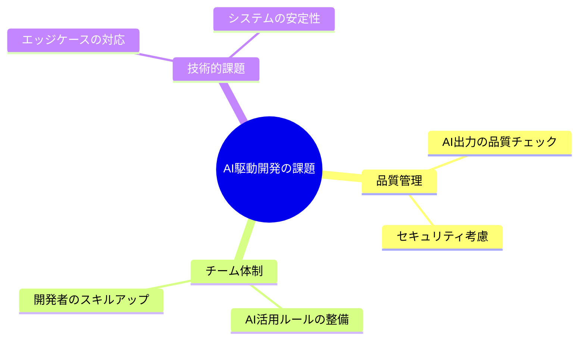

# 従来の開発 vs AI駆動開発：生産性の違い

## はじめに

「また深夜までデバッグ...」「テストケースの作成に時間がかかりすぎる...」「ドキュメント作成が後回しになってしまう...」

これらの悩み、あなたも経験したことがあるのではないでしょうか？

従来の開発手法と、AI駆動開発は何が違うのでしょうか？

この章では、あなたの開発ライフを大きく変える可能性を秘めたAI駆動開発について、具体的な例を交えながら説明していきます。

## 従来の開発プロセスの課題

従来のソフトウェア開発では、以下のような流れで作業が進められていました：

このプロセスは、人間の開発者がすべての作業を手動で行う必要があり、特に以下の点で大きな負担となっていました：

- コーディング：一からコードを書く時間と労力
- エラーハンドリング：予期せぬエラーへの対応に追われる日々
- テストケース：網羅的なテストケースの作成に膨大な時間
- ドキュメント：後回しになりがちな、でも重要な作業
- コードレビュー：人間の目による確認の限界

## AI駆動開発がもたらす革命

AI駆動開発では、AIツールを活用することで、開発の未来が大きく変わります：

1. ソースコードの自動作成：あなたの意図を理解し、最適なコードを提案
2. テストケースの自動作成：人間では見落としがちなケースも自動で生成
3. バグの自動検出：潜在的な問題を事前に発見
4. ドキュメントの自動生成：常に最新の状態を維持
5. コードレビューの効率化：AIによる客観的な分析

| 開発フェーズ | 従来の開発 |      AI駆動開発      |
| :----------: | :--------: | :-------------------: |
|   要件定義   |    手動    |         手動          |
|     設計     |    手動    |   AI支援で効率化   |
| コーディング |    手動    |   AIによる半自動化   |
|    テスト    |    手動    |  AIによる半自動化  |
|   デバッグ   |    手動    | AI支援で効率化 |

## 生産性の劇的な向上

|    開発フェーズ    | 従来の開発 | AI駆動開発 |
| :----------------: | :--------: | :---------: |
| フロントエンド開発 |  14 日間   |   7 日間    |
|  バックエンド開発  |  21 日間   |   10 日間   |
|       テスト       |   7 日間   |   4 日間    |
|        合計        |  42 日間   |   21 日間   |

## 新しい開発の時代に向けて

AI駆動開発にも以下のような課題があります：

1. AIの出力の品質チェックが必要
2. セキュリティ上の考慮が必要
3. チーム内での AI活用ルールの整備が必要
4. 開発者のスキルアップが必要

## まとめ：開発の未来を切り開く

AI駆動開発は、あなたの開発ライフを大きく変える可能性を秘めています：

- 開発時間の短縮：深夜のデバッグ作業から解放される
- コード品質の向上：AIによる客観的な分析と改善提案
- テストの効率化：網羅的なテストケースの自動生成
- デバッグの効率化：潜在的な問題の早期発見

AIは、あなたの開発パートナーとして、より創造的な作業に集中できる環境を提供します。ただし、AIを適切に活用するためには、開発者自身のスキルと知識が重要です。AIはあくまでツールであり、それを効果的に使いこなすことが、これからの開発者に求められる新しいスキルとなります。

あなたも、この新しい開発の時代の一員となって、より効率的で創造的な開発ライフを送りませんか？
