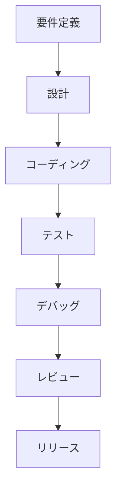
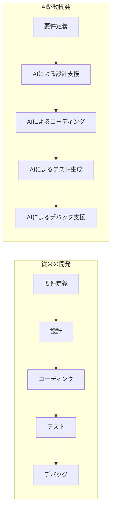
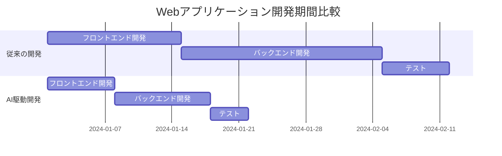
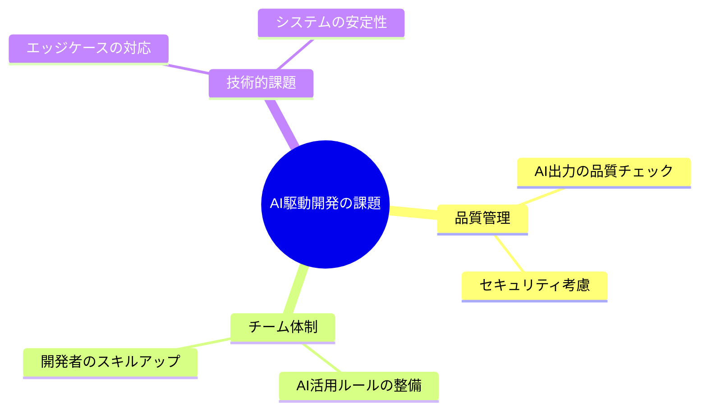

# 従来の開発 vs AI駆動開発：生産性の違い

## はじめに

従来の開発手法と AI駆動開発の違いを、具体的な例を交えながら説明していきます。

## 従来の開発プロセス

従来のソフトウェア開発では、以下のような流れで作業が進められていました：

1. 要件定義
2. 設計
3. コーディング
4. テスト
5. デバッグ
6. レビュー
7. リリース

このプロセスは、人間の開発者がすべての作業を手動で行う必要があり、特に以下の点で時間と労力がかかっていました：

- コーディング
- エラーハンドリングの実装
- テストケースの作成
- ドキュメントの作成
- コードレビュー

## AI駆動開発の特徴

AI駆動開発では、AIツールを活用することで、以下のような効率化が実現できます：

1. ソースコードの作成
2. テストケースの自動生成
3. バグの自動検出
4. ドキュメントの自動生成
5. コードレビューの効率化

## 具体的な生産性の違い

### 1. コーディング時間の短縮

従来の開発：

- 1 つの機能実装に数時間から数日
- エラーハンドリングの実装に追加の時間
- コードの最適化に時間を要する

AI駆動開発：

- ソースコードの作成が数分で完了
- エラーハンドリングの自動生成
- コードの最適化提案の自動化

### 2. テスト作成の効率化

従来の開発：

- テストケースの設計に時間を要する
- エッジケースの考慮が漏れがち
- テストコードの実装に時間がかかる

AI駆動開発：

- テストケースの自動生成
- エッジケースの自動検出
- テストコードの自動実装

### 3. デバッグの効率化

従来の開発：

- バグの特定に時間を要する
- 原因の特定が難しい
- 修正に時間がかかる

AI駆動開発：

- バグの自動検出
- 原因の自動分析
- 修正案の自動提案

## 実際の開発現場での違い

### ケーススタディ：Web アプリケーション開発

従来の開発：

- フロントエンド開発：14 日間
- バックエンド開発：21 日間
- テスト：7 日間
- 合計：42 日間

AI駆動開発：

- フロントエンド開発：7 日間
- バックエンド開発：10 日間
- テスト：4 日間
- 合計：21 日間

## 注意点

AI駆動開発にも以下のような課題があります：

1. AIの出力の品質チェックが必要
2. セキュリティ上の考慮が必要
3. チーム内での AI活用ルールの整備が必要
4. 開発者のスキルアップが必要

## まとめ

AI駆動開発は、従来の開発手法と比較して、以下の点で大きな生産性向上が期待できます：

- 開発時間の短縮
- コード品質の向上
- テストの効率化
- デバッグの効率化

ただし、AIを適切に活用するためには、開発者自身のスキルと知識が重要です。AIはあくまでツールであり、それを効果的に使いこなすことが求められます。
