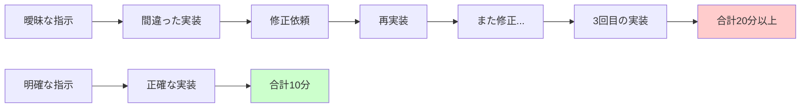
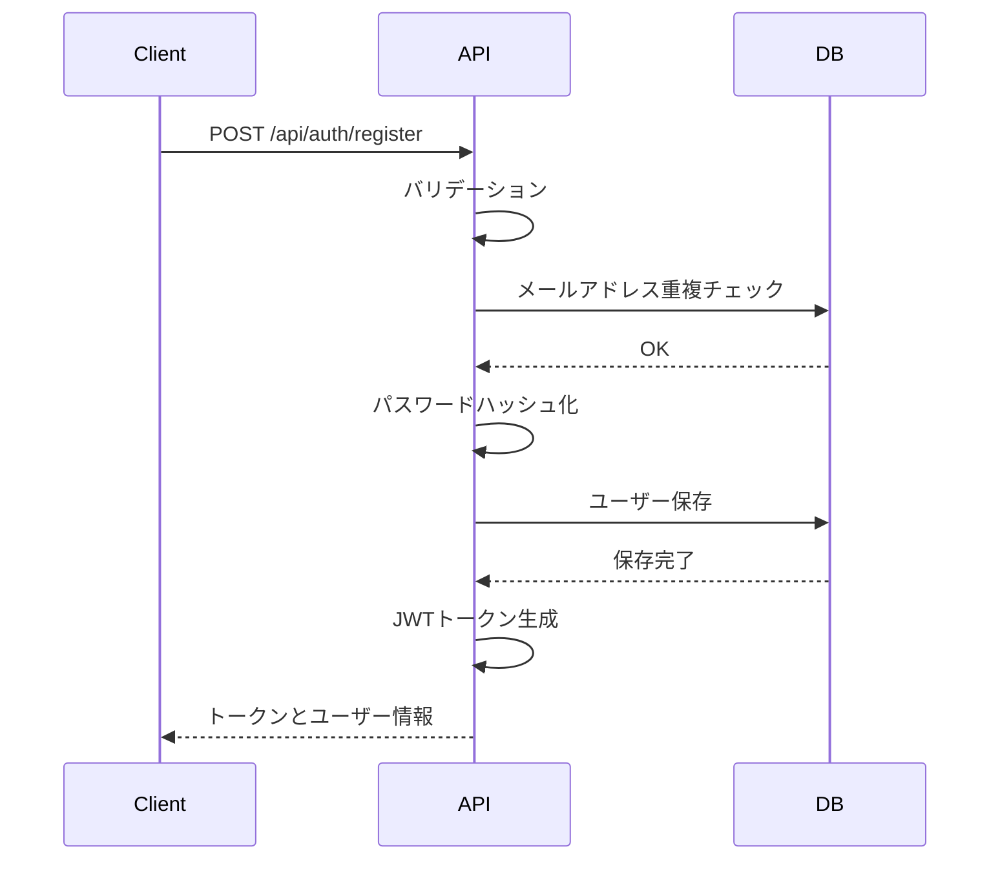
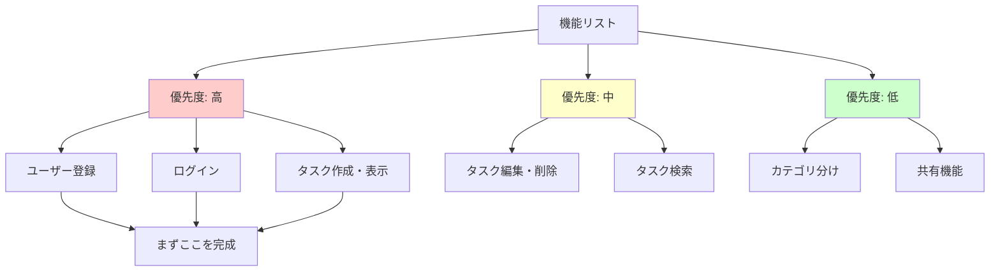
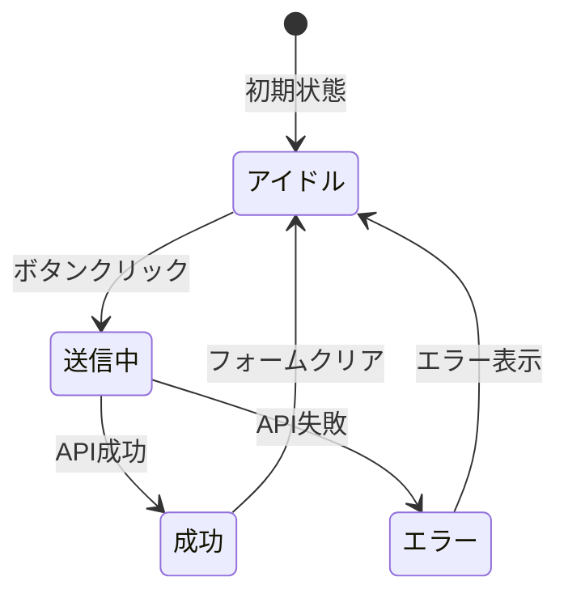

# 明確さは力なり

AI駆動開発において、最も重要なスキルは何でしょうか。プログラミングの知識でしょうか、それとも最新のフレームワークの使い方でしょうか。実は、どちらでもありません。

最も重要なスキル、それは**効果的な指示を出す能力**です。

AIは非常に強力なツールですが、あなたの頭の中を読むことはできません。曖昧な指示では曖昧な結果しか得られませんが、明確で構造化された指示を出せば、AIの真の力を引き出すことができます。

## AIは読心術師ではない

まず理解すべきことは、AIは書かれたことしか理解できないということです。あなたが頭の中で思い描いている理想の実装も、プロジェクトの背景も、AIには見えません。

曖昧な指示の例を見てみましょう。

```
ログイン機能を作って
```

このような指示では、AIは以下のような疑問を抱えます。

- どの言語で実装するのか
- フレームワークは何を使うのか
- 認証方式は何か（JWT、Session、OAuth）
- データベースは何を使うのか
- フロントエンドも含むのか

AIは、これらの情報がないまま、推測で実装を始めることになります。結果として、あなたが期待したものとは全く違うコードが生成される可能性が高いです。

次に、明確な指示の例を見てみましょう。

```
Node.js + Express でJWT認証のログインAPIを作成してください。

技術スタック：
- Express.js
- JWT for authentication
- bcrypt for password hashing
- PostgreSQL with Prisma

エンドポイント：
- POST /api/auth/register
- POST /api/auth/login
- GET /api/auth/me

レスポンス形式：JSON
エラーハンドリング：必須
```

このように明確に指示することで、AIは迷わず実装に取り掛かることができます。技術スタック、エンドポイント、レスポンス形式など、必要な情報がすべて含まれています。

## 明確さがもたらす時間の節約

「明確な指示を書くのは時間がかかる」と思うかもしれません。しかし、実際には逆です。明確な指示は時間を節約します。

曖昧な指示の場合の流れを見てみましょう。

1. 曖昧な指示を出す（1分）
2. AIが間違った実装をする（5分）
3. 「違う、こうじゃない」と修正依頼（2分）
4. AIが再実装（5分）
5. また違う... 再度修正（2分）
6. 3回目の実装（5分）

**合計：20分以上**

何度もやり直しが発生し、時間がかかります。さらに、あなた自身も「何が違うのか」を説明する必要があり、ストレスも溜まります。

明確な指示の場合はどうでしょうか。

1. 明確な指示を書く（5分）
2. AIが正確に実装（5分）

**合計：10分**

最初に5分かけて明確な指示を書くことで、結果的に10分短縮できます。明確な指示を書く時間は投資です。その投資は、必ず時間の節約として返ってきます。



## 5W1Hで指示を組み立てる

明確な指示を書くためには、5W1Hのフレームワークが役立ちます。これは、必要な情報を漏れなく伝えるための枠組みです。

### What（何を）

目的を明確に伝えます。

❌ 曖昧：

```
アプリを作って
```

✅ 明確：

```
タスク管理アプリを作成してください。
ユーザーがタスクを追加・編集・削除・完了できる機能です。
```

「何を作るのか」を具体的に説明することで、AIは正確に目的を理解できます。単に「アプリ」と言うのではなく、どんな種類のアプリで、どんな機能があるのかを伝えることが大切です。

### How（どのように）

技術スタックや実装方法を指定します。

❌ 曖昧：

```
Webアプリで
```

✅ 明確：

```
技術スタック：
- フロントエンド：React 18 + TypeScript
- スタイリング：TailwindCSS
- 状態管理：Zustand
- ビルドツール：Vite
```

使用する技術を明示することで、AIは適切なコードを生成できます。プロジェクトで既に使っている技術スタックを伝えることが重要です。

### Where（どこに）

ファイルの配置を指定します。

❌ 曖昧：

```
適切な場所に配置して
```

✅ 明確：

```
ファイル配置：
- src/components/TaskList.tsx
- src/components/TaskItem.tsx
- src/hooks/useTasks.ts
- src/types/task.ts
```

プロジェクトの構造に合わせて、ファイルをどこに配置するかを指定します。これにより、既存のプロジェクト構造が崩れることを防げます。

### Why（なぜ）

必要に応じて、背景や制約を説明します。

❌ 曖昧：

```
認証を追加して
```

✅ 明確：

```
セキュリティ要件のため、JWT認証を実装してください。

理由：
- ステートレスな認証が必要
- マイクロサービス間で認証情報を共有
- トークンの有効期限管理が必要
```

「なぜその実装が必要なのか」を説明することで、AIはより適切な実装方法を選択できます。特に、複数の実装方法がある場合に有効です。

### When（いつ・条件）

条件や制約を明示します。

❌ 曖昧：

```
エラーハンドリングを追加
```

✅ 明確：

```
以下の場合のエラーハンドリングを実装：

1. ネットワークエラー時
   → リトライ機能（最大3回）
   → ユーザーに通知

2. 認証エラー時
   → ログイン画面にリダイレクト

3. バリデーションエラー時
   → フォームにエラーメッセージ表示
```

どんな場合にどう対応するかを明確にすることで、漏れのないエラーハンドリングが実装できます。エラーハンドリングは、実装を忘れがちな部分なので、最初から明確に指示することが重要です。

### 出力形式の指定

AIにどのような形式で回答して欲しいかを明示します。

```
回答は以下の形式で提供してください:
1. 問題の分析
2. 解決策の説明
3. 修正後のコード全体
4. テスト方法の提案
```

出力形式を指定することで、レビューしやすく、理解しやすい回答が得られます。特に、複雑な問題を解決する際には、段階的に説明してもらうことで、理解が深まります。

## 実践例：Before / After

実際の例を見ながら、明確な指示の書き方を学びましょう。

### 例1：機能実装

**Before（曖昧）：**

```
ユーザー登録機能を作って
```

この指示では、何をどう実装すればいいかわかりません。AIは推測で実装を始めるしかありません。

**After（明確）：**

```
ユーザー登録機能を実装してください。

エンドポイント：
POST /api/auth/register

リクエストボディ：
{
  "email": "user@example.com",
  "password": "password123",
  "name": "田中太郎"
}

バリデーション：
- email: 有効なメールアドレス形式
- password: 8文字以上、英数字含む
- name: 必須、2-50文字

処理フロー：
1. バリデーション
2. メールアドレスの重複チェック
3. パスワードのハッシュ化（bcrypt）
4. データベースに保存
5. JWTトークンを生成して返却

レスポンス（成功時）：
{
  "token": "jwt_token_here",
  "user": {
    "id": 1,
    "email": "user@example.com",
    "name": "田中太郎"
  }
}

エラーレスポンス：
- 400: バリデーションエラー
- 409: メールアドレス重複
- 500: サーバーエラー

使用技術：
- Node.js + Express
- Prisma (PostgreSQL)
- bcrypt
- jsonwebtoken
```

エンドポイント、リクエスト・レスポンスの形式、バリデーションルール、処理フロー、エラーハンドリング、使用技術をすべて明記しています。これにより、AIは正確に実装できます。



### 例2：バグ修正

**Before（曖昧）：**

```
ログインできないバグを修正して
```

この指示では、何が問題なのかわかりません。AIはどこから調べればいいか迷ってしまいます。

**After（明確）：**

````
ログイン機能のバグを修正してください。

症状：
- メールアドレス: test@example.com
- パスワード: correct_password
で、「Invalid credentials」エラーが返される

期待される動作：
正しいパスワードの場合、JWTトークンが返される

関連ファイル：
- src/routes/auth.ts (line 45-67)
- src/services/authService.ts

エラーログ：
```
POST /api/auth/login 401
Error: Invalid credentials
  at authService.login (authService.ts:23)
```

確認済み：
- データベースにユーザーは存在する
- パスワードのハッシュは保存されている
- 他のエンドポイントは正常動作

修正後の確認：
1. ユニットテストが通ること
2. 実際のログインが成功すること
````

症状、期待される動作、関連ファイル、エラーログ、既に確認済みのことを明記しています。これにより、AIは効率的にバグを特定し、修正できます。

デバッグでは、「何を試したか」「何がわかっているか」を伝えることが非常に重要です。これにより、AIは無駄な調査をせず、直接問題の核心に迫ることができます。

## 明確さを高める5つのテクニック

明確な指示を書くための、実践的なテクニックを紹介します。

### テクニック1：具体例を含める

**Before：**

```
商品リストを表示して
```

**After：**

```
商品リストを表示してください。

表示例：
┌─────────────────────────────┐
│ MacBook Pro             │
│ ¥250,000               │
│ [カートに追加]          │
└─────────────────────────────┘
┌─────────────────────────────┐
│ iPhone 15 Pro           │
│ ¥150,000               │
│ [カートに追加]          │
└─────────────────────────────┘

各商品カードに表示：
- 商品名
- 価格（税込）
- カートに追加ボタン
- 商品画像（サムネイル）

レイアウト：
- グリッドレイアウト
- レスポンシブ（スマホは1列、タブレットは2列、PCは3列）
```

具体的な表示例を示すことで、デザインや機能のイメージが明確になります。テキストで説明するだけでなく、視覚的な例を含めることで、AIはより正確にあなたの意図を理解できます。

### テクニック2：制約を明示

**Before：**

```
データベースに保存して
```

**After：**

```
データベースに保存してください。

制約：
- トランザクションを使用（全て成功 or 全て失敗）
- 保存前にバリデーション必須
- 既存データとの重複チェック
- エラー時は適切にロールバック
- 保存後はログに記録
```

制約を明示することで、品質の高い実装が得られます。特に、データベース操作では、トランザクションやエラーハンドリングが重要です。これらを最初から指示することで、後から修正する手間を省けます。

### テクニック3：優先順位を示す

**Before：**

```
これらの機能を実装して
```

**After：**

```
以下の機能を優先順位順に実装してください。

優先度: 高（必須）
1. ユーザー登録
2. ログイン
3. タスクの作成・表示

優先度: 中（できれば）
4. タスクの編集・削除
5. タスクの検索

優先度: 低（余裕があれば）
6. タスクのカテゴリ分け
7. タスクの共有機能

まず優先度「高」の3つを完成させてください。
```

優先順位を示すことで、重要な機能から確実に実装できます。すべてを一度に実装しようとすると、どれも中途半端になりがちです。優先順位を明確にすることで、段階的に進めることができます。



### テクニック4：期待される動作を記述

**Before：**

```
ボタンを押したら何か起きるようにして
```

**After：**

```
「送信」ボタンのクリック時の動作を実装してください。

期待される動作：
1. ボタンが無効化される（二重送信防止）
2. ローディングスピナーが表示される
3. フォームデータをAPIに送信
4. 成功時：
   - 成功メッセージを表示（緑色のトースト）
   - フォームをクリア
   - タスク一覧を再読み込み
5. エラー時：
   - エラーメッセージを表示（赤色のトースト）
   - フォームは保持
6. 最後にボタンを再度有効化

アニメーション：
- ボタン: クリック時に縮小エフェクト
- トースト: フェードイン・アウト（3秒後に自動消去）
```

期待される動作を詳細に記述することで、ユーザー体験の高い実装が得られます。特に、UIの動作は、細かい部分まで指定することで、プロフェッショナルな仕上がりになります。



### テクニック5：既存コードとの関連を示す

**Before：**

```
新しい機能を追加して
```

**After：**

```
既存のユーザー管理機能に、プロフィール編集を追加してください。

既存コード：
@src/components/UserProfile.tsx
@src/services/userService.ts

統合ポイント：
- UserProfile コンポーネントに「編集」ボタンを追加
- 既存の UserService.getUser() を使用してデータ取得
- 同じスタイル（TailwindCSS）を使用
- 既存のフォームバリデーションパターンに従う

新規作成ファイル：
- src/components/UserProfileEdit.tsx
- src/components/UserProfileEditForm.tsx
```

既存コードとの関連を示すことで、一貫性のある実装が得られます。プロジェクトが大きくなるほど、既存のコードスタイルやパターンに従うことが重要になります。

## よくある失敗と対策

実際によくある失敗例と、その対策を見ていきましょう。

### 失敗1：「いい感じに」と丸投げ

❌ NG：

```
ログイン画面をいい感じにデザインして
```

「いい感じ」は人によって異なります。AIにとっては、何も指定されていないのと同じです。あなたの「いい感じ」とAIの「いい感じ」は違います。

✅ OK：

```
ログイン画面のデザインを以下の仕様で作成してください：

スタイル：
- モダン・ミニマル
- カラー：#3B82F6（プライマリ）、#1F2937（テキスト）
- Google のログイン画面を参考

レイアウト：
- 中央配置（縦横）
- カード型（影付き）
- 最大幅：400px

要素：
1. ロゴ（上部、中央）
2. タイトル「ログイン」
3. メールアドレス入力
4. パスワード入力
5. ログインボタン（幅100%、青）
6. 「パスワードを忘れた」リンク
7. 「新規登録」リンク
```

具体的な仕様を示すことで、期待通りのデザインが得られます。デザインでは、色、レイアウト、要素の配置などを具体的に指定することが大切です。

### 失敗2：専門用語だけで説明

❌ NG：

```
RESTful APIをCRUDで
```

専門用語だけでは、詳細な仕様が伝わりません。AIは専門用語を理解していますが、それだけでは実装の詳細はわかりません。

✅ OK：

```
REST APIを実装してください。

エンドポイント：
- GET /api/tasks - 全タスク取得
- POST /api/tasks - タスク作成
- PUT /api/tasks/:id - タスク更新
- DELETE /api/tasks/:id - タスク削除

各エンドポイントの詳細：

GET /api/tasks
レスポンス：
{
  "tasks": [
    {
      "id": 1,
      "title": "タスク1",
      "completed": false,
      "createdAt": "2025-01-15T10:00:00Z"
    }
  ]
}

POST /api/tasks
リクエスト：
{
  "title": "新しいタスク"
}
レスポンス：
{
  "task": {
    "id": 2,
    "title": "新しいタスク",
    "completed": false,
    "createdAt": "2025-01-15T11:00:00Z"
  }
}

PUT /api/tasks/:id
リクエスト：
{
  "title": "更新されたタスク",
  "completed": true
}
レスポンス：
{
  "task": {
    "id": 1,
    "title": "更新されたタスク",
    "completed": true,
    "updatedAt": "2025-01-15T12:00:00Z"
  }
}

DELETE /api/tasks/:id
レスポンス：
{
  "message": "Task deleted successfully"
}
```

具体的なリクエスト・レスポンス例を示すことで、正確な実装が得られます。APIの設計では、データの形式を明確にすることが非常に重要です。

### 失敗3：複数のことを同時に依頼

❌ NG：

```
ログイン機能を作って、デザインも改善して、
テストも書いて、ドキュメントも更新して
```

複数のタスクを同時に依頼すると、どれも中途半端になりがちです。AIは複数のタスクを同時に処理しようとして、注意が分散します。

✅ OK：

```
まず、ログイン機能を実装してください。

[詳細な仕様]

実装完了後、次のステップで
デザイン改善をお願いします。
```

1つずつタスクを完了させることで、確実に品質の高い実装が得られます。タスクを分割することの重要性については、別のページで詳しく解説します。

## チェックリスト

指示を送る前に、以下を確認しましょう。このチェックリストを使うことで、明確な指示を書けているかを確認できます。

### 基本情報

- [ ] 何を作るのか明確か
- [ ] 使用する技術スタックを指定したか
- [ ] ファイルの配置を指定したか

これらの基本情報は、どんな指示にも必須です。特に、技術スタックは必ず指定しましょう。

### 詳細情報

- [ ] 入力・出力を具体的に記述したか
- [ ] エラーハンドリングを指定したか
- [ ] 制約や条件を明示したか

詳細情報を含めることで、実装の品質が上がります。特に、エラーハンドリングは忘れがちなので、最初から指示に含めることが大切です。

### 品質管理

- [ ] 期待される動作を記述したか
- [ ] テストについて言及したか
- [ ] パフォーマンス要件を示したか

品質管理の観点を含めることで、プロフェッショナルな実装が得られます。

### コンテキスト

- [ ] 既存コードとの関連を説明したか
- [ ] なぜこれが必要か説明したか
- [ ] 優先順位を示したか

コンテキストを伝えることで、AIはより適切な判断ができます。特に、既存のプロジェクトに追加する場合は、既存コードとの関連を明確にすることが重要です。

## まとめ

明確な指示を書くことは、AI駆動開発において最も重要なスキルです。

### 重要なポイント

**AIは読心術師ではない**

書かれたことしか理解できません。頭の中のイメージは伝わりません。

**明確さは時間の投資**

最初に5分かけて明確な指示を書くことで、結果的に時間を節約できます。

**5W1Hで指示を組み立てる**

- What（何を）：目的を明確に
- How（どのように）：技術スタックを指定
- Where（どこに）：ファイルの配置を指定
- Why（なぜ）：背景や制約を説明
- When（いつ・条件）：条件や制約を明示
- 出力形式の指定：期待する形式を明示

**5つのテクニック**

1. 具体例を含める
2. 制約を明示
3. 優先順位を示す
4. 期待される動作を記述
5. 既存コードとの関連を示す

**よくある失敗を避ける**

- 「いい感じに」と丸投げしない
- 専門用語だけで説明しない
- 複数のことを同時に依頼しない

### 実践のための金言

> 「明確な指示は、AIとの対話における最も強力な武器である」

> 「曖昧さはコストである。明確さは投資である」

> 「AIは賢いが、読心術師ではない」

これらの原則とテクニックを実践することで、AI駆動開発の効率と品質が劇的に向上します。最初は時間がかかるかもしれませんが、慣れれば自然と明確で効果的な指示を出せるようになります。

明確な指示を書くスキルは、実践を通じて上達します。チェックリストを使いながら、様々な指示を書いてみましょう。
