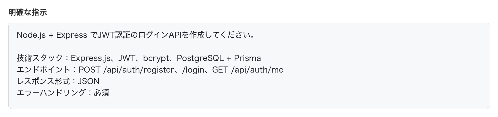
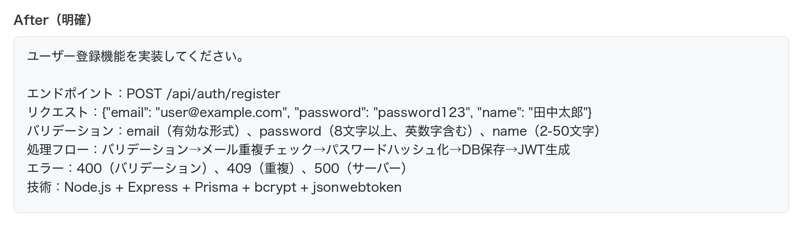
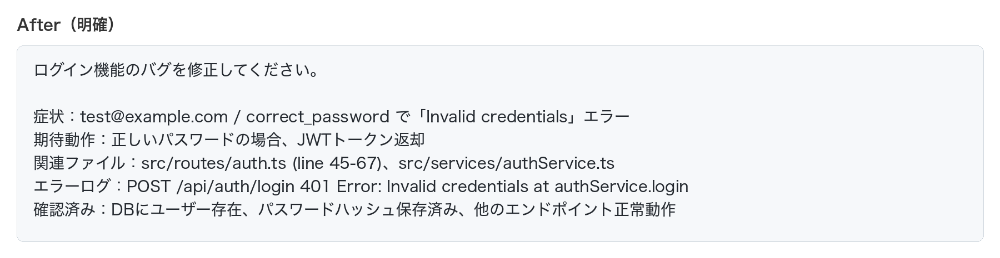

# 明確さは力なり

AIは非常に強力なツールですが、あなたの頭の中を読むことはできません。曖昧な指示では曖昧な結果しか得られませんが、明確な指示を出せば、AIの真の力を引き出すことができます。

## AIは人の心が読めない

AIは書かれたことしか理解できません。曖昧な指示では、AIは推測で実装を始めるしかありません。

**曖昧な指示：**

この指示では、言語・フレームワーク・認証方式・データベースなど、何も判断できません。

**明確な指示：**

明確に指示することで、AIは迷わず実装に取り掛かることができます。

## 実践例：Before / After

### 例1：機能実装

**Before（曖昧）：** ユーザー登録機能を作って

**After（明確）：**

### 例2：バグ修正

**Before（曖昧）：** ログインできないバグを修正して

**After（明確）：**

## まとめ

曖昧な指示では曖昧な結果しか得られません。
明確な指示を出せば、AIの真の力を引き出すことができます。

