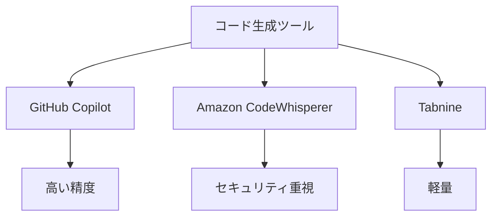

# 最新の AI 開発ツール

## 主要な AI 開発ツール

### コード生成ツール

現在、以下のようなコード生成ツールが注目されています：

- GitHub Copilot
- Amazon CodeWhisperer
- Tabnine
- Kite

### 開発環境

AI を統合した開発環境も進化しています：

- Visual Studio Code with AI
- JetBrains AI Assistant
- Cursor
- Codeium

## ツールの特徴と使い分け

### コード生成ツールの比較

### 開発環境の特徴

各開発環境の主な特徴：

- Visual Studio Code: 豊富な拡張機能
- JetBrains: 高度なコード分析
- Cursor: AI との対話型開発
- Codeium: 高速なコード補完

## 実践的な活用方法

### コード生成の活用

コード生成ツールを効果的に活用する方法：

- 適切なプロンプトの作成
- コンテキストの提供
- 生成コードのレビュー
- 継続的な学習

### 開発環境の最適化

開発環境を最適化するポイント：

- 必要な拡張機能の選択
- 設定のカスタマイズ
- ワークフローの確立
- パフォーマンスの最適化

## 将来の展望

### ツールの進化

AI 開発ツールは以下のように進化すると予想されます：

- より高度なコード生成
- コンテキスト理解の深化
- マルチモーダル対応
- ドメイン特化型機能

### 開発者への影響

新しいツールの登場により、開発者には以下のような変化が求められます：

- ツールの習熟
- 新しい開発手法の確立
- 継続的な学習
- 適応力の向上

## 実践的なアドバイス

### ツール選択のポイント

適切なツールを選択する際の考慮点：

- プロジェクトの要件
- チームのスキル
- 予算
- セキュリティ要件

### 効果的な活用方法

ツールを効果的に活用するためのポイント：

- 基本的な使い方の習得
- ベストプラクティスの確立
- チームでの共有
- 継続的な改善

## まとめ

最新の AI 開発ツールは、開発効率を大幅に向上させる可能性を秘めています。適切なツールを選択し、効果的に活用することが重要です。
