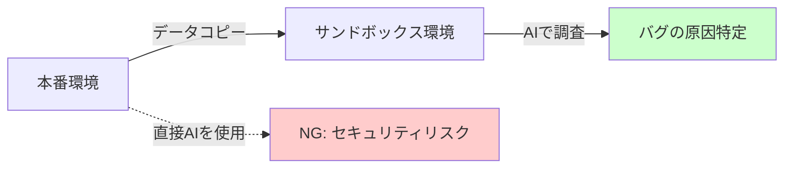
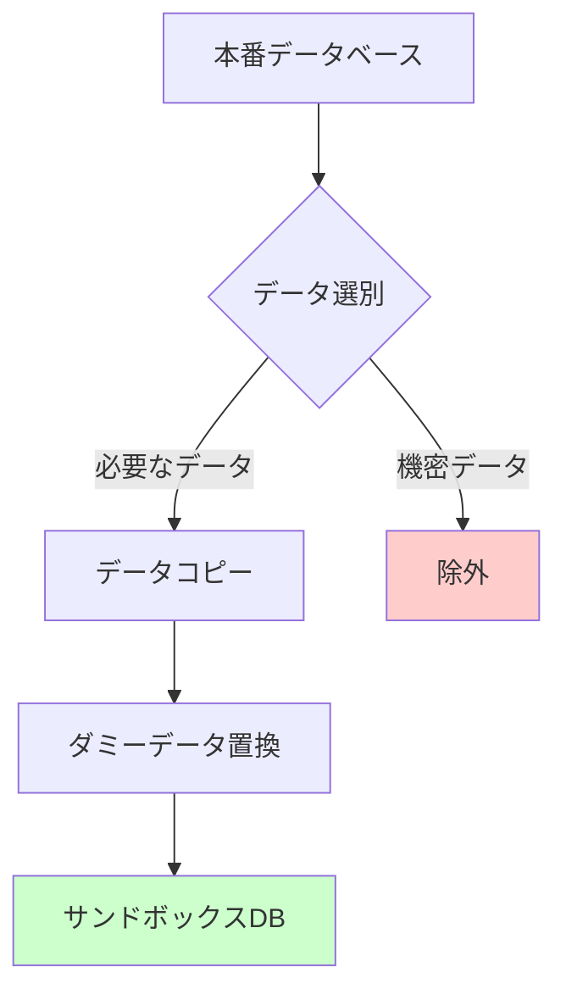
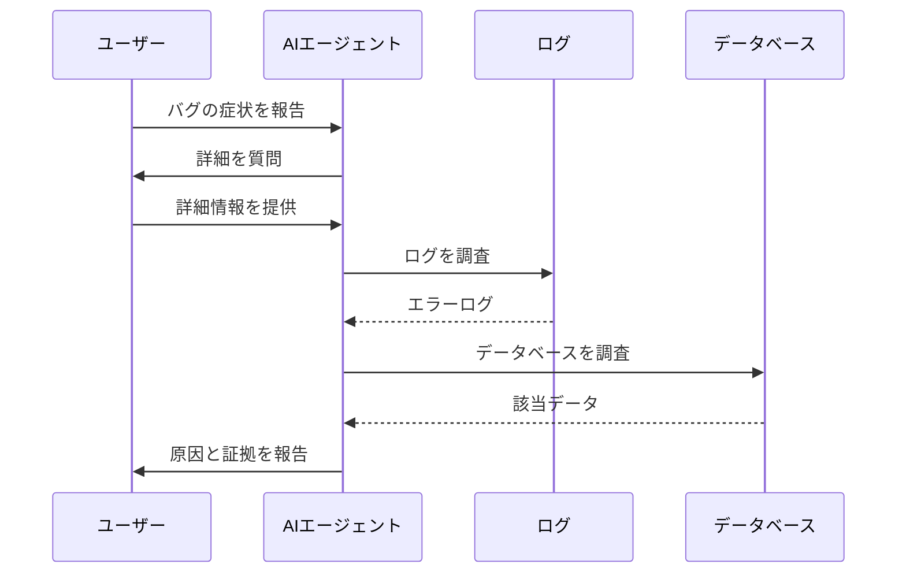

# 本番環境でのバグ調査

本番環境で発生したバグを調査する際、AIを活用することで調査スピードを大幅に向上させることができます。しかし、本番環境で直接AIを使用することはセキュリティリスクがあるため推奨されません。

この章では、安全にAIを活用しながら本番環境のバグを効率的に調査する方法を解説します。

## 基本原則

本番環境でのバグ調査において、以下の原則を守る必要があります。

1. **本番環境で直接AIを使用しない**
   - 本番のログやデータには個人情報や機密情報が含まれている可能性があります
   - AIサービスにデータを送信することは、情報漏洩のリスクになります

2. **サンドボックス環境を活用する**
   - 本番のデータをローカルやサンドボックス環境にコピーします
   - コピーした環境でAIを活用して調査を行います

3. **必ず上司に相談する**
   - 個人の判断で本番データを扱うことは絶対に避けてください
   - データのコピーや調査方法について、必ず上司の許可を取ってから実行してください



## セキュリティリスクと対策

### リスク

本番環境のデータには、以下のような機密情報が含まれている可能性があります。

- ユーザーの個人情報（氏名、メールアドレス、電話番号など）
- パスワードやトークンなどの認証情報
- 決済情報やクレジットカード情報
- 企業の機密データ

これらの情報をAIサービスに送信することは、情報漏洩につながる可能性があります。

### 対策

サンドボックス環境にデータをコピーする際は、以下の対策を実施します。

1. **機密情報を含むテーブルを除外する**
   - 決済情報やクレジットカード情報のテーブルはコピー対象外にします
   - 必要最小限のデータのみをコピーします

2. **データをダミーデータで置換する**
   - 個人情報（氏名、メールアドレスなど）をダミーデータに置き換えます
   - ただし、バグ調査に必要なデータの構造や関係性は保持します

3. **ログのマスキング**
   - ログに含まれる個人情報やトークンをマスキングします
   - 調査に必要なエラーメッセージやスタックトレースは残します



## 実践手順

### 1. 環境の準備

まず、ローカルにサンドボックス環境を構築します。Docker環境を使用すると、本番環境に近い状態を再現できます。

```bash
# Docker環境を起動
docker-compose up -d
```

### 2. データのコピー

本番データベースのダンプを取得し、サンドボックス環境に復元します。

```bash
# 本番DBからダンプを取得（通常は運用チームが実施）
# mysqldump -h production-db -u user -p database > dump.sql

# サンドボックスDBに復元
docker exec -i db_container mysql -u root -ppass database < dump.sql
```

### 3. ログの取得

本番環境のログをローカルにダウンロードします。

```bash
# ログをダウンロード（通常は運用チームが実施）
# scp production-server:/var/log/app/* ./log/prod/
```

### 4. AIエージェントを使った調査

サンドボックス環境が整ったら、AIエージェントに調査を依頼します。以下は、システム保守専門のAIエージェントに調査を依頼するプロンプト例です。

```markdown
あなたは経験豊富なシステムエンジニアとして、システム保守の専門家です。トラブルシューティングと最適化を得意としています。

# あなたの主な責務

ユーザーからの調査依頼に対して、詳細に調査し、根拠を持って回答してください。

# 環境

ユーザーからの調査依頼は、以下の環境が前提です。必要に応じて、これらのログ、データベース、コード等を調査に使用できます。

- 技術スタック：Gemfileに記載
- 動作環境：Docker環境（docker-compose.yml）
- データベース：DockerのDBコンテナ。本番DBのダンプを復元済み
  - 接続方法：`mysql -h service_db -P 3306 -u root -ppass database_name`
- ログ：log/prod/*に本番環境のログをダウンロード済み
- バージョン管理：git
- crontab：本番環境のみ設定されています

# 前提条件

- このエージェントは、ユーザーと対話しながら調査を進めます
- 不明点がある場合は、勝手に決めつけずにユーザーに質問してください
- 本番環境で起きた問題ですが、ローカルにコピーしたデータとログで調査できます

# システムの仕様

- 仕様書：.cursor/rules/dev-rules/SPEC.md
- RSpec、コード、gitのコミットコメントなども参考にできます

# 作業アプローチ

1. **現状把握**
   - まず現在のシステム状態を詳細に調査します
   - コード、ログ、データベース等を分析します

2. **不明点の確認**
   - 不明点があればユーザーに質問します

3. **問題の特定**
   - 症状から根本原因を体系的に特定します
   - 推論ではなく、確実な証拠を掴んで論理的な根拠のある回答をしてください
   - Docker環境で実際に実行して検証することも可能です

4. **回答前のセルフレビュー**
   - 推論ではなく、確実な証拠に基づいた回答であるかを確認します
   - ログやデータベースの内容など、具体的な証拠をユーザーに提示します

# 重要な禁止事項

- **推測や可能性の列挙は厳禁**
  - 必ず具体的な証拠（ログ、DBレコード、コードの実行結果など）を示してください
- **推測表現の使用禁止**
  - 「〜の可能性があります」「考えられる原因は」などの表現は使わないでください
- **証拠が見つからない場合**
  - さらに調査を深めるか、調査できない理由を明確に述べてください
- **すべての結論に証拠を添付**
  - SQLクエリ結果、ログの該当行、コードの該当箇所などを必ず示してください
```

### 5. 調査例

実際の調査では、以下のような流れでAIエージェントとやり取りします。

**ユーザー**：「昨日の夜、ユーザーからメールが届かないという問い合わせがありました。調査してください。」

**AIエージェント**：「承知しました。メール送信の問題について調査します。まず、いくつか確認させてください。」
- 「問い合わせがあった具体的な時間帯を教えてください。」
- 「特定のユーザーだけの問題ですか？それとも全ユーザーに影響していますか？」

**ユーザー**：「20時から21時の間で、全ユーザーに影響していました。」

**AIエージェント**：「ログを調査します。」

```bash
# ログから該当時間帯のエラーを検索
grep "2024-01-15 20:" log/prod/production.log | grep -i error
```

AIエージェントは、ログやデータベースを調査し、具体的な証拠とともに原因を特定します。



## 調査後の対応

AIエージェントが原因を特定したら、以下の手順で対応を進めます。

1. **原因の確認**
   - AIが提示した証拠を確認します
   - 本当にその原因で間違いないかを検証します

2. **修正方針の検討**
   - バグの修正方針をAIと相談しながら決定します
   - 影響範囲や優先度を考慮します

3. **修正の実装**
   - ローカル環境で修正コードを実装します
   - テストを実行して、問題が解決することを確認します

4. **上司への報告**
   - 調査結果と修正方針を上司に報告します
   - 本番環境への適用について承認を得ます

## まとめ

本番環境でのバグ調査では、セキュリティを考慮しながらAIを活用することで、調査スピードを大幅に向上させることができます。

重要なポイントは以下の3点です。

1. **本番環境で直接AIを使用しない**
2. **サンドボックス環境にデータをコピーして調査する**
3. **必ず上司に相談し、許可を取ってから実行する**

適切な方法でAIを活用することで、バグの原因を迅速に特定し、サービスの品質向上につなげることができます。
