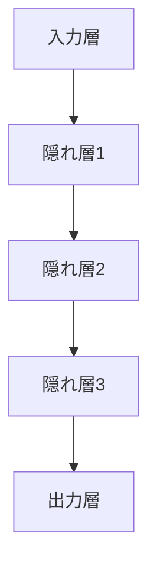

# 機械学習とディープラーニングの違い

## はじめに

機械学習とディープラーニングは、AI の重要な技術として注目されています。この章では、両者の違いについて、わかりやすく説明していきます。

## 機械学習とは

機械学習は、データから学習し、パターンを見つけ出す技術です。

### 主な特徴

1. データから学習

   - 過去のデータを分析
   - パターンを発見
   - 予測モデルを構築

2. 学習方法

   - 教師あり学習
   - 教師なし学習
   - 強化学習

3. 適用分野
   - 予測分析
   - 分類問題
   - クラスタリング

## ディープラーニングとは

ディープラーニングは、機械学習の一種で、人間の脳の神経回路を模倣した技術です。

### 主な特徴

1. 多層構造

   - 入力層
   - 隠れ層（複数）
   - 出力層

2. 学習方法

   - バックプロパゲーション
   - 勾配降下法
   - 特徴の自動抽出

3. 適用分野
   - 画像認識
   - 音声認識
   - 自然言語処理

## 両者の違い

### 1. 構造の違い

機械学習：

ディープラーニング：

### 2. データ量の違い

機械学習：

- 比較的少ないデータ量で学習可能
- 特徴量の設計が重要
- 計算リソースの要求が低い

ディープラーニング：

- 大量のデータが必要
- 特徴量の自動抽出
- 高い計算リソースが必要

### 3. 適用分野の違い

機械学習：

- 構造化データの分析
- 予測モデルの構築
- クラスタリング

ディープラーニング：

- 非構造化データの処理
- 画像・音声認識
- 自然言語処理

## 実際の使用例

### 1. 機械学習の例

- 顧客の購買予測
- スパムメールの判定
- クレジットカードの不正検知

### 2. ディープラーニングの例

- 画像認識（写真の分類）
- 音声認識（音声から文字への変換）
- 機械翻訳（言語の自動翻訳）

## 選択の基準

### 1. 機械学習を選ぶ場合

- データ量が限られている
- 計算リソースが限られている
- 解釈可能性が重要

### 2. ディープラーニングを選ぶ場合

- 大量のデータがある
- 高い計算リソースがある
- 複雑なパターンの認識が必要

## まとめ

機械学習とディープラーニングは、それぞれ異なる特徴と用途を持っています。適切な技術を選択することで、より効果的な AI システムを構築することができます。
