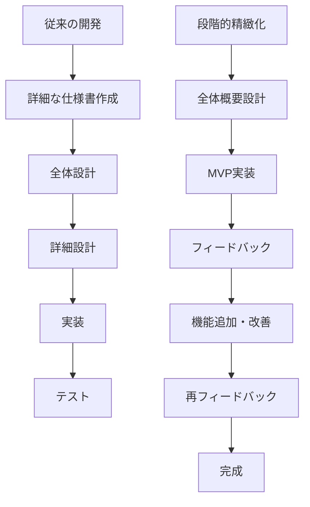
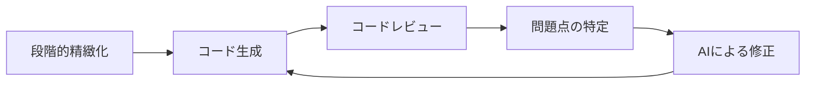

# 段階的精緻化アプローチによる実装

AI駆動開発において、複雑な機能やシステムを実装する際に特に効果的な「段階的精緻化アプローチ」について解説します。このアプローチは、大きな問題を小さなステップに分解し、徐々に詳細化していくことで、より効率的かつ確実に実装を進める手法です。

## 段階的精緻化とは

段階的精緻化（Progressive Refinement）とは、最初に大まかな構想やスケルトンコードから始め、段階的に詳細な実装を加えていく開発手法です。AI駆動開発においては、この手法が AIの特性と非常に相性が良いため、効果的な実装方法として注目されています。

### 従来の開発との違い



従来の開発では、実装前に詳細な仕様書や設計書を作成することが一般的でした。一方、段階的精緻化アプローチでは、全体像を把握した上で、まず動く最小限のプロダクト（MVP: Minimum Viable Product）を作り、そこから徐々に機能を追加・改善していきます。

## AI駆動開発における段階的精緻化の手順

### 1. 全体像の設計

最初に、実装したい機能やシステムの全体像を AIに伝えます。この段階では細部にこだわらず、目的や主要な機能、使用する技術スタックなど、大枠を定義します。

**具体例**：

```
Reactを使用したTodoアプリを開発したいと考えています。
機能としては以下を実装予定です：
- タスクの追加・削除・編集
- タスクの完了状態の切り替え
- タスクのカテゴリ分け
- ローカルストレージでのデータ保存

まずは、このアプリケーションの全体構成と、どのようなコンポーネントが必要になるか提案してください。
```

### 2. スケルトンコードの生成

全体像が固まったら、実際に動くシンプルな骨組み（スケルトンコード）を生成します。この段階では、完全な機能は実装せず、アプリケーションの基本的な構造を作ります。

**具体例**：

```
提案いただいたコンポーネント構成に基づいて、基本的なファイル構造とスケルトンコードを生成してください。
この段階では、UIの基本レイアウトとコンポーネントの相互関係が分かるようにしたいです。
実際のデータ処理ロジックは後で実装するので、簡略化して大丈夫です。
```

### 3. コア機能の実装

スケルトンコードができたら、アプリケーションの中核となる機能を実装します。ここでは最も重要な機能に焦点を当て、他の部分はまだシンプルなままにしておきます。

**具体例**：

```
次に、このTodoアプリの中核機能であるタスクの追加・表示・完了処理を実装したいと思います。
具体的には以下の機能を実装してください：

1. 新しいタスクを入力して追加する機能
2. タスクのリストを表示する機能
3. タスクをクリックして完了状態を切り替える機能

UIはシンプルで構いませんが、これらの機能が正常に動作するようにしてください。
```

### 4. 機能の拡張と改善

コア機能が動くようになったら、追加機能の実装や既存機能の改善・最適化を行います。この段階では、具体的な改善点やエッジケースへの対応も含めて指示します。

**具体例**：

```
コア機能が実装できたので、次にタスクの編集と削除機能を追加したいと思います。
また、以下の改善点も実装してください：

1. タスク編集時にモーダルウィンドウを表示する
2. 削除前に確認ダイアログを表示する
3. 空のタスクが追加できないようにバリデーションを追加
4. 完了したタスクと未完了タスクを視覚的に区別する

さらに、現在のコードで改善できる点があれば提案してください。
```

### 5. 詳細な機能とエッジケースへの対応

基本機能が揃ったら、より詳細な機能やエッジケース、ユーザビリティの向上などに取り組みます。この段階では、細部にわたる指示とフィードバックが重要です。

**具体例**：

```
アプリケーションの基本機能は整いましたが、以下のエッジケースと追加機能に対応したいと思います：

1. ブラウザをリロードしてもデータが保持されるようにローカルストレージを実装
2. タスクが多い場合のパフォーマンス最適化（仮想スクロールなど）
3. タスクの期限設定機能と期限切れの表示
4. ダークモード/ライトモードの切り替え機能

また、現在のコードでのパフォーマンスやメモリリークなどの潜在的な問題点があれば指摘してください。
```

## 段階的精緻化のコツと注意点

### AIへの効果的な指示出し

段階的精緻化で重要なのは、各段階で適切な指示を出すことです。以下のポイントを押さえましょう：

1. **段階ごとに焦点を絞る**：一度に全ての機能を実装しようとせず、各段階で扱う範囲を明確にします。
2. **前の段階のコードを提示する**：新しい指示を出す際は、前の段階で生成されたコードを提示し、それを基に拡張するように依頼します。
3. **具体的なフィードバックを与える**：「うまく動かない」ではなく「〇〇の機能で ×× というエラーが発生する」など、具体的な情報を提供します。

### コード品質の確保

AIはスピード感のある開発をサポートしますが、コード品質を維持するための工夫も必要です：



1. **各段階でのレビュー**：生成されたコードを必ず確認し、問題点や改善点を特定します。
2. **テストの要求**：各機能実装後にはテストコードの生成も依頼し、機能の正常性を確認します。
3. **リファクタリングの意識**：機能が増えてきたら、コードの重複や複雑な部分のリファクタリングも依頼します。

### スケーラビリティの考慮

段階的に機能を追加していくと、初期設計の制約にぶつかることがあります。以下のポイントに注意しましょう：

1. **拡張性を考慮した初期設計**：将来的な機能追加を見越した設計を意識します。
2. **状態管理の適切な選択**：小規模から始めても、将来的な拡張に対応できる状態管理方法を選びます。
3. **モジュール化と分離**：機能ごとにモジュールを分離し、相互依存を減らします。

## 段階的精緻化の実践例

### Web アプリケーション開発の場合

以下は、Web アプリケーション開発における段階的精緻化の実践例です：

#### 段階 1：基本設計とスケルトン実装

AIに全体像を伝え、基本的なページレイアウトとルーティング構造を生成します。

```
React、TypeScript、React Routerを使用したブログサイトを開発したいと考えています。
以下のページが必要です：
- ホームページ（記事一覧）
- 記事詳細ページ
- About Us ページ
- お問い合わせフォーム

まずは、これらのページの基本的なコンポーネント構造とルーティング設定を生成してください。
```

#### 段階 2：データモデルと主要機能の実装

基本構造ができたら、データモデルと主要な機能を実装します。

```
ブログ記事のデータモデルと、記事一覧・詳細表示の機能を実装したいと思います。
現時点ではモックデータを使用し、以下の機能を実装してください：

1. 記事リストの表示（タイトル、サマリー、日付）
2. 記事詳細ページの表示（タイトル、内容、著者情報、日付）
3. ホームページから詳細ページへのナビゲーション

TypeScriptの型定義もしっかり行ってください。
```

#### 段階 3：UI の改善とインタラクション追加

基本機能が実装できたら、UI の改善とインタラクションを追加します。

```
基本機能が実装できたので、次にUIの改善とユーザーインタラクションを追加したいと思います：

1. レスポンシブデザインの実装（モバイル、タブレット、デスクトップ対応）
2. 記事のカテゴリ別フィルタリング機能
3. 最新記事のハイライト表示
4. 記事の「いいね」ボタンと「シェア」機能

また、Tailwind CSSを使用してスタイリングを改善してください。
```

#### 段階 4：バックエンド連携とデータの永続化

UI が整ったら、実際のバックエンド API との連携や状態管理を実装します。

```
モックデータからAPIデータに移行したいと思います。以下の実装をお願いします：

1. axios/fetchを使用したREST APIとの通信機能
2. ローディング状態とエラーハンドリング
3. React Queryを使用したデータキャッシュ
4. ユーザー認証（ログイン/ログアウト）機能

APIエンドポイントは以下を想定しています：
[APIエンドポイントの詳細]
```

#### 段階 5：パフォーマンス最適化とエッジケース対応

最後に、パフォーマンスの最適化やエッジケースへの対応を行います。

```
アプリケーションの基本機能は整いましたが、以下の最適化とエッジケース対応をお願いします：

1. React.memoを使用したコンポーネントの最適化
2. Code Splittingによる初期ロード時間の改善
3. オフラインサポート（ServiceWorker）
4. アクセシビリティ対応（ARIA属性など）
5. SEO対策（メタタグ、構造化データ）

また、E2Eテスト（Cypress）とユニットテスト（Jest）も実装してください。
```

## 段階的精緻化のメリット

1. **オーバーエンジニアリングの防止**：必要な機能から着手するため、過剰な設計を避けられます。
2. **早期のフィードバック**：早い段階で動くものができるため、方向性の修正が容易です。
3. **複雑さの管理**：一度に扱う複雑さが限定されるため、理解しやすいコードになります。
4. **AI能力の最大活用**：AIは全体像を把握した上で段階的に詳細化することが得意です。
5. **学習効果**：段階的に機能が追加される過程を見ることで、コードの発展を理解しやすくなります。

## まとめ

段階的精緻化アプローチは、AI駆動開発において複雑な実装を効率的に進めるための強力な手法です。大きな問題を小さなステップに分解し、徐々に詳細化していくことで、AIの能力を最大限に活用できます。

このアプローチを実践する際は、各段階で適切な指示を出し、生成されたコードをしっかりレビューすることが重要です。また、初期段階から拡張性を考慮した設計を心がけることで、後の段階での変更が容易になります。

段階的精緻化は、特に初心者のエンジニアが AIを活用して複雑なプロジェクトに取り組む際に、とても有効なアプローチです。小さな成功体験を積み重ねながら、徐々に完成度の高いシステムを構築していきましょう。
