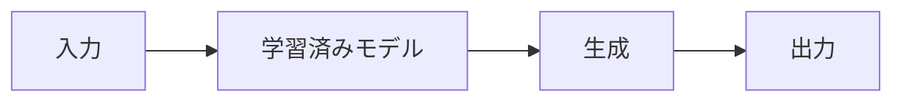

# 生成 AI の仕組みと特徴

## はじめに

生成 AI は、テキスト、画像、音声などを生成する AI 技術です。この章では、生成 AI の基本的な仕組みと特徴について説明していきます。

## 生成 AI とは

生成 AI は、与えられた条件に基づいて、新しいコンテンツを生成する AI 技術です。

### 主な特徴

1. コンテンツ生成

   - テキスト生成
   - 画像生成
   - 音声生成
   - 動画生成

2. 学習方法

   - 大量のデータから学習
   - パターンの理解
   - 創造的な出力

3. 応用分野
   - コンテンツ作成
   - デザイン支援
   - エンターテイメント

## 生成 AI の仕組み

### 1. 基本的な仕組み

### 2. 学習プロセス

1. データ収集

   - 大量のデータを収集
   - データの前処理
   - 品質の確保

2. モデル学習

   - パターンの学習
   - 特徴の抽出
   - 生成ルールの確立

3. 生成プロセス
   - 入力の解析
   - パターンの適用
   - 出力の生成

## 生成 AI の種類

### 1. テキスト生成 AI

特徴：

- 自然な文章の生成
- 文脈の理解
- 多言語対応

例：

- ChatGPT
- GPT-4
- BERT

### 2. 画像生成 AI

特徴：

- リアルな画像の生成
- スタイルの変換
- 画像の編集

例：

- DALL-E
- Midjourney
- Stable Diffusion

### 3. 音声生成 AI

特徴：

- 自然な音声の生成
- 感情の表現
- 多言語対応

例：

- WaveNet
- Tacotron
- VALL-E

## 生成 AI の特徴

### 1. 長所

- 創造的な出力
- 大量のコンテンツ生成
- カスタマイズ可能
- 時間の節約

### 2. 短所

- 品質のばらつき
- 倫理的な問題
- 著作権の問題
- 誤情報の生成

## 生成 AI の活用例

### 1. ビジネス

- マーケティングコンテンツの作成
- デザインの自動生成
- カスタマーサポートの自動化

### 2. エンターテイメント

- ゲームのキャラクター生成
- 音楽の作曲
- アニメーションの作成

### 3. 教育

- 教材の作成
- 問題の生成
- 学習支援

## 生成 AI の課題

### 1. 技術的な課題

- 生成品質の向上
- 計算リソースの最適化
- リアルタイム生成の実現

### 2. 社会的な課題

- 著作権の保護
- 誤情報の防止
- 倫理的な使用

## まとめ

生成 AI は、様々な分野で革新的な可能性を秘めています。ただし、その活用には、技術的な理解と社会的な配慮が必要です。適切に活用することで、より創造的な未来を実現することができます。
