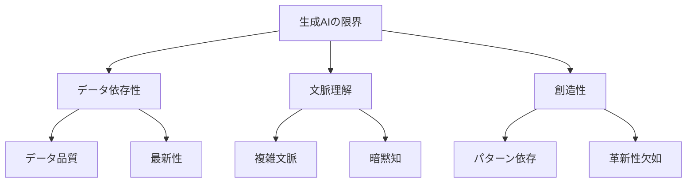

# 生成 AIの限界と弱点領域

## 生成 AIの基本的な限界

生成 AIは強力なツールですが、いくつかの基本的な限界があります。これらの限界を理解することで、より効果的に AIを活用できます。

### 1. データ依存性

- 学習データの品質と量に依存
- 最新情報の欠如
- 特定ドメインの知識不足
- データバイアスの影響

### 2. 文脈理解の制限

- 複雑な文脈の理解が困難
- 暗黙知の処理が限定的
- 文化的背景の理解が不十分
- 曖昧な指示の解釈が困難

### 3. 創造性の制約

- 真の創造性の欠如
- 既存パターンの組み合わせ
- 革新的な解決策の生成が困難
- 独創的なアイデアの創出が限定的

## 技術的な弱点領域

### 1. コード生成の弱点

**アルゴリズムの実装**:

- 複雑なアルゴリズムの理解が困難
- 最適化の判断が不十分
- エッジケースの考慮が限定的
- パフォーマンス最適化が不十分

**アーキテクチャ設計**:

- 大規模システムの設計が困難
- スケーラビリティの考慮が不十分
- セキュリティ設計が限定的
- 保守性の考慮が不十分

### 2. テスト生成の弱点

**テストカバレッジ**:

- エッジケースの特定が困難
- 複雑な条件のテストが不十分
- 統合テストの生成が限定的
- パフォーマンステストの生成が困難

**テスト品質**:

- テストの有効性の判断が困難
- テストの保守性の考慮が不十分
- テストデータの生成が限定的
- テスト環境の考慮が不十分

### 3. ドキュメント生成の弱点

**技術文書**:

- 複雑な技術の説明が困難
- 専門用語の適切な使用が限定的
- 図表の生成が不十分
- 更新履歴の管理が困難

**ユーザードキュメント**:

- ユーザー視点の理解が限定的
- インタラクションの説明が不十分
- エラー処理の説明が困難
- 多言語対応が限定的

## 実践的な制限

### 1. 開発プロセスでの制限

**要件定義**:

- 曖昧な要件の明確化が困難
- 非機能要件の考慮が不十分
- ステークホルダーの要望の理解が限定的
- 競合要件の調整が困難

**設計段階**:

- 大規模システムの設計が困難
- パフォーマンス要件の考慮が不十分
- セキュリティ設計が限定的
- 拡張性の考慮が不十分

### 2. 品質管理での制限

**コード品質**:

- 複雑なコードの理解が困難
- リファクタリングの判断が限定的
- コードの保守性の評価が不十分
- パフォーマンスの最適化が困難

**テスト品質**:

- テストの有効性の評価が困難
- テストカバレッジの判断が限定的
- テストの保守性の評価が不十分
- テスト環境の考慮が困難

## 限界への対応策

### 1. 技術的な対応

**コード生成**:

- 人間によるレビューの強化
- 自動テストの充実
- コード品質ツールの活用
- 継続的な改善プロセス

**テスト生成**:

- テスト戦略の明確化
- テストカバレッジの監視
- テストの自動化
- テスト環境の整備

### 2. プロセスの改善

**開発プロセス**:

- 要件定義の明確化
- 設計レビューの強化
- 品質管理の徹底
- 継続的改善の実施

**品質管理**:

- コードレビューの強化
- テストの自動化
- 品質メトリクスの監視
- フィードバックループの確立

## まとめ

生成 AIには、データ依存性、文脈理解の制限、創造性の制約などの基本的な限界があります。また、コード生成、テスト生成、ドキュメント生成などの技術的な弱点領域も存在します。

これらの限界に対応するためには、以下の点が重要です：

1. 限界の理解と認識
2. 適切な対応策の実施
3. 人間によるレビューの強化
4. 継続的な改善プロセス

生成 AIの限界を理解し、適切に対応することで、より効果的な AI駆動開発を実現できます。
