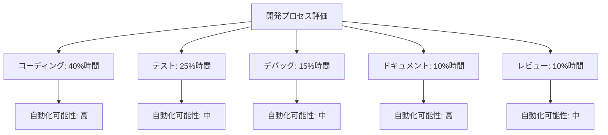
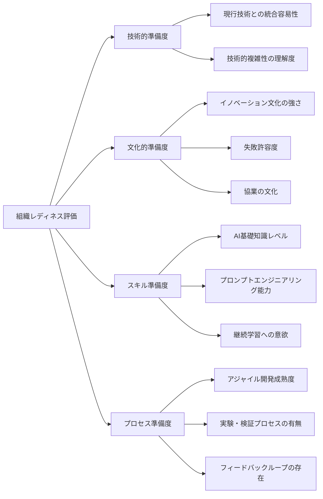
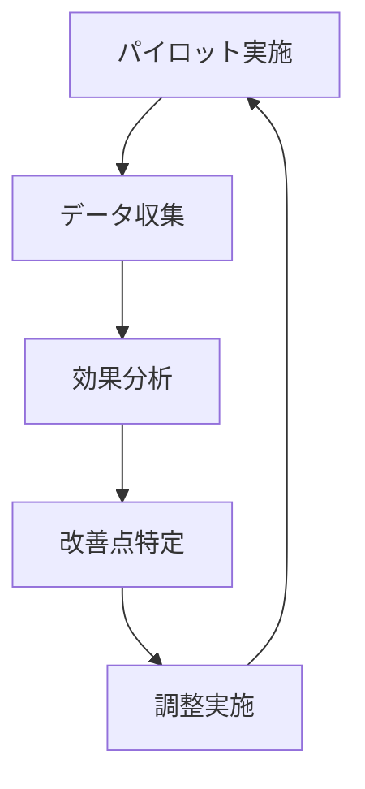
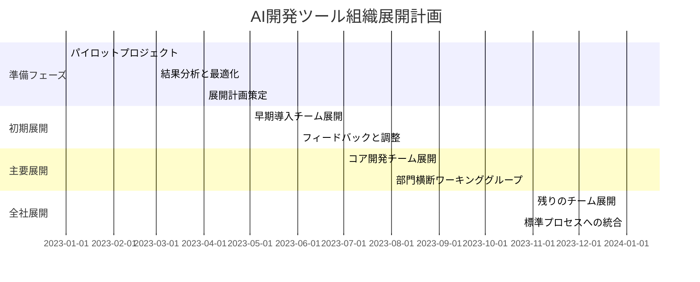
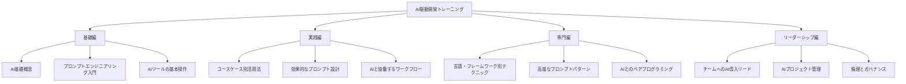
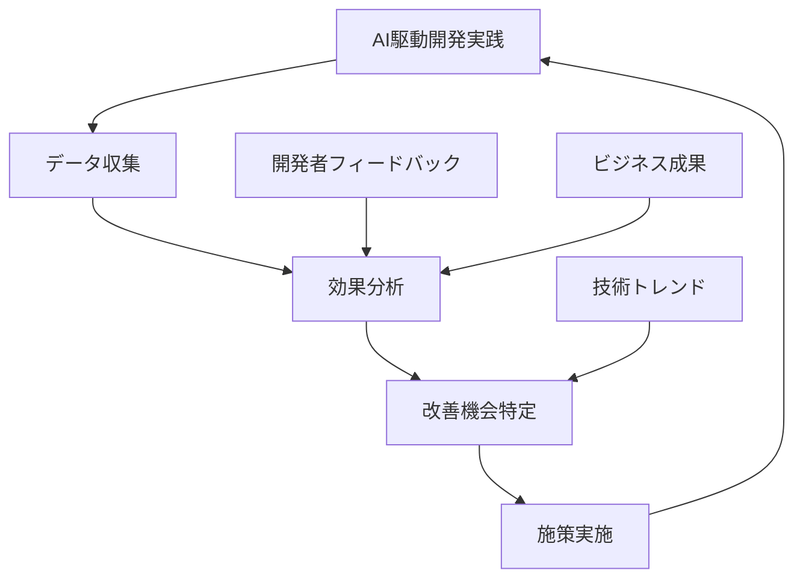

# 組織への AIツール導入ステップ

## AI駆動開発の組織的導入

AI駆動開発の効果を最大限に発揮するためには、個人レベルの活用を超えて組織全体への計画的な導入が必要です。単に最新ツールを導入するだけでなく、組織文化、プロセス、人材育成を含めた総合的なアプローチが成功への鍵となります。

本章では、組織への AIツール導入を成功させるための段階的なステップと各段階での具体的な実施項目を解説します。

## 導入前の準備と現状分析

### 現状評価とニーズ分析

組織への AIツール導入の第一歩は、現在の開発プロセスを客観的に評価し、AIがどのように価値を提供できるかを明確にすることです。

**実施項目**:

- **開発プロセスの可視化**: 現在の開発フローを詳細にマッピングし、ボトルネックや非効率な部分を特定する
- **時間分析**: 開発者がどのタスクにどれだけの時間を費やしているかを定量的に測定する
- **期待効果の定義**: AI導入によって改善したい具体的な指標（開発速度、品質、コスト等）を設定する

**評価マトリックスの例**:

### 技術環境の評価

既存の技術スタックやインフラストラクチャと AIツールの互換性を評価し、必要な準備を行います。

**実施項目**:

- **技術スタック分析**: 使用言語、フレームワーク、ツールチェーンと AIツールの互換性確認
- **セキュリティ要件の整理**: 組織のセキュリティポリシーと AIツール利用の両立性評価
- **インフラ要件の特定**: 必要なハードウェア、ネットワーク、クラウドリソースの特定

**技術環境チェックリスト例**:

- □ 開発環境が AIツールと互換性があるか
- □ コードホスティングプラットフォームとの統合が可能か
- □ ネットワーク環境（プロキシ、ファイアウォール等）の対応が必要か
- □ エンタープライズレベルのセキュリティ要件を満たせるか
- □ オンプレミス/プライベートクラウド要件があるか

### 組織文化とレディネス評価

AIツール導入の成功には、技術面だけでなく組織文化や人材の準備状況も重要です。

**実施項目**:

- **変化への適応度測定**: 組織の新技術受容性や変化への適応能力を評価
- **スキルギャップ分析**: 現在のチームスキルと AI活用に必要なスキルのギャップを特定
- **潜在的な抵抗の予測**: AIツール導入に対する懸念や抵抗の可能性を特定し対策を準備

**組織レディネス評価フレームワーク**:

## パイロットプロジェクトの実施

### パイロット範囲の選定

全社導入の前に、限定的なパイロットプロジェクトで効果を検証します。

**実施項目**:

- **適切なプロジェクト選定**: AIの効果が測定しやすく、リスクが限定的なプロジェクトを選ぶ
- **明確な目標設定**: パイロットで達成したい具体的な成果と評価基準を定義する
- **参加者の選定**: 技術的好奇心が高く、変化に前向きなチームメンバーを選定する

**選定基準の例**:

- 中規模プロジェクト（大きすぎず小さすぎない）
- ビジネスクリティカルではないが、価値のある成果物
- 多様な開発タスクを含む（コーディング、テスト、ドキュメント等）
- タイムラインに余裕があり、学習曲線を許容できる

### パイロット実施と測定

パイロットプロジェクトを通じて、AIツールの効果を客観的に評価します。

**実施項目**:

- **ベースライン測定**: AI導入前の開発メトリクスを測定（開発速度、品質、工数等）
- **段階的導入**: 簡単なユースケースから始め、徐々に複雑なタスクへ適用範囲を広げる
- **定期的振り返り**: 週次や隔週でのレトロスペクティブで課題と効果を議論する
- **データ収集**: 定量的・定性的データを体系的に収集し、効果を測定する

**測定指標の例**:

- 開発速度（機能実装時間、リリースサイクル）
- コード品質（バグ数、技術的負債）
- 開発者体験（満足度、学習曲線）
- ビジネスインパクト（コスト削減、価値創出）

### 知見の収集と最適化

パイロットから得られた学びを整理し、本格導入に向けた最適化を行います。

**実施項目**:

- **成功パターンの特定**: 特に効果が高かった AI活用シナリオを特定
- **課題の整理**: 発生した技術的・文化的障害を分析
- **プロンプトライブラリの構築**: 効果的だったプロンプトやテクニックを文書化
- **チューニングと最適化**: ツール設定やワークフローの改善

**最適化サイクル**:

## 組織全体への展開計画

### 段階的ロールアウト戦略

パイロットの成功を踏まえ、組織全体への展開計画を策定します。

**実施項目**:

- **展開フェーズの設計**: チームや部門ごとの段階的導入計画
- **スケールに伴う課題予測**: 大規模展開で発生しうる課題の予測と対策
- **成功指標の設定**: 各フェーズでの具体的な成功基準を設定
- **フィードバックループの確立**: 継続的な改善を可能にする仕組みづくり

**ロールアウトプラン例**:

### ガバナンスとポリシーの確立

AIツール活用の一貫性と適切性を確保するためのガバナンス体制を整備します。

**実施項目**:

- **利用ガイドライン策定**: 適切な AIツール利用のためのルールとベストプラクティス
- **セキュリティポリシー策定**: 機密情報保護や知的財産管理のポリシー
- **意思決定フレームワーク**: AI生成コードの採用判断や品質保証の枠組み
- **モニタリング体制**: 利用状況や効果を継続的に測定する仕組み

**ガイドライン項目例**:

- AIへの入力に関するルール（機密情報、個人情報の取扱い）
- 生成コードのレビュープロセス
- ライセンスとコンプライアンスの確認手順
- リスク管理と問題発生時の対応フロー

### インフラストラクチャとツール整備

組織全体での AIツール活用を支えるインフラを整備します。

**実施項目**:

- **ライセンス管理**: 適切なライセンス計画と管理体制の構築
- **統合環境の整備**: 既存の開発環境やツールチェーンとの統合
- **プライベートモデルの検討**: 必要に応じてプライベート AIモデルの導入
- **モニタリングツール**: 利用状況や効果測定のためのダッシュボード整備

**インフラ整備チェックリスト**:

- □ ライセンス管理システムの構築
- □ シングルサインオン (SSO) との統合
- □ ネットワーク帯域とレイテンシの最適化
- □ セキュリティ監視体制の構築
- □ バックアップと障害復旧計画

## 人材育成とチェンジマネジメント

### トレーニングプログラムの開発

AIツールを効果的に活用するためのスキル開発プログラムを構築します。

**実施項目**:

- **役割別トレーニング**: 開発者、リーダー、管理者など役割別の教育プログラム
- **スキルマップ構築**: AI駆動開発に必要なスキルの体系化と習得計画
- **学習リソース整備**: ドキュメント、チュートリアル、実践演習の準備
- **継続学習の仕組み**: 常に進化する AI技術に対応するための継続学習体制

**トレーニングプログラム構成例**:

### チェンジマネジメント戦略

新しい AIツールと働き方への移行をスムーズに進めるための変革管理を行います。

**実施項目**:

- **コミュニケーション計画**: 導入目的や期待効果の透明な共有
- **エバンジェリスト育成**: 組織内で AI活用を推進するチャンピオンの育成
- **成功事例の可視化**: 初期の成功事例を組織内で共有し、モチベーションを高める
- **懸念への対応**: AIに対する不安や抵抗感への丁寧な対応

**コミュニケーション戦略の例**:

- 定期的なタウンホールミーティングでの進捗共有
- 「AIアイデアジャム」でのユースケース発掘ワークショップ
- 内部ブログやニュースレターでの成功事例紹介
- Q&A セッションや相談窓口の設置

### コミュニティ構築と知識共有

組織内での AI活用知識の蓄積と共有を促進する文化とプラットフォームを構築します。

**実施項目**:

- **実践コミュニティ (CoP) 設立**: AI駆動開発の実践者コミュニティの構築
- **知識リポジトリ整備**: 効果的なプロンプトやパターンのライブラリ作成
- **定期的な共有セッション**: ベストプラクティスや学びを共有する場の設定
- **メンタリング制度**: 経験者から初心者へのサポート体制構築

**知識共有プラットフォームの例**:

- 社内 Wiki によるプロンプトライブラリとベストプラクティス集
- Slack チャンネルでの日常的な質問対応と情報共有
- 月例の AI駆動開発勉強会
- ハッカソンやコンテストによる創造的活用の促進

## 効果測定と継続的改善

### KPI の設定と測定

AI駆動開発の効果を客観的に評価するための指標を設定し、継続的に測定します。

**実施項目**:

- **定量的指標の設定**: 生産性、品質、コスト等の測定可能な指標の設定
- **基準値の確立**: AI導入前の値を基準としたベンチマーク設定
- **測定システムの構築**: データ収集と分析の自動化
- **ダッシュボード作成**: 経営層や関係者が理解しやすい形での可視化

**KPI 例**:

- 開発速度: 機能実装時間の短縮率
- コード品質: バグ発生率の変化
- 開発者生産性: 一定期間内の成果物量
- コスト効率: 開発コスト削減率
- 開発者満足度: エンゲージメントスコアの変化

### フィードバックループの確立

継続的な改善のためのフィードバック収集と反映の仕組みを構築します。

**実施項目**:

- **定期的なレビュー**: 四半期ごとなど定期的な効果検証と方針見直し
- **ユーザーフィードバック**: 開発者からの定期的なフィードバック収集
- **改善提案制度**: AIツール活用の改善アイデアを募集する仕組み
- **アダプティブガバナンス**: 状況変化に応じてガイドラインを柔軟に更新

**フィードバックサイクル**:

### スケーリングと高度化

成功パターンの横展開と、より高度な AI活用へのステップアップを計画します。

**実施項目**:

- **成功事例の標準化**: 効果が実証された活用パターンの標準プロセス化
- **応用領域の拡大**: 新しい開発領域やユースケースへの適用拡大
- **高度な活用への移行**: より複雑なタスクやプロジェクト全体への AI適用
- **新技術の評価と導入**: 進化する AI技術の継続的な評価と取り込み

**高度化ロードマップの例**:

- フェーズ 1: 個別タスク効率化（コード生成、テスト等）
- フェーズ 2: ワークフロー統合（CI/CD パイプライン、レビュー自動化）
- フェーズ 3: プロジェクト全体最適化（要件定義からデプロイまで）
- フェーズ 4: 組織レベルの知識活用と最適化

## 導入の成功事例と教訓

### 成功事例：大手金融機関での AI開発ツール導入

あるグローバル金融機関は、2000 人以上の開発者を抱える組織全体に AI駆動開発を導入し、大きな成果を上げました。

**アプローチのポイント**:

- セキュリティとコンプライアンスを最優先したガバナンス設計
- 10 チームでの段階的パイロットと効果測定
- コードレビュー効率化から始め、徐々に適用範囲を拡大
- AI専門家と開発リーダーからなる横断チームの設置

**成果**:

- コードレビュー時間が 40%削減
- バグ発見率が 25%向上
- 新規機能の市場投入時間が 30%短縮
- 開発者満足度スコアが 15 ポイント上昇

### 教訓：製造業ソフトウェア部門での導入課題と解決策

ある製造業の社内ソフトウェア開発部門では、初期の AIツール導入で課題に直面しましたが、アプローチを修正して成功に転じた事例です。

**直面した課題**:

- AIツールへの過度の期待と現実とのギャップ
- 部門による採用率の大きな差異
- セキュリティポリシーとの衝突
- 初期トレーニング不足による誤用

**解決策**:

- 現実的な期待値設定と段階的成功の可視化
- 部門特性に合わせたカスタマイズアプローチ
- セキュリティチームを早期から巻き込んだポリシー策定
- ハンズオン形式の実践的トレーニングプログラム刷新

## 導入における注意点と対策

### データセキュリティとプライバシー

AIツール導入における最重要課題の一つがセキュリティとプライバシーです。

**主なリスクと対策**:

- **機密情報の漏洩リスク**

  - プライベート AIモデルやオンプレミスソリューションの検討
  - AIツールに送信する情報の明確なガイドライン策定
  - センシティブコードの自動検出と警告システム

- **知的財産の保護**
  - AIベンダーの利用規約と知的財産ポリシーの詳細確認
  - 生成コードの権利関係の明確化
  - 法務部門と連携したリスク評価と対策

### 変化への抵抗と文化的課題

新しい技術導入における人的・文化的側面は成功の鍵となります。

**主な課題と対策**:

- **「AIが仕事を奪う」不安**

  - AIをスキル強化ツールとして位置づける明確なメッセージング
  - より創造的な仕事への時間創出としての価値訴求
  - キャリア発展機会の提示

- **従来の働き方への固執**
  - 小さな成功体験の積み重ねによる信頼構築
  - インフルエンサー活用による文化変革の促進
  - 変化を促進する評価・報酬制度の検討

### 依存性リスクと長期戦略

AIツールへの過度の依存がもたらすリスクを認識し、対策を講じることが重要です。

**主なリスクと対策**:

- **ベンダーロックインリスク**

  - マルチベンダー戦略の検討
  - データとプロンプトの可搬性確保
  - 代替手段の維持

- **スキル低下リスク**
  - AIとの協働を通じた学習促進
  - 基礎スキル維持のための施策
  - 批判的思考と AI出力評価能力の育成

## まとめ

組織への AIツール導入は、単なるツール選定や技術導入ではなく、人材、プロセス、文化を含めた総合的な取り組みです。段階的アプローチと継続的改善のマインドセットを持ち、以下のポイントを押さえることが成功への鍵となります：

1. **現状分析に基づく明確な目標設定**
2. **パイロットプロジェクトによる効果検証と最適化**
3. **計画的な組織展開とガバナンス確立**
4. **人材育成とチェンジマネジメントの重視**
5. **効果測定と継続的改善の仕組み構築**

AI駆動開発への移行は一朝一夕に完了するものではなく、組織の継続的な進化の一環として捉えることが重要です。技術の進化に合わせて柔軟に適応し、常に学び続ける組織文化を育みながら、AIツールの真の価値を引き出していきましょう。
