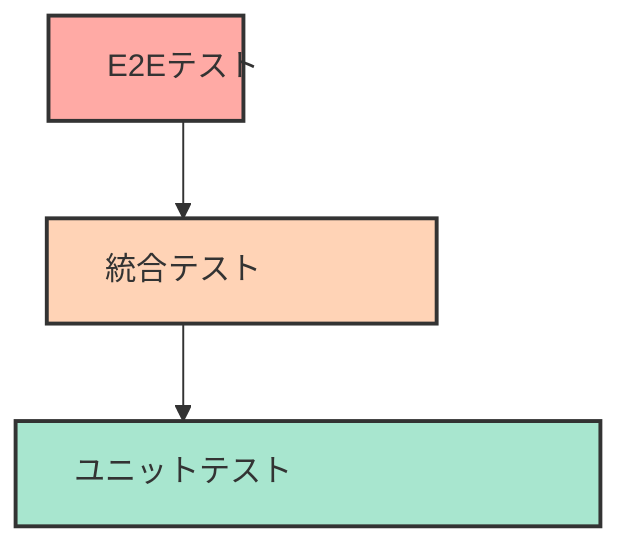
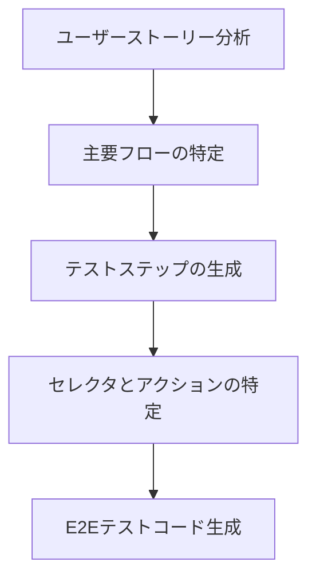

# 統合・E2E テストの自動化

## はじめに

ソフトウェア開発において、単体テスト（ユニットテスト）だけでは捉えきれない複数コンポーネント間の連携や、システム全体の動作を確認するためには、統合テストとエンドツーエンド（E2E）テストが不可欠です。しかし、これらのテストは構築と維持が複雑で時間がかかることが課題でした。AI 駆動開発の手法を活用することで、統合テストと E2E テストの自動化を効率的に実現し、より堅牢なソフトウェア開発が可能になります。この章では、AI を活用した統合テストと E2E テストの自動化について解説します。

## 統合テストと E2E テストの基本

### 統合テストとは

統合テストは、複数のコンポーネントが連携して正しく動作するかを検証するテストです。例えば、データベースとのやり取りを行うサービスレイヤーと、そのサービスを使用するコントローラーの連携をテストします。

### E2E テストとは

エンドツーエンド（E2E）テストは、実際のユーザーが使用するのと同様にシステム全体を通してテストする方法です。例えば、Web アプリケーションであれば、ブラウザを自動操作して実際のユーザーの行動を模倣し、期待通りの結果が得られるかを確認します。

### テストピラミッドにおける位置づけ

テストピラミッドは、ソフトウェアテストの構造を示す概念で、以下のように構成されます：



- **ベース（広い領域）**: ユニットテスト - 実行が速く、メンテナンスも容易
- **中間層**: 統合テスト - コンポーネント間の連携を検証
- **頂点（狭い領域）**: E2E テスト - システム全体を通した検証だが、実行に時間がかかり、壊れやすい

適切なテスト戦略では、コストと効果のバランスを考慮し、各層のテストを適切に組み合わせることが重要です。

## AI を活用した統合テスト自動化

### 1. テストシナリオの自動生成

AI は、アプリケーションのコードや設計書を分析し、重要な統合ポイントを特定してテストシナリオを自動生成できます。

#### シナリオ生成プロセス


#### プロンプト例

```
以下のサービスクラスとリポジトリクラスの統合テストシナリオを生成してください。
特に、異常系やエッジケースも考慮したテストケースを含めてください。

[サービスクラスのコード]
public class UserService {
    private final UserRepository userRepository;
    private final EmailService emailService;

    public UserService(UserRepository userRepository, EmailService emailService) {
        this.userRepository = userRepository;
        this.emailService = emailService;
    }

    public User registerUser(String username, String email, String password) {
        if (userRepository.findByUsername(username).isPresent()) {
            throw new UserAlreadyExistsException("Username already exists");
        }

        if (userRepository.findByEmail(email).isPresent()) {
            throw new UserAlreadyExistsException("Email already in use");
        }

        User newUser = new User(username, email, password);
        User savedUser = userRepository.save(newUser);

        emailService.sendWelcomeEmail(email, username);

        return savedUser;
    }
}

[リポジトリインターフェースのコード]
public interface UserRepository {
    Optional<User> findByUsername(String username);
    Optional<User> findByEmail(String email);
    User save(User user);
}
```

AI が生成するテストシナリオ例：

1. 正常系: 新規ユーザー登録が成功するケース
2. 異常系: ユーザー名が既に存在する場合
3. 異常系: メールアドレスが既に使用されている場合
4. 異常系: メール送信に失敗した場合の挙動
5. エッジケース: 境界値パラメータ（空文字列など）での動作

### 2. モックとスタブの自動生成

統合テストでは、外部依存（データベースや API など）をモックやスタブで置き換えることがあります。AI はこれらのコードを自動生成できます。

```java
// AIが生成したモックコード例
@ExtendWith(MockitoExtension.class)
class UserServiceIntegrationTest {

    @Mock
    private UserRepository userRepository;

    @Mock
    private EmailService emailService;

    @InjectMocks
    private UserService userService;

    @Test
    void testRegisterUser_Success() {
        // Arrange
        String username = "testuser";
        String email = "test@example.com";
        String password = "password123";

        when(userRepository.findByUsername(username)).thenReturn(Optional.empty());
        when(userRepository.findByEmail(email)).thenReturn(Optional.empty());
        when(userRepository.save(any(User.class))).thenAnswer(i -> i.getArgument(0));
        doNothing().when(emailService).sendWelcomeEmail(email, username);

        // Act
        User result = userService.registerUser(username, email, password);

        // Assert
        assertNotNull(result);
        assertEquals(username, result.getUsername());
        assertEquals(email, result.getEmail());

        verify(userRepository).findByUsername(username);
        verify(userRepository).findByEmail(email);
        verify(userRepository).save(any(User.class));
        verify(emailService).sendWelcomeEmail(email, username);
    }

    @Test
    void testRegisterUser_UsernameAlreadyExists() {
        // Arrange
        String username = "existinguser";
        String email = "test@example.com";
        String password = "password123";

        when(userRepository.findByUsername(username)).thenReturn(Optional.of(new User()));

        // Act & Assert
        assertThrows(UserAlreadyExistsException.class, () ->
            userService.registerUser(username, email, password)
        );

        verify(userRepository).findByUsername(username);
        verify(userRepository, never()).save(any(User.class));
        verify(emailService, never()).sendWelcomeEmail(anyString(), anyString());
    }

    // 他のテストケースも同様に実装...
}
```

### 3. テストデータの自動生成

AI は、統合テストに必要なテストデータを分析して自動生成できます。

```java
// AIによるテストデータ生成の例
class TestDataGenerator {

    public static List<User> generateUsers(int count) {
        List<User> users = new ArrayList<>();
        for (int i = 1; i <= count; i++) {
            users.add(new User(
                "user" + i,
                "user" + i + "@example.com",
                "Password" + i + "!"
            ));
        }
        return users;
    }

    public static List<Order> generateOrdersForUser(User user, int count) {
        List<Order> orders = new ArrayList<>();
        for (int i = 1; i <= count; i++) {
            Order order = new Order(user.getId(), LocalDateTime.now().minusDays(i));
            order.addItem(new OrderItem("Product" + i, i * 10.0, 1));
            orders.add(order);
        }
        return orders;
    }
}
```

## AI を活用した E2E テスト自動化

### 1. ユーザーフロー分析と自動テスト生成

AI はアプリケーションの設計書やユーザーストーリーを分析し、重要なユーザーフローを特定して E2E テストを自動生成できます。



#### Cypress を使用した E2E テスト例

```javascript
// AIが生成したCypressテストコード例
describe("User Registration Flow", () => {
  it("should allow a new user to register, login, and view their profile", () => {
    // ユニークなテストデータの生成
    const username = `user${Date.now().toString().slice(-5)}`;
    const email = `${username}@example.com`;
    const password = "Password123!";

    // 登録ページに移動
    cy.visit("/register");

    // フォーム入力とサブミット
    cy.get("#username").type(username);
    cy.get("#email").type(email);
    cy.get("#password").type(password);
    cy.get("#confirmPassword").type(password);
    cy.get('button[type="submit"]').click();

    // 登録成功メッセージの確認
    cy.contains("Registration successful").should("be.visible");

    // ログインページへの遷移
    cy.get('a[href="/login"]').click();

    // ログイン
    cy.get("#username").type(username);
    cy.get("#password").type(password);
    cy.get('button[type="submit"]').click();

    // ダッシュボードへの遷移確認
    cy.url().should("include", "/dashboard");
    cy.contains(`Welcome, ${username}`).should("be.visible");

    // プロフィールページへの遷移
    cy.get('a[href="/profile"]').click();

    // プロフィール情報の確認
    cy.url().should("include", "/profile");
    cy.get("#username").should("have.value", username);
    cy.get("#email").should("have.value", email);
  });
});
```

### 2. UI マッピングの自動化

AI は、アプリケーションの UI 要素を自動的に分析し、適切なセレクタを特定してテストに使用できます。

```javascript
// AIによるUIマッピング自動生成
// プロンプト: 「このHTMLからCypressテスト用のセレクタマッピングを生成してください」

/*
<form id="login-form">
  <div class="form-group">
    <label for="username">Username</label>
    <input type="text" id="username" name="username" required>
  </div>
  <div class="form-group">
    <label for="password">Password</label>
    <input type="password" id="password" name="password" required>
  </div>
  <div class="form-actions">
    <button type="submit" class="btn-primary">Login</button>
    <a href="/forgot-password" class="forgot-link">Forgot Password?</a>
  </div>
</form>
*/

// 生成されるセレクタマッピング
const selectors = {
  loginForm: "#login-form",
  usernameInput: "#username",
  passwordInput: "#password",
  loginButton: 'button[type="submit"]',
  forgotPasswordLink: "a.forgot-link",
};

// 使用例
cy.get(selectors.usernameInput).type("testuser");
cy.get(selectors.passwordInput).type("password123");
cy.get(selectors.loginButton).click();
```

### 3. テスト結果分析と自己修復テスト

AI は、テスト失敗の原因を分析し、テストの自己修復提案を行うことができます。

```javascript
// AIによるテスト失敗分析と修復提案
// エラーログ: 'Failed to find element: #signup-form (waited 4000ms)'

/*
修復提案:
1. セレクタが変更された可能性があります。ページのHTML構造を確認してください。
2. 要素が表示される前にテストが実行されている可能性があります。待機時間を追加してください。
3. ページが正しく読み込まれているか確認してください。

修復コード例:
*/

// 修正前
cy.get("#signup-form").find('input[name="email"]').type("test@example.com");

// 修正後 (複数の戦略を組み合わせ)
cy.visit("/signup"); // 明示的にページにアクセス
cy.wait(1000); // 待機時間を追加
cy.get("form").contains("Sign Up").parent("form").as("signupForm"); // より堅牢なセレクタ戦略
cy.get("@signupForm").find('input[type="email"]').type("test@example.com");
```

## 実践的な統合・E2E テスト自動化ガイド

### 1. フレームワーク選定のポイント

AI は、プロジェクトの要件に最適なテストフレームワークの選定をサポートできます。

| テスト種別 | 人気のフレームワーク                                        | 特徴                                                           |
| ---------- | ----------------------------------------------------------- | -------------------------------------------------------------- |
| 統合テスト | JUnit/TestNG (Java)<br>Jest (JavaScript)<br>pytest (Python) | プログラムコードとして実行<br>ビルドパイプラインに統合しやすい |
| E2E テスト | Cypress<br>Playwright<br>Selenium                           | ブラウザ操作の自動化<br>実際のユーザー体験に近いテスト         |

#### AI によるフレームワーク推奨の例

```
質問: 「主にNode.jsとReactを使用しているプロジェクトに適したE2Eテストフレームワークは？」

AI回答:

以下のフレームワークがおすすめです：

1. **Cypress** - React向けに最適化されており、セットアップが簡単で直感的なAPIを持ちます。
   - 利点: 同じブラウザインスタンス内で実行、開発者体験が優れている
   - 欠点: 複数のブラウザタブのテストが難しい

2. **Playwright** - Microsoftが開発した比較的新しいフレームワークで、複数ブラウザ対応が強み。
   - 利点: 複数ブラウザ対応、モバイル表示のエミュレート機能
   - 欠点: Cypressほど成熟したエコシステムがない

3. **Selenium** - 古くから使われている定番フレームワーク。
   - 利点: 豊富なドキュメントと情報、多言語対応
   - 欠点: セットアップが複雑、実行速度が遅い場合がある

React向けであればCypressが最も学習曲線が緩やかで、開発体験も良好です。
```

### 2. CI/CD パイプライン統合

AI は、テストを CI/CD パイプラインに統合するための設定を支援できます。

```yaml
# AIが生成したGitHub Actionsの設定例
name: E2E Tests

on:
  push:
    branches: [main, develop]
  pull_request:
    branches: [main]

jobs:
  cypress-tests:
    runs-on: ubuntu-latest
    steps:
      - name: Checkout
        uses: actions/checkout@v2

      - name: Setup Node.js
        uses: actions/setup-node@v2
        with:
          node-version: "16"

      - name: Install dependencies
        run: npm ci

      - name: Start application
        run: npm start & npx wait-on http://localhost:3000

      - name: Run Cypress tests
        uses: cypress-io/github-action@v2
        with:
          browser: chrome
          headless: true

      - name: Upload screenshots on failure
        uses: actions/upload-artifact@v2
        if: failure()
        with:
          name: cypress-screenshots
          path: cypress/screenshots

      - name: Upload videos
        uses: actions/upload-artifact@v2
        if: always()
        with:
          name: cypress-videos
          path: cypress/videos
```

### 3. テスト環境の自動構築

統合テストや E2E テストでは、テスト環境の構築が重要です。AI は Docker などを使ったテスト環境の自動構築を支援できます。

```dockerfile
# AIが生成したテスト環境用Dockerfile例
FROM node:16-alpine

WORKDIR /app

# アプリケーション依存関係のインストール
COPY package.json package-lock.json ./
RUN npm ci

# アプリケーションのコピー
COPY . .

# テスト用DBの初期化スクリプト
COPY ./scripts/init-test-db.js ./scripts/

# テスト用ポートの公開
EXPOSE 3000

# テスト環境変数の設定
ENV NODE_ENV=test
ENV DATABASE_URL=mongodb://mongo:27017/testdb
ENV API_URL=http://localhost:3000/api

# テスト実行コマンド
CMD ["npm", "test:e2e"]
```

docker-compose.yml:

```yaml
version: "3"
services:
  app:
    build: .
    ports:
      - "3000:3000"
    depends_on:
      - mongo
    environment:
      - NODE_ENV=test
      - DATABASE_URL=mongodb://mongo:27017/testdb

  mongo:
    image: mongo:4.4
    ports:
      - "27017:27017"
    volumes:
      - mongo-data:/data/db

  e2e-tests:
    build:
      context: .
      dockerfile: Dockerfile.cypress
    depends_on:
      - app
    environment:
      - CYPRESS_baseUrl=http://app:3000
    volumes:
      - ./cypress/screenshots:/app/cypress/screenshots
      - ./cypress/videos:/app/cypress/videos

volumes:
  mongo-data:
```

## 高度な統合・E2E テスト技術

### 1. データ駆動テスト

AI は、様々なテストシナリオで使用するテストデータセットを生成できます。

```javascript
// AIが生成したデータ駆動テストの例（Cypressの場合）
const testCases = [
  { username: "user1", password: "valid123", expectedResult: "success" },
  { username: "user1", password: "invalid", expectedResult: "error" },
  { username: "", password: "valid123", expectedResult: "error" },
  { username: "nonexistent", password: "valid123", expectedResult: "error" },
  {
    username: "user1".repeat(50),
    password: "valid123",
    expectedResult: "error",
  }, // 超長文テスト
];

describe("Login Functionality", () => {
  testCases.forEach((tc) => {
    it(`should handle login with ${tc.username}/${tc.password} and expect ${tc.expectedResult}`, () => {
      cy.visit("/login");

      if (tc.username !== "") {
        cy.get("#username").type(tc.username);
      }

      if (tc.password !== "") {
        cy.get("#password").type(tc.password);
      }

      cy.get('button[type="submit"]').click();

      if (tc.expectedResult === "success") {
        cy.url().should("include", "/dashboard");
        cy.getCookie("authToken").should("exist");
      } else {
        cy.url().should("include", "/login");
        cy.contains("Invalid credentials").should("be.visible");
      }
    });
  });
});
```

### 2. 視覚的回帰テスト

AI は、ビジュアル要素の変更を検出する視覚的回帰テストのコード生成を支援できます。

```javascript
// AIが生成した視覚的回帰テストの例（Cypressとcypress-image-snapshotの組み合わせ）
describe("Visual Regression Tests", () => {
  beforeEach(() => {
    // 一貫した表示のためのセットアップ
    cy.clock(new Date(2023, 5, 15).getTime());
    cy.viewport(1280, 720);
  });

  it("should match homepage snapshot", () => {
    cy.visit("/");
    cy.get(".loading-indicator").should("not.exist");
    cy.document().toMatchImageSnapshot({
      name: "homepage",
      threshold: 0.1, // 10%の差異を許容
    });
  });

  it("should match product details page snapshot", () => {
    cy.visit("/products/1");
    cy.get(".product-image").should("be.visible");
    cy.get(".loading-indicator").should("not.exist");
    cy.document().toMatchImageSnapshot({
      name: "product-details",
      threshold: 0.1,
    });
  });

  it("should match shopping cart snapshot", () => {
    // カートにアイテムを追加
    cy.visit("/products/1");
    cy.get(".add-to-cart-button").click();
    cy.get(".cart-icon").click();

    cy.get(".loading-indicator").should("not.exist");
    cy.document().toMatchImageSnapshot({
      name: "shopping-cart",
      threshold: 0.1,
    });
  });
});
```

### 3. パフォーマンステスト

AI は、アプリケーションのパフォーマンスをテストするコードも生成できます。

```javascript
// AIが生成したパフォーマンステストの例（Lighthouse CIを使用）
describe("Performance Tests", () => {
  it("should meet performance benchmarks for homepage", () => {
    cy.visit("/");
    cy.lighthouse({
      performance: 80,
      accessibility: 90,
      "best-practices": 85,
      seo: 80,
      pwa: 50,
    });
  });

  it("should load product listing page within acceptable time", () => {
    cy.visit("/products");

    // ページロード時間の測定
    cy.window().then((win) => {
      const perfData = win.performance.timing;
      const pageLoadTime = perfData.loadEventEnd - perfData.navigationStart;
      expect(pageLoadTime).to.be.lessThan(3000); // 3秒以内にロードすべき
    });

    // APIレスポンス時間の検証
    cy.intercept("GET", "/api/products").as("productsAPI");
    cy.reload();
    cy.wait("@productsAPI").its("response.duration").should("be.lessThan", 500);
  });
});
```

## 統合・E2E テスト自動化の実践的なヒント

### 1. テストの信頼性を高める工夫

統合・E2E テストを安定させるためのポイント：

1. **明示的な待機**: 要素が表示されるまで適切に待機する

   ```javascript
   // 不安定
   cy.get("#dynamicElement").click();

   // より安定
   cy.get("#dynamicElement").should("be.visible").click();
   ```

2. **テスト分離**: テスト間で状態が漏れないようにする

   ```javascript
   // 各テスト前にデータをリセット
   beforeEach(() => {
     cy.task("resetDb");
     cy.clearCookies();
     cy.clearLocalStorage();
   });
   ```

3. **セレクタの堅牢性**: UI の変更に強いセレクタを使用する

   ```javascript
   // 脆弱 (クラス名が変更される可能性あり)
   cy.get(".submit-button").click();

   // より堅牢
   cy.get('[data-testid="submit-button"]').click();
   ```

4. **テスト再試行戦略**: 断続的な失敗に対処する
   ```javascript
   // Cypressの設定例
   {
     retries: {
       runMode: 2,    // CI環境での再試行回数
       openMode: 1    // 開発環境での再試行回数
     }
   }
   ```

### 2. テスト実行の最適化

テスト実行を高速化するテクニック：

1. **並列実行**: テストを複数のワーカーで実行

   ```yaml
   # GitHub Actionsでのマトリックス並列実行
   jobs:
     e2e-tests:
       strategy:
         matrix:
           containers: [1, 2, 3, 4]
       steps:
         - uses: cypress-io/github-action@v2
           with:
             record: true
             parallel: true
             group: "UI Tests"
   ```

2. **テストの優先順位付け**: 重要なテストを先に実行

   ```javascript
   // 優先度の高いテストには高い優先順位を付ける
   describe('Critical user flows', { tag: '@critical' }, () => {
     it('should allow users to purchase products', () => {
       // 重要なテスト
     });
   });

   // CIで優先順位の高いテストのみを実行
   // package.json
   {
     "scripts": {
       "test:critical": "cypress run --tag '@critical'"
     }
   }
   ```

### 3. テスト結果の分析と可視化

AI は、テスト結果の分析と問題の特定を支援できます。

```javascript
// AIが生成したテスト結果分析ツールの例
const analyzeTestResults = (results) => {
  // 失敗パターンの分析
  const failureTypes = results
    .filter((r) => !r.success)
    .reduce((acc, result) => {
      const errorType = categorizeError(result.error);
      acc[errorType] = (acc[errorType] || 0) + 1;
      return acc;
    }, {});

  // 実行時間の分析
  const slowTests = results
    .filter((r) => r.duration > 5000)
    .sort((a, b) => b.duration - a.duration);

  // フレークーテスト（不安定なテスト）の特定
  const flakeyCandidates = results.filter(
    (r) => r.attemptResults.some((a) => !a.success) && r.success
  );

  return {
    summary: {
      total: results.length,
      passed: results.filter((r) => r.success).length,
      failed: results.filter((r) => !r.success).length,
      totalDuration: results.reduce((sum, r) => sum + r.duration, 0),
    },
    failureTypes,
    slowTests: slowTests.slice(0, 10), // 上位10件
    flakeyCandidates,
  };
};
```

## まとめ

AI を活用した統合・E2E テストの自動化は、以下のような多くのメリットをもたらします：

1. **テスト作成の効率化**: AI によるテストコード生成で開発時間を短縮
2. **テストカバレッジの向上**: 人間が見落としがちなエッジケースの発見
3. **テスト品質の向上**: 構造化された一貫性のあるテスト
4. **メンテナンスコストの削減**: UI の変更に対する自己修復能力
5. **開発ワークフローの効率化**: CI/CD パイプラインとの統合

AI を統合・E2E テスト自動化のアシスタントとして活用することで、より堅牢なアプリケーション開発が可能になります。テストの作成と実行が効率化されることで、開発チームはより多くの時間を創造的な作業に割くことができるようになるでしょう。

最終的には、AI とヒューマンテスターの強みを組み合わせることで、最も効果的なテスト戦略を実現できます。AI がルーチンワークを担当し、人間は直感やユーザー視点を活かした価値のあるテストに集中することで、品質向上と効率化を両立しましょう。
