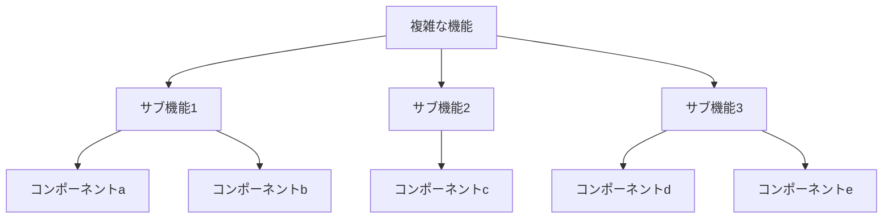
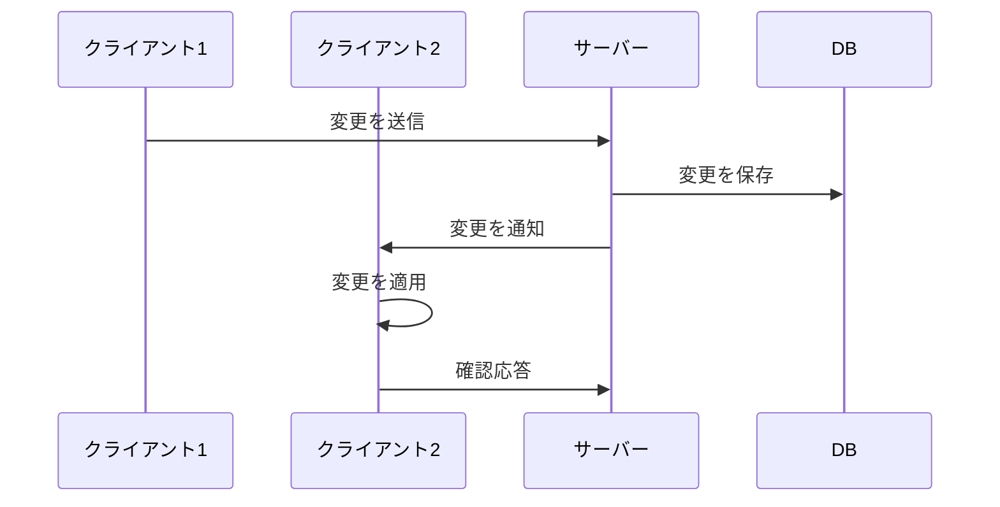
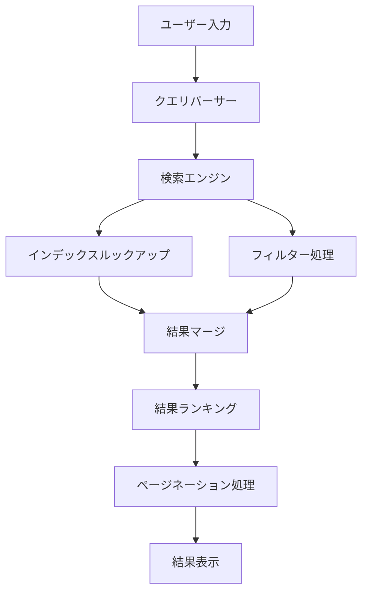

# 複雑な機能の実装支援

## 複雑な機能の実装における課題

ソフトウェア開発において、複雑な機能の実装は大きな課題です。以下のような要素が複雑さを生み出します：

- **多くの条件分岐**: 様々なユースケースに対応するための分岐ロジック
- **状態管理の複雑さ**: アプリケーション全体の状態を正確に把握・制御する難しさ
- **非同期処理の連携**: 複数の非同期操作の結果を適切に統合する難しさ
- **パフォーマンス要件**: 処理速度やメモリ使用量などの制約
- **拡張性とメンテナンス性**: 将来の変更に対応できる柔軟な設計の必要性

これらの課題に直面すると、開発の進捗が遅れたり、バグが増加したりする可能性があります。また、特に経験の浅い開発者にとっては、こうした複雑な機能の実装は大きな壁となることがあります。

## AI による複雑機能実装の支援方法

AI を活用することで、複雑な機能実装の課題に効果的に対応できます。以下にその方法を紹介します。

### 1. 問題の分解とアーキテクチャ設計



AI に複雑な機能を説明し、以下のような支援を得ることができます：

- **機能の分解**: 大きな機能を小さなサブ機能に分割
- **コンポーネント設計**: 責任範囲が明確な独立したコンポーネントの提案
- **インターフェース定義**: コンポーネント間の連携方法や通信インターフェースの設計
- **設計パターン提案**: 問題に適した設計パターンの推奨

**実践例**:

```
以下の機能を実装するためのアーキテクチャを提案してください：
「複数の外部APIから取得したデータを統合し、ユーザー権限に基づいてフィルタリングした上で、
リアルタイム更新とオフライン同期をサポートするダッシュボード機能」

考慮すべき点：
- スケーラビリティ
- フォールトトレランス
- パフォーマンス最適化
- セキュリティ
```

### 2. 具体的な実装コードの生成

設計が完了したら、AI に各コンポーネントの具体的な実装を依頼できます：

- **スケルトンコード生成**: 基本的な構造やインターフェースの実装
- **複雑なアルゴリズム実装**: 効率的なデータ処理やビジネスロジックの実装
- **エッジケース対応**: 例外的なケースや境界条件の処理
- **パフォーマンス最適化**: ボトルネックとなる部分の効率的な実装

**実践例**:

```
以下の要件を満たすReactコンポーネントを実装してください：

1. 複数のデータソースからの非同期データ取得
2. 取得データのキャッシュ機能
3. 表示データの動的フィルタリングと並べ替え
4. エラー状態とローディング状態の適切な処理
5. データ更新時の差分レンダリング最適化
```

### 3. テストケースの自動生成

複雑な機能には包括的なテストが不可欠です。AI を活用して以下のようなテストを生成できます：

- **ユニットテスト**: 個々のコンポーネントや関数の検証
- **統合テスト**: コンポーネント間の連携の検証
- **エッジケーステスト**: 境界条件や例外的なケースの検証
- **パフォーマンステスト**: 処理速度やメモリ使用量の検証

**実践例**:

```
以下のユーザー認証サービスクラスに対する包括的なテストスイートを作成してください：
[コードを提示]

以下のシナリオをカバーするテストが必要です：
- 通常のログイン成功/失敗
- ソーシャルログイン連携
- 2段階認証
- アカウントロックアウト
- セッション管理
- 権限チェック
```

### 4. デバッグとトラブルシューティング支援

複雑な機能は予期せぬバグやエラーが発生しやすくなります。AI を活用したデバッグ支援には以下があります：

- **エラー解析**: エラーメッセージやスタックトレースの解釈
- **原因特定**: バグの根本原因の特定
- **修正案提示**: 問題解決のための具体的なコード修正案
- **回避策提案**: 修正が難しい場合の暫定的な回避策

**実践例**:

```
以下のコードでメモリリークが発生しています：
[問題のコードを提示]

エラーログ：[エラー情報を提示]

問題の原因を特定し、修正案を提示してください。また、この種の問題を
防ぐためのベストプラクティスも教えてください。
```

## 複雑な機能の実装事例

### 事例 1: リアルタイムコラボレーション機能

複数ユーザーが同時に同じドキュメントを編集できるリアルタイムコラボレーション機能の実装事例を紹介します。



**AI による支援ポイント**:

1. **差分同期アルゴリズムの実装**:

   - 操作変換（Operational Transformation）アルゴリズムの実装
   - CRDT ベースの状態管理の設計

2. **競合解決メカニズム**:

   - 同時編集による競合の自動解決ロジック
   - 競合の可視化とユーザー介入インターフェース

3. **ネットワーク遅延対策**:
   - 楽観的更新とロールバックメカニズム
   - イベント伝播の優先順位付け

**実装サンプル** (WebSocket を用いた基本実装):

```javascript
// サーバー側（Node.js + Socket.IO）
const io = require("socket.io")(server);

// ドキュメントの状態管理
const documents = {};

io.on("connection", (socket) => {
  socket.on("joinDocument", (documentId) => {
    socket.join(documentId);

    // 新しいクライアントに現在の状態を送信
    if (documents[documentId]) {
      socket.emit("documentState", documents[documentId]);
    } else {
      documents[documentId] = { content: "", version: 0 };
    }
  });

  socket.on("updateDocument", (data) => {
    const { documentId, changes, baseVersion } = data;

    // バージョン確認と変更適用
    if (documents[documentId].version === baseVersion) {
      // 変更を適用
      applyChanges(documents[documentId], changes);
      documents[documentId].version++;

      // 他のクライアントに変更を通知
      socket.to(documentId).emit("documentUpdate", {
        changes,
        version: documents[documentId].version,
      });
    } else {
      // バージョンが不一致の場合は変換アルゴリズムを適用
      const transformedChanges = transformChanges(
        changes,
        documents[documentId].version,
        baseVersion
      );

      applyChanges(documents[documentId], transformedChanges);
      documents[documentId].version++;

      // 送信元を含めすべてのクライアントに更新を通知
      io.to(documentId).emit("documentUpdate", {
        changes: transformedChanges,
        version: documents[documentId].version,
      });
    }
  });
});

function applyChanges(document, changes) {
  // 変更を適用するロジック
  // ...
}

function transformChanges(changes, currentVersion, baseVersion) {
  // 操作変換アルゴリズム
  // ...
}
```

### 事例 2: 高度な検索・フィルタリングシステム

大量のデータから効率的に情報を検索・フィルタリングするシステムの実装事例です。

**AI による支援ポイント**:

1. **検索アルゴリズムの最適化**:

   - インデックス設計と検索クエリの最適化
   - フルテキスト検索の実装

2. **動的フィルタリングの実装**:

   - 複数条件を組み合わせたフィルタリングロジック
   - フィルタリング状態の管理

3. **UI とのインタラクション**:
   - 検索結果のリアルタイム更新
   - 無限スクロールや仮想化リストの実装

**実装アプローチの例**:



## AI 活用のベストプラクティス

複雑な機能実装で AI を活用する際のベストプラクティスを紹介します。

### 1. 段階的な実装アプローチ

一度にすべてを実装しようとせず、段階的に進めることが重要です：

1. **最小実装（MVP）の定義**: まず核となる機能に集中
2. **プロトタイプ作成**: 早期にフィードバックを得るための簡易実装
3. **反復的な改善**: 機能を少しずつ追加・改善

### 2. コンテキスト提供の工夫

AI に適切なコンテキストを提供することで、より質の高い支援を得られます：

- **要件の明確化**: 機能の目的や制約条件を明確に説明
- **既存コードの共有**: 関連するコードや構造を AI に提示
- **技術スタックの情報**: 使用言語・フレームワーク・ライブラリの情報提供
- **非機能要件の共有**: パフォーマンス、セキュリティなどの要件を伝える

### 3. 複雑なロジックの分割

AI により効果的に支援してもらうためのコード分割アプローチ：

- **単一責任の原則**: 各コンポーネントが一つの責任のみを持つよう設計
- **関心の分離**: UI ロジック、ビジネスロジック、データアクセスの分離
- **適切な抽象化**: 共通部分を抽象化してコードの重複を避ける

### 4. 人間と AI の協業ポイント

AI の支援を受けながらも、人間の強みを活かす協業モデル：

- **設計判断**: アーキテクチャや重要な設計判断は人間が主導
- **コードレビュー**: AI が生成したコードを人間が批判的にレビュー
- **統合とテスト**: 複数のコンポーネントの統合は人間が監督
- **ドメイン知識の注入**: ビジネスロジックや特定のドメインの知見は人間が提供

## 複雑な実装に取り組む際のヒント

### 1. 思考プロセスの外部化

AI に思考プロセスを説明してもらうことで学習効果を高めます：

```
この複雑なアルゴリズムの実装について、以下のステップで説明してください：
1. アルゴリズムの基本的な考え方
2. 実装の前に考慮すべき点
3. 実装の各ステップとその理由
4. 想定される課題と対処法
5. テストすべきケース
```

### 2. 実装の代替アプローチ

同じ問題に対する複数のアプローチを AI に提案してもらいましょう：

```
このグラフ処理アルゴリズムを実装する3つの異なるアプローチを提示し、
それぞれの長所・短所を比較してください。特に以下の観点で評価してください：
- 時間計算量
- 空間計算量
- 実装の複雑さ
- スケーラビリティ
```

### 3. 既存ライブラリとカスタム実装の比較

機能の実装において、既存ライブラリを使用するか独自実装するかの判断材料を得ましょう：

```
リアルタイムチャート描画機能の実装において、Chart.jsなどの既存ライブラリを使用する場合と、
D3.jsを使用してカスタム実装する場合の比較分析をお願いします。
プロジェクトの要件は以下の通りです：[要件リスト]
```

## まとめ

AI を活用することで、複雑な機能実装における多くの課題を効率的に解決できます：

- **設計支援**: 複雑な問題の分解と適切なアーキテクチャ設計
- **実装支援**: 複雑なロジックや最適化された実装の提案
- **テスト支援**: 包括的なテストケースの作成
- **デバッグ支援**: エラーの解析と修正案の提案

AI はツールであり、最終的な判断や統合は開発者自身が行うことが重要です。AI と人間の強みを組み合わせることで、より高品質で複雑な機能の実装が可能になります。経験を積みながら AI との効果的な協業方法を習得することで、開発者としての能力も向上していくでしょう。
