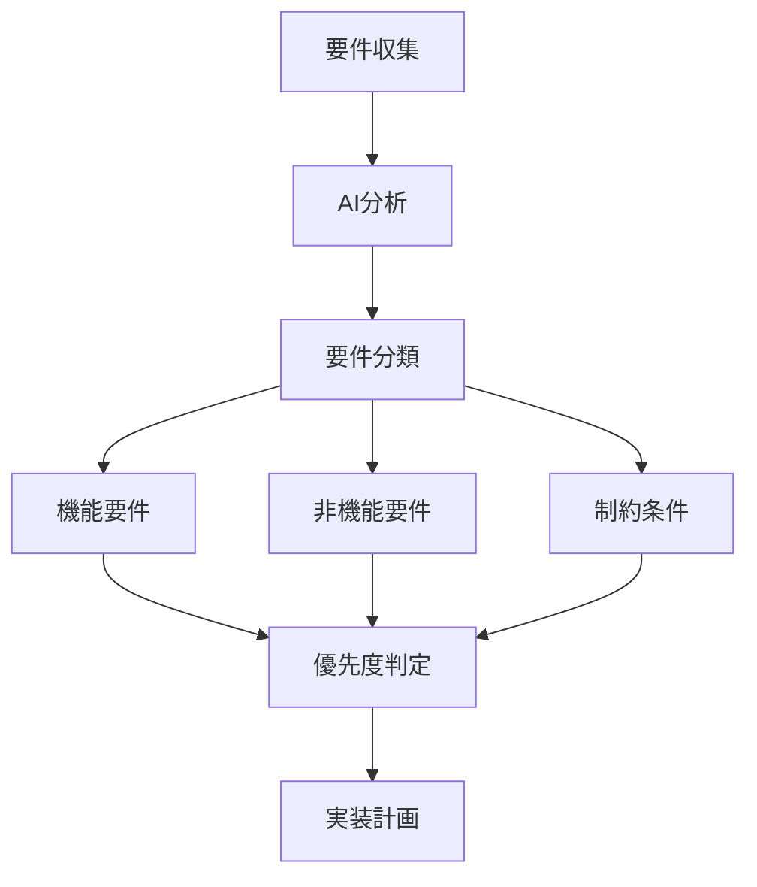
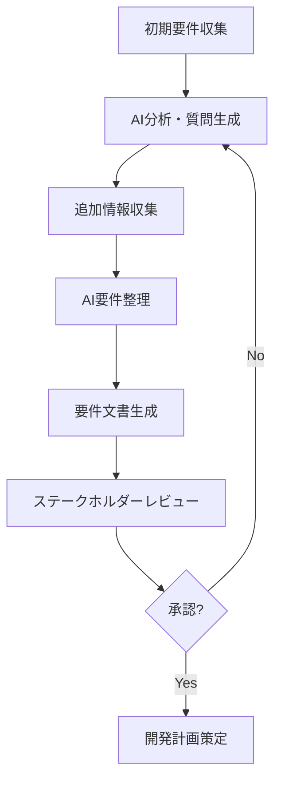
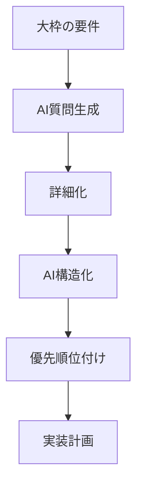

# 要件の整理と AI活用

ソフトウェア開発の成功は、実装前の要件定義と整理にかかっていると言っても過言ではありません。曖昧な要件は開発の遅延、コスト超過、そして顧客の不満につながります。AI駆動開発は、この重要な初期段階から大きな価値を発揮します。

## 従来の要件整理の課題

要件整理には、従来から以下のような課題が存在していました：

- **不明確な要求**: 顧客やステークホルダーの要望が曖昧で解釈が難しい
- **見落とし**: 重要な要件が抜け落ちてしまう
- **矛盾する要件**: 複数の要求が互いに相反している
- **優先順位付けの難しさ**: 何を先に実装すべきか判断するのが困難
- **技術的実現可能性**: 要望と技術的制約のバランスが取りにくい
- **コミュニケーションの齟齬**: 開発者と非技術者の間での認識の違い

## AIによる要件整理の革新

AIツールは、要件の収集から整理、分析、そして実装計画までの一連のプロセスを効率化できます。以下に主要な活用方法を紹介します。

### 1. 要件の明確化とリファインメント

AIは、曖昧な要件を明確にするための質問を自動生成できます：

```
以下のプロジェクト要件を分析し、不明確な点や詳細化が必要な部分を指摘してください：

[クライアントから提供された要件文書]

特に以下の観点から確認してください：
1. 機能の境界と範囲
2. 非機能要件（パフォーマンス、セキュリティなど）
3. ユーザーフロー
4. エッジケースの処理
```

AIは要件の曖昧さを検出し、明確化のための質問を提案します。例えば：

- 「ユーザー認証」という要件に対して、「どの認証方式をサポートすべきか」「パスワードポリシーはどうするか」などの具体的な質問を生成
- 「システムは高速であるべき」という曖昧な表現に対して、「具体的なレスポンス時間の目標値」を確認する質問

### 2. 要件の構造化と可視化

膨大な要件文書からエッセンスを抽出し、整理するのに AIが役立ちます：



AIプロンプト例：

```
次のプロジェクト文書から要件を抽出し、機能要件・非機能要件・制約条件に分類してください：

[プロジェクト文書]

また、各要件の依存関係と優先度を分析し、実装順序の推奨案を提示してください。
```

### 3. ユーザーストーリーの生成と改善

要件からユーザーストーリーを作成し、アジャイル開発を支援します：

```
次の機能要件からユーザーストーリーを作成してください：

[機能要件]

ユーザーストーリーは「〜として、私は〜したい。なぜなら〜だからだ」の形式で、
具体的な受け入れ基準も含めてください。
```

AIが生成するユーザーストーリー例：

```
ユーザーストーリー: 一般ユーザーとして、私はパスワードをリセットできるようにしたい。なぜなら、パスワードを忘れた時にアカウントにアクセスし続けられるようにするためだ。

受け入れ基準:
1. ログイン画面に「パスワードを忘れた場合」のリンクがある
2. ユーザーは登録済みのメールアドレスを入力できる
3. システムは一時的なリセットリンクをメールで送信する
4. リンクは24時間後に無効になる
5. リンク経由で新しいパスワードを設定できる
6. 新しいパスワードは既定のセキュリティ基準を満たす必要がある
```

### 4. 要件のギャップ分析

AIは、要件間の矛盾や抜け落ちを検出するのに役立ちます：

```
以下の要件セットを分析し、以下の観点からギャップや問題点を指摘してください：

[要件リスト]

1. 互いに矛盾する要件
2. 前提条件が欠けている要件
3. 実現可能性が疑わしい要件
4. 見落とされている可能性のある関連要件
```

### 5. 技術的実現可能性の評価

要件の技術的な実現性を初期段階で評価できます：

```
次の機能要件について、技術的実現可能性を評価してください：

[機能要件]

以下の点について分析してください：
1. 適切な技術スタックの提案
2. 実装の複雑さの予測
3. 考えられる技術的課題
4. 代替アプローチの提案
```

## 要件整理のための実践的 AI活用例

### 例 1: 顧客インタビューの分析

顧客との会話から要件を抽出する例：

```
以下の顧客インタビュー記録から、主要な要件を抽出し、優先順位をつけてください：

顧客: 「我々のオンラインストアでは、顧客がもっと簡単に商品を見つけられるようにしたいんです。
また、購入プロセスが複雑すぎるという苦情も多いです。そして、モバイルでの使いやすさも
向上させたいです。あ、そうそう、商品レビュー機能も追加したいですね。」

以下の形式で出力してください：
1. 抽出された要件リスト
2. 各要件の優先度（高/中/低）
3. 検討すべき追加質問
```

### 例 2: 要件ドキュメントの生成

AIを使って整理された要件から、正式な要件ドキュメントを生成できます：

```
次の機能リストに基づいて、「オンライン予約システム」のための要件仕様書を作成してください：

1. ユーザー登録/ログイン機能
2. 予約可能な時間枠の表示
3. 予約作成/編集/キャンセル機能
4. 管理者向け予約管理ダッシュボード
5. メール通知機能
6. 決済連携

以下のセクションを含めてください：
- プロジェクト概要
- 機能要件（各機能の詳細説明）
- 非機能要件（パフォーマンス、セキュリティ、可用性など）
- 技術要件
- ユーザーフロー
- 画面遷移図（テキストで説明）
```

### 例 3: モックアップとワイヤーフレームの生成

要件から直接 UI のワイヤーフレームを説明させることもできます：

```
次のユーザーストーリーに基づいて、モバイルアプリの主要画面のワイヤーフレームを
テキストで詳細に説明してください：

ユーザーストーリー：
1. ユーザーは新規登録またはソーシャルアカウントでログインできる
2. ユーザーは近くの店舗を地図上で探せる
3. ユーザーは店舗の詳細情報と営業時間を確認できる
4. ユーザーは店舗の混雑状況をリアルタイムで確認できる
5. ユーザーは店舗を「お気に入り」に追加できる

各画面の主要なUI要素、レイアウト、インタラクションを詳しく説明してください。
```

## 要件整理の AIワークフロー

AI駆動の要件整理プロセスを図解します：



## 実践的な要件整理の AIプロンプトテンプレート

### 1. 要件チェックリスト生成

```
次のプロジェクト用の要件チェックリストを作成してください：

プロジェクト: [プロジェクト名]
概要: [プロジェクト概要]

以下のカテゴリごとに、確認すべき項目のリストを作成してください：
- 機能要件
- セキュリティ要件
- パフォーマンス要件
- ユーザビリティ要件
- 互換性要件
- コンプライアンス要件
- 保守性・拡張性要件
```

### 2. ペルソナとユースケース生成

```
以下のターゲットユーザー情報を基に、ペルソナを3つ作成し、
各ペルソナの主要なユースケースをリストアップしてください：

サービス: [サービス説明]
ターゲット層: [ターゲット層の説明]

各ペルソナについて、以下の情報を含めてください：
- 名前、年齢、職業
- 技術習熟度
- 目標と課題
- 行動パターン
- サービスを使用する動機
- 主要なユースケース（少なくとも3つ）
```

### 3. 優先順位付けマトリックス

```
次の機能要件リストに対して、「重要度」と「実装の複雑さ」を評価し、
優先順位付けマトリックスを作成してください：

[機能要件リスト]

各要件について、以下の評価を行ってください：
- 重要度（高/中/低）
- 実装の複雑さ（高/中/低）
- 推奨実装フェーズ（第1フェーズ/第2フェーズ/第3フェーズ）
- 実装の前提条件

また、「高重要度/低複雑性」から始めるべき理由とその効果について説明してください。
```

## AI活用による要件整理の効果測定

AI駆動の要件整理プロセスの有効性を評価するためのメトリクスを紹介します：

1. **要件の明確さスコア**: 要件の曖昧さが減少した度合い
2. **要件カバレッジ**: 見落とされていた要件の検出数
3. **矛盾検出率**: AIによって検出された要件間の矛盾の数
4. **要件合意時間**: ステークホルダー間で要件合意に至るまでの時間削減
5. **要件変更率**: 開発中の要件変更リクエストの減少率

## 要件整理のための AI活用戦略

要件整理プロセスで AIを最大限に活用するためのベストプラクティスを紹介します：

### 1. 段階的アプローチ



### 2. ヒューマン・イン・ザ・ループ

AIは強力なツールですが、最終判断は人間が行うことが重要です：

1. AIによる初期分析と提案
2. 人間による検証と修正
3. AIによる再分析と改善
4. 人間による最終判断

### 3. 反復的改善

要件は固定されたものではなく、進化するものとして扱います：

```
前回整理した要件セットに対して、以下の新しい情報に基づいて更新案を提示してください：

[新しい情報や変更点]

特に以下に注目してください：
1. 既存要件への影響
2. 追加すべき新要件
3. 優先順位の変更
4. スケジュールへの影響
```

## ケーススタディ：EC サイトリニューアルプロジェクト

実際のプロジェクトで AIがどのように要件整理を支援するかを具体例で見てみましょう：

### 初期要件（クライアントからの要望）

「当社の EC サイトをモダンな見た目にリニューアルしたい。スマホでも使いやすくして、購入までのステップを減らしたい。また、顧客の購買履歴に基づいたおすすめ商品も表示できるようにしたい。」

### AIによる要件の明確化と分解

AIに上記の要望を分析してもらうと、以下のような詳細な要件リストが生成されます：

**1. UI/UX のモダン化**

- レスポンシブデザインの実装
- 最新のデザイントレンド調査と適用
- ブランドアイデンティティの反映
- アクセシビリティガイドラインへの準拠

**2. モバイル最適化**

- タッチフレンドリーなインターフェース
- モバイルファーストアプローチ
- 画像の最適化
- 高速読み込み

**3. 購入プロセスの最適化**

- ワンクリックでのショッピングカート追加
- ゲスト購入オプション
- 保存された支払い情報の利用
- 購入ステップ数の具体的な削減（現状と目標）

**4. レコメンデーションエンジン**

- 購買履歴分析アルゴリズム
- 閲覧履歴に基づく推奨
- 類似商品の推奨
- パーソナライズされたセールスプロモーション

### AIによる優先順位付けと実装計画

AIは更に、これらの要件の依存関係と影響度を分析し、以下のような実装計画を提案します：

**フェーズ 1（基盤構築）**

- レスポンシブデザインフレームワークの選定と実装
- データベース構造の最適化（レコメンデーション機能の準備）
- 購入プロセスのワークフロー再設計

**フェーズ 2（コア機能改善）**

- 新 UI の実装（モバイル最適化を含む）
- 購入プロセスの簡略化
- 支払いシステムの統合

**フェーズ 3（高度機能追加）**

- レコメンデーションエンジンの実装
- パーソナライズ機能の追加
- A/B テストと最適化

## まとめ

AI駆動の要件整理は、ソフトウェア開発プロジェクトの成功率を大幅に向上させる可能性を持っています。AIツールを効果的に活用することで：

- 要件の曖昧さを減らし、明確な目標を設定できる
- 抜け漏れや矛盾を早期に発見できる
- 優先順位付けと実装計画が効率化される
- ステークホルダー間のコミュニケーションが改善される
- プロジェクトのリスクが低減される

要件整理は、AIの強みが最大限に発揮される領域の一つです。しかし、最終的な判断は人間が行い、AIはあくまでも強力な支援ツールとして活用することが重要です。業務知識、ステークホルダーの意向、市場の動向など、AIが完全には把握できない文脈も考慮して、バランスの取れた要件整理を目指しましょう。
