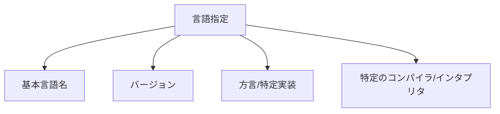

# 言語・フレームワーク・アーキテクチャ指定の最適方法

## はじめに

AI を活用したソフトウェア開発では、特定のプログラミング言語、フレームワーク、アーキテクチャなどを指定して、希望する環境に合わせたコードやアドバイスを得ることが重要です。この記事では、AI に対して技術スタックを効果的に指定する方法について解説します。

## 言語指定の基本

### 明確な言語指定

AI に特定のプログラミング言語でコードを生成してもらうには、リクエストの冒頭で明確に言語を指定することが効果的です。

**悪い例**：

```
ユーザー登録フォームを作成してください。
```

**良い例**：

```
TypeScript と React を使用して、ユーザー登録フォームを作成してください。
```

### バージョンの指定

言語やライブラリのバージョンを指定することで、そのバージョン特有の機能や構文を活用したコードを得られます。

```
Python 3.10 の新機能であるパターンマッチングを使って、JSONデータを解析するコードを書いてください。
```



## フレームワーク指定のテクニック

### フレームワーク名とバージョン

使用するフレームワークとそのバージョンを明示します。

```
Angular 16を使用したSPA（シングルページアプリケーション）のルーティング設定方法を示してください。
```

### 複数フレームワークの組み合わせ

複数のフレームワークやライブラリを組み合わせて使用する場合は、それらの関係性も明記すると良いでしょう。

```
Next.js (v13) と Tailwind CSS を使用して、レスポンシブなナビゲーションバーを実装してください。Next.jsのApp Routerを使用し、ダークモード対応も含めてください。
```

### フレームワークの特定機能の指定

フレームワークの特定の機能や実装パターンを指定することで、より具体的なコードを得られます。

```
Laravel 10のEloquent ORMを使用して、多対多のリレーションシップを持つブログとタグのモデルを実装してください。ポリモーフィック関連も使用したいです。
```

## アーキテクチャ指定の方法

### アーキテクチャパターンの明示

使用したいアーキテクチャパターンを明確に指定します。

```
Reactアプリケーションで、Fluxアーキテクチャを実装する方法を教えてください。特にReduxを使用した状態管理の部分に焦点を当ててください。
```

### アーキテクチャの制約条件

アーキテクチャに関する特定の制約条件がある場合は、それも明記します。

```
マイクロサービスアーキテクチャを採用したEコマースシステムのサービス分割方法を提案してください。各サービスはDockerコンテナとして実装し、Kubernetesで管理する予定です。サービス間通信にはgRPCを使用します。
```

### 設計原則の指定

特定の設計原則に従ったコードが欲しい場合は、その旨を伝えます。

```
Python 3.9で、SOLIDの原則に従ったユーザー認証システムを設計してください。特に単一責任の原則と依存性逆転の原則に注意して実装してください。
```

## 効果的な技術スタック指定のコツ

### 1. 階層的に指定する

技術スタックを階層的に指定することで、AI はより正確な文脈を理解できます。

```
バックエンド: Node.js (v18) + Express.js + MongoDB
フロントエンド: React (v18) + Redux + Material UI
インフラ: Docker + AWS (ECS, S3, CloudFront)

上記の技術スタックを使用して、ユーザーが写真を共有できるWebアプリケーションのアーキテクチャを設計してください。
```

### 2. 実装の制約条件を明確にする

特定の実装方法に関する制約条件がある場合は、それも明確に伝えましょう。

```
React Hooksのみを使用して（クラスコンポーネントは使わずに）、無限スクロール機能を実装してください。パフォーマンスを最適化するために仮想化も考慮してください。
```

### 3. プロジェクトの背景情報を提供する

プロジェクトの背景情報や目的を提供することで、より適切な技術的アドバイスが得られます。

```
私たちは、毎秒数千のセンサーデータを処理する必要があるIoTプラットフォームを開発しています。リアルタイムデータ処理のために、Apache KafkaとSpring Bootを使用したイベント駆動型アーキテクチャを検討しています。このユースケースに適したアーキテクチャパターンを提案してください。
```

## 状況別の指定例

### Web アプリケーション開発

```
フロントエンド: Vue.js 3 (Composition API) + Pinia + Vue Router
バックエンド: ASP.NET Core 7 Web API + Entity Framework Core
データベース: PostgreSQL 15
認証: JWT + Identity

上記のスタックを使用した、マルチテナントSaaSアプリケーションのアーキテクチャを設計してください。テナントごとのデータ分離方法と、スケーラビリティの確保方法に焦点を当ててください。
```

### モバイルアプリケーション開発

```
Flutter 3.10とDart 3を使用して、オフライン対応の料理レシピアプリを開発したいと思います。状態管理にはRiverpodを使用し、ローカルデータベースにはHiveを検討しています。アプリのアーキテクチャとしてClean Architectureを採用する場合、各レイヤーの分割方法と、データの流れを示してください。
```

### マイクロサービス設計

```
以下の技術スタックを使用したマイクロサービスアーキテクチャを設計してください：

- サービス実装: Go 1.20
- サービスメッシュ: Istio
- コンテナオーケストレーション: Kubernetes
- メッセージブローカー: RabbitMQ
- データベース: MongoDB (サービスごと)
- API Gateway: Kong

特に、サービス間通信、障害検出、サーキットブレーカーパターンの実装に焦点を当ててください。
```

## 注意点と推奨事項

### 過度に限定的にならない

時には、特定の技術に限定しすぎると、より良い選択肢を見逃す可能性があります。AI に代替案を提案する余地を残すことも重要です。

**過度に限定的な例**：

```
必ずAngular 15とNestJSを使って実装してください。他のフレームワークは考慮しないでください。
```

**バランスの取れた例**：

```
主にAngular 15とNestJSの使用を検討していますが、このユースケースに他のフレームワークがより適している場合は、その理由とともに代替案を提案してください。
```

### 技術の組み合わせの整合性を確認する

指定する技術の組み合わせに整合性があることを確認しましょう。互換性のない技術の組み合わせを指定すると、AI は混乱する可能性があります。

**整合性のない例**：

```
React HooksとAngularのサービスを組み合わせたコンポーネントを作成してください。
```

**整合性のある例**：

```
Reactアプリケーション内でAngularアプリケーションを埋め込む方法（マイクロフロントエンド）を教えてください。
```

## まとめ

AI に言語、フレームワーク、アーキテクチャを効果的に指定するためのポイントをまとめると：

1. 使用する技術スタックを明確かつ具体的に指定する
2. バージョンや特定の機能/パターンも含めて詳細に伝える
3. 技術スタックを階層的に整理して提示する
4. プロジェクトの背景情報や制約条件も提供する
5. 必要に応じて代替案を求める余地を残す

これらのポイントを意識することで、AI からより質の高いコードや設計提案を得ることができます。適切な技術スタックの指定は、AI 駆動開発の効率と品質を大きく向上させる重要な要素です。
