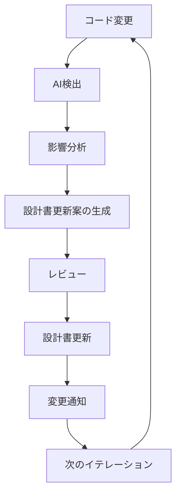
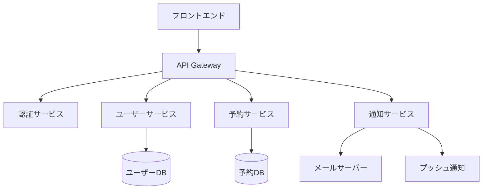

# 設計書の自動生成

ソフトウェア開発において、設計書は開発の青写真として重要な役割を果たします。しかし、詳細な設計書の作成には多くの時間と労力がかかります。AI駆動開発を活用することで、設計書作成プロセスを効率化し、より質の高いドキュメントを短時間で生成できるようになります。

## 設計書の重要性と従来の課題

設計書は以下のような重要な役割を持ちます：

- プロジェクトの方向性を明確にする
- 開発チーム間での認識統一を図る
- 将来の保守・拡張の際の参考資料となる
- 品質管理やテスト計画の基礎となる

しかし、従来の設計書作成には以下のような課題がありました：

- 作成に多大な時間がかかる
- 常に最新の状態に保つのが困難
- 技術的な詳細と抽象的な概念の両方を適切に表現するのが難しい
- 開発者によって品質やスタイルにばらつきが出る
- 作成が後回しにされがちで、実装と乖離することがある

## AIによる設計書自動生成のメリット

AI駆動開発を活用することで、設計書作成において以下のようなメリットが得られます：

1. **作成時間の大幅短縮**: 数時間かかっていた作業が数分で完了
2. **一貫性の確保**: 統一されたフォーマットとスタイルの維持
3. **網羅性の向上**: 人間が見落としやすい詳細も漏れなく記述
4. **リアルタイム更新**: コードの変更に合わせて設計書も迅速に更新
5. **多角的な視点**: 異なるステークホルダー向けの文書を効率的に生成

## AIで自動生成できる設計書の種類

### 1. システム概要設計書

システム全体の構成や主要機能を概説する文書です：

```
次のプロジェクト情報に基づいて、システム概要設計書を作成してください：

プロジェクト名: [プロジェクト名]
目的: [プロジェクトの目的]
主要機能: [主な機能のリスト]
対象ユーザー: [想定ユーザー]

以下のセクションを含めてください：
1. システム概要
2. アーキテクチャ概要図（テキストで説明）
3. 主要コンポーネント説明
4. 技術スタック
5. 外部システム連携
6. 非機能要件の概要
```

### 2. 詳細設計書

特定の機能やモジュールの詳細な設計を記述する文書です：

```
次の機能の詳細設計書を作成してください：

機能名: [機能名]
概要: [機能の概要]
入力: [入力データ/パラメータ]
出力: [出力データ/結果]
関連機能: [関連する他の機能]

以下を含めてください：
1. 処理フロー
2. データモデル
3. 例外処理
4. パフォーマンス考慮点
5. テスト項目
```

### 3. データベース設計書

データベースのスキーマや関連性を記述する文書です：

```
次の情報に基づいて、データベース設計書を作成してください：

プロジェクト: [プロジェクト名]
データベース種類: [RDBMSの種類]
主要エンティティ: [エンティティリスト]

以下を含めてください：
1. ER図（テキスト表現）
2. テーブル定義（各テーブルの列、データ型、制約）
3. インデックス設計
4. 関連性の説明
5. データ移行計画
6. パフォーマンス最適化戦略
```

### 4. API 設計書

システムが提供する API の仕様を記述する文書です：

```
次のAPIの設計書を作成してください：

API名: [API名]
目的: [APIの目的]
認証方式: [認証方法]
エンドポイント一覧: [エンドポイントのリスト]

各エンドポイントについて、以下を含めてください：
1. HTTPメソッド
2. リクエストパラメータ/ボディ
3. レスポンス形式
4. ステータスコードと意味
5. エラーハンドリング
6. 利用例
```

## 設計書自動生成の実践例

### 例 1: ユーザー認証モジュールの詳細設計書

AIが生成した詳細設計書の例を見てみましょう：

````markdown
# ユーザー認証モジュール 詳細設計書

## 1. 概要

本モジュールは、システムへのアクセス制御を行うユーザー認証機能を提供する。
ユーザー ID/パスワード認証、OAuth2.0 による SNS 認証、および JWT トークンを用いた
セッション管理を実装する。

## 2. アーキテクチャ

認証モジュールは、以下のコンポーネントで構成される：

- 認証コントローラ（AuthController）
- ユーザーサービス（UserService）
- トークン管理サービス（TokenService）
- 外部認証連携サービス（OAuthService）

## 3. 認証フロー

### 3.1 ユーザー ID/パスワード認証

1. ユーザーが ID/パスワードを入力
2. AuthController がリクエストを受け取る
3. UserService がユーザー情報を検証
   - パスワードは bcrypt でハッシュ化されたものと比較
4. 認証成功時：TokenService が JWT トークンを生成
5. トークンをレスポンスとして返却

### 3.2 OAuth 認証

1. ユーザーが OAuth 認証を選択（Google/Facebook 等）
2. OAuthService が認証プロバイダのログインページにリダイレクト
3. ユーザーがプロバイダで認証する
4. コールバック URL にリダイレクトされる
5. OAuthService が認証コードを検証
6. UserService が関連ユーザー情報を取得または作成
7. TokenService が JWT トークンを生成
8. トークンをレスポンスとして返却

## 4. データモデル

### 4.1 ユーザーテーブル

| フィールド名  | データ型     | 説明                 |
| ------------- | ------------ | -------------------- |
| id            | UUID         | 主キー               |
| username      | VARCHAR(50)  | ユーザー名           |
| email         | VARCHAR(100) | メールアドレス       |
| password_hash | VARCHAR(128) | ハッシュ化パスワード |
| last_login    | TIMESTAMP    | 最終ログイン日時     |
| created_at    | TIMESTAMP    | 作成日時             |
| updated_at    | TIMESTAMP    | 更新日時             |
| is_active     | BOOLEAN      | アカウント有効フラグ |

### 4.2 OAuth プロバイダーテーブル

| フィールド名     | データ型     | 説明                                |
| ---------------- | ------------ | ----------------------------------- |
| id               | UUID         | 主キー                              |
| user_id          | UUID         | ユーザー ID（外部キー）             |
| provider         | VARCHAR(20)  | プロバイダ名（google, facebook 等） |
| provider_user_id | VARCHAR(100) | プロバイダ側のユーザー ID           |
| access_token     | VARCHAR(255) | アクセストークン                    |
| refresh_token    | VARCHAR(255) | リフレッシュトークン                |
| expires_at       | TIMESTAMP    | トークン有効期限                    |

## 5. API 仕様

### 5.1 ログイン API

- エンドポイント: `/api/auth/login`
- メソッド: POST
- リクエスト:
  ```json
  {
    "username": "user@example.com",
    "password": "password123"
  }
  ```
````

- レスポンス:
  ```json
  {
    "token": "eyJhbGciOiJIUzI1NiIsInR5cCI6IkpXVCJ9...",
    "expires_in": 3600,
    "user": {
      "id": "550e8400-e29b-41d4-a716-446655440000",
      "username": "user@example.com"
    }
  }
  ```

### 5.2 OAuth ログイン API

- エンドポイント: `/api/auth/oauth/{provider}`
- メソッド: GET
- パラメータ: provider = "google" | "facebook" | "github"
- レスポンス: OAuth プロバイダへのリダイレクト

## 6. 例外処理

- 不正な認証情報: 401 Unauthorized
- アカウントロック: 403 Forbidden
- サーバーエラー: 500 Internal Server Error

## 7. セキュリティ対策

- パスワードは最低 8 文字、大文字・小文字・数字・特殊文字を含める
- アカウントロック: 5 回連続失敗で 30 分間ロック
- JWT トークンの有効期限: 1 時間
- リフレッシュトークン: 30 日間有効
- すべての通信は HTTPS 経由
- CSRF トークン対策実装

## 8. テスト計画

- 単体テスト: 各サービスメソッドのテスト
- 統合テスト: 認証フロー全体のテスト
- 負荷テスト: 同時 100 ユーザーのログイン処理

## 9. 今後の拡張性

- 二要素認証（2FA）の追加
- シングルサインオン（SSO）対応
- API キー認証の追加

````

この例では、AIが単なる機能の説明だけでなく、データモデル、API仕様、例外処理、セキュリティ対策など、実装に必要な詳細情報まで生成しています。

### 例2: ER図の自動生成

```mermaid
erDiagram
    USERS ||--o{ ORDERS : places
    USERS {
        uuid id PK
        string username
        string email
        string password_hash
        datetime last_login
        boolean is_active
        datetime created_at
        datetime updated_at
    }
    ORDERS ||--|{ ORDER_ITEMS : contains
    ORDERS {
        uuid id PK
        uuid user_id FK
        datetime order_date
        string status
        decimal total_amount
        string shipping_address
        string payment_method
        datetime created_at
        datetime updated_at
    }
    PRODUCTS ||--o{ ORDER_ITEMS : includes
    PRODUCTS {
        uuid id PK
        string name
        string description
        decimal price
        int stock_quantity
        string category
        string image_url
        datetime created_at
        datetime updated_at
    }
    ORDER_ITEMS {
        uuid id PK
        uuid order_id FK
        uuid product_id FK
        int quantity
        decimal unit_price
        decimal subtotal
    }
````

## 設計書自動生成のための効果的なプロンプト

AIに設計書を生成してもらう際の効果的なプロンプトを紹介します：

### 1. コンテキスト提供型プロンプト

```
以下のプロジェクト情報に基づいて、システム設計書を作成してください：

【プロジェクト概要】
プロジェクト名: オンライン予約システム
目的: 美容室の予約をオンラインで受け付けるシステムの構築
対象ユーザー: 一般顧客、美容師、管理者

【主要機能】
- ユーザー登録・ログイン
- 空き時間の検索
- 予約の作成・変更・キャンセル
- 予約確認メールの送信
- 管理者向けのダッシュボード

【技術スタック】
- フロントエンド: React, TypeScript
- バックエンド: Node.js, Express
- データベース: PostgreSQL
- 認証: JWT

【非機能要件】
- レスポンス時間: ページロードは3秒以内
- 同時アクセス: 最大100ユーザー
- 可用性: 99.9%（月間ダウンタイム43分以内）

以下のセクションを含む包括的な設計書を作成してください：
1. システム概要
2. アーキテクチャ設計
3. データベース設計
4. API設計
5. UI/UX設計の概要
6. セキュリティ設計
7. テスト計画
8. デプロイメント計画
```

### 2. 既存コードからの設計書生成プロンプト

```
以下のコードを分析して、このモジュールの詳細設計書を作成してください：

[既存のコードをここに貼り付け]

設計書には以下を含めてください：
1. モジュールの目的と概要
2. 主要なクラス・関数の説明
3. データフロー
4. 依存関係
5. エラーハンドリング手法
6. 潜在的な改善点
```

### 3. 特定視点に特化したプロンプト

```
次のシステム概要を基に、セキュリティに特化した設計書を作成してください：

[システム概要]

以下の観点に特に注目してください：
1. 認証・認可メカニズム
2. データの暗号化
3. 入力検証と出力エンコーディング
4. セッション管理
5. ログとモニタリング
6. 脆弱性対策
```

## 設計書の継続的更新と保守

設計書は一度作成したら終わりではなく、継続的に更新していくことが重要です。AIを活用した設計書の保守戦略を図解します：



AIを使った設計書更新の例：

```
次のコード変更に基づいて、既存の設計書を更新してください：

変更前コード:
[変更前のコード]

変更後コード:
[変更後のコード]

既存の設計書:
[既存の設計書内容]

変更部分を明確にハイライトし、設計書に必要な修正を加えてください。
また、この変更によって影響を受ける可能性のある他のコンポーネントがあれば指摘してください。
```

## 設計書自動生成のベストプラクティス

### 1. 具体的な入力情報の提供

AIに良い設計書を生成してもらうためには、具体的な情報を提供することが重要です：

- プロジェクトの背景と目的
- 主要な機能リスト
- 技術スタック
- 非機能要件
- 制約条件

### 2. 反復的な改善

最初の生成結果をそのまま使用するのではなく、反復的に改善していくアプローチが効果的です：

```
生成していただいた設計書について、以下の点を強化してください：

1. 「データベース設計」セクションをより詳細にしてください
2. パフォーマンス要件をより具体的な数値で記述してください
3. エラーハンドリングの部分が不足しているので追加してください
```

### 3. 複数の視点からのレビュー

異なるステークホルダーの視点からレビューするよう AIに指示することで、より包括的な設計書になります：

```
この設計書を以下のステークホルダーの視点からレビューし、改善点を指摘してください：

1. フロントエンド開発者
2. バックエンド開発者
3. データベース専門家
4. セキュリティ専門家
5. プロジェクトマネージャー
```

### 4. 実装可能性の確認

AIが生成した設計が実際に実装可能かを検証することも重要です：

```
この設計書の内容について、以下の観点から実装可能性を検証してください：

1. 選定された技術スタックで実現可能か
2. 想定される開発期間内に完了できるか
3. スケーラビリティ要件を満たせるか
4. 潜在的な技術的課題はあるか
```

## 設計書自動生成の応用例

### マイクロサービスアーキテクチャの設計

複雑なマイクロサービスアーキテクチャの設計も AIで支援できます：



### 段階的な開発計画の策定

設計書から開発計画を立案することもできます：

```
この設計書に基づいて、3ヶ月間の開発計画を立ててください：

[設計書の内容]

以下を含めてください：
1. 開発フェーズの分割（最低3フェーズ）
2. 各フェーズで実装する機能
3. 必要な開発リソース
4. 主要なマイルストーン
5. リスク要因と対策
```

## 設計書と実装の一貫性確保

自動生成した設計書と実際の実装の一貫性を保つための方法を紹介します：

### 設計と実装の同期

```
次のコードが、既存の設計書と一致しているか確認してください：

設計書:
[設計書の関連部分]

実装コード:
[実装コード]

以下の点について分析してください：
1. 設計との一致点
2. 設計との相違点
3. 相違がある場合、どちらを優先すべきか、またはどう調整すべきか
```

### コードからの設計書更新

```
次の実装コードに基づいて、設計書を更新してください：

実装コード:
[実装コード]

現在の設計書:
[現在の設計書]

実装に合わせて設計書を調整し、変更点を明示してください。
```

## まとめ

AI駆動開発による設計書の自動生成は、ソフトウェア開発プロセスを大きく効率化します。主なメリットは以下の通りです：

- 設計書作成の工数と時間の大幅削減
- 一貫性と網羅性の向上
- 実装との整合性維持の容易さ
- 多角的な視点の取り込み
- 継続的な更新が容易

ただし、自動生成された設計書は必ず人間のレビューを受け、実際のビジネス要件や技術的制約と照らし合わせて検証することが重要です。AIは強力な支援ツールですが、最終的な判断と責任は人間が持つことを忘れないようにしましょう。

設計書自動生成を活用して、ドキュメント作成に費やす時間を削減し、より創造的で価値の高い開発作業に集中することができます。
