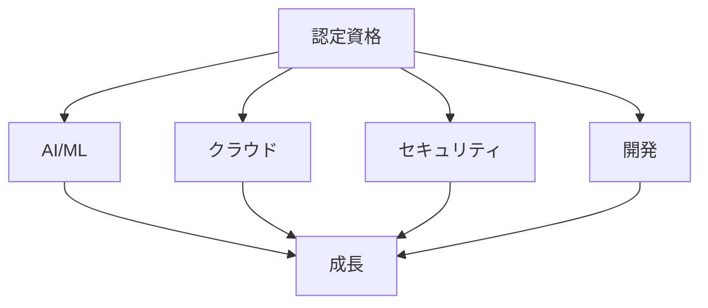

# 認定資格受けましょう！

## 認定資格の重要性

### 資格の意義

AI 駆動開発における認定資格の意義：

- スキルの証明
- 競争力の向上
- キャリアの成長
- 信頼性の確保

### 資格の種類

## 主要な認定資格

### 1. AI/ML 関連資格

AI/ML に関する主要な資格：

- 機械学習エンジニア
- データサイエンティスト
- AI アーキテクト
- プロンプトエンジニア

### 2. クラウド関連資格

クラウド技術に関する主要な資格：

- クラウドアーキテクト
- クラウド開発者
- クラウドセキュリティ
- クラウド運用

### 3. セキュリティ関連資格

セキュリティに関する主要な資格：

- セキュリティエンジニア
- セキュリティアーキテクト
- セキュリティオーディター
- セキュリティコンサルタント

## 実践的なアプローチ

### 資格取得の準備

効果的な資格取得の準備：

- 目標の設定
- 学習計画の作成
- 実践的な演習
- 模擬試験

### 試験対策

効果的な試験対策：

- 過去問題の分析
- 弱点の特定
- 集中的な学習
- 実践的な演習

## 成功のポイント

### 学習の最適化

学習を最適化するポイント：

- 計画的な学習
- 実践的な演習
- フィードバックの活用
- 継続的な改善

### モチベーションの維持

モチベーションを維持するポイント：

- 明確な目標設定
- 進捗の可視化
- コミュニティの活用
- 継続的な学習

## 実践的なアドバイス

### 資格取得のステップ

効果的な資格取得のステップ：

1. 目標の設定
2. 学習計画の作成
3. 実践的な演習
4. 模擬試験
5. 本番試験

### 成功への道筋

資格取得を成功させるポイント：

- 明確な目標設定
- 計画的なアプローチ
- 継続的な学習
- 実践的な経験

## まとめ

認定資格の取得は、AI 駆動開発のスキル向上とキャリア成長に不可欠です。適切な準備、計画的な学習、そして継続的な努力が重要です。
