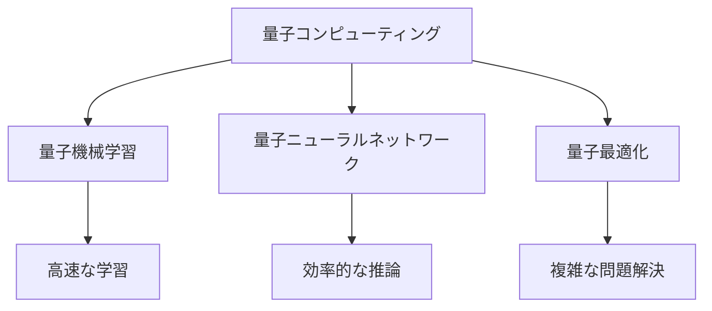

# 量子コンピューティングとの融合

## 量子コンピューティングとは

量子コンピューティングは、量子力学の原理を利用した新しい計算パラダイムです。従来のコンピュータがビット（0 か 1）を使用するのに対し、量子コンピュータは量子ビット（キュービット）を使用します。キュービットは 0 と 1 の状態を同時に取ることができ、これにより並列計算が可能になります。

## AI 駆動開発と量子コンピューティングの関係

### 計算能力の飛躍的な向上

量子コンピューティングは、AI の学習や推論に必要な計算を大幅に高速化する可能性があります。特に以下の分野で大きな影響が期待されています：

- 機械学習モデルの学習速度の向上
- 複雑な最適化問題の解決
- 大規模なデータセットの処理

### 新しい AI アルゴリズムの開発

量子コンピューティングの特性を活かした新しい AI アルゴリズムが開発されています：

## 実践的な応用

### コード生成の高速化

量子コンピューティングを活用することで、AI によるコード生成がさらに高速化される可能性があります：

- 複雑なアルゴリズムの最適化
- 大規模なコードベースの分析
- パフォーマンスの自動チューニング

### テスト自動化の革新

量子コンピューティングは、テスト自動化にも革新的な変化をもたらす可能性があります：

- テストケースの最適な組み合わせの探索
- バグの早期発見
- テストカバレッジの最大化

## 将来の展望

### 2025 年以降の予測

量子コンピューティングと AI 駆動開発の融合は、以下のような形で進展すると予想されます：

1. 量子コンピュータの実用化
2. 量子 AI アルゴリズムの標準化
3. 開発ツールへの量子コンピューティングの統合

### 開発者への影響

量子コンピューティングの台頭により、開発者には以下のような新しいスキルが求められます：

- 量子プログラミングの基礎知識
- 量子 AI アルゴリズムの理解
- ハイブリッド（古典+量子）システムの設計能力

## まとめ

量子コンピューティングと AI 駆動開発の融合は、ソフトウェア開発の未来を大きく変える可能性を秘めています。開発者として、この新しい技術トレンドを理解し、適応していくことが重要です。
