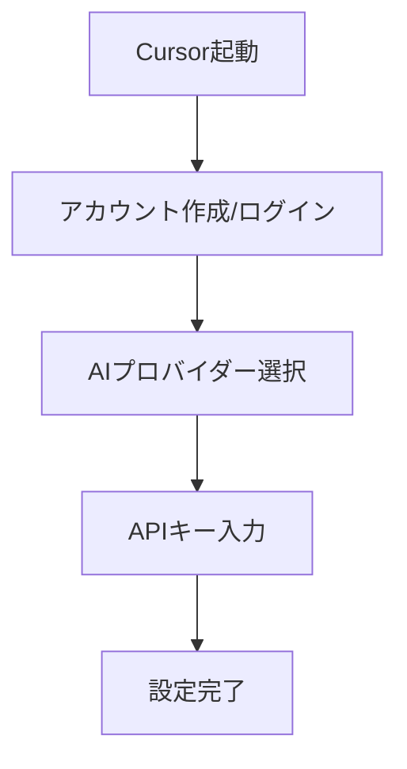
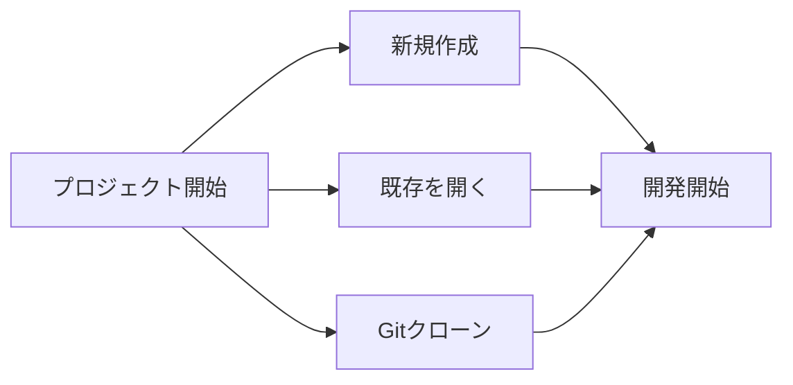

# Cursor 開発環境のセットアップ

Cursor は、AI を活用した次世代のコードエディタです。VS Code をベースにしながら、強力な AI 機能を搭載することで、コーディングをより効率的に行うことができます。この章では、Cursor の基本的なセットアップ方法を解説します。

## Cursor のインストール

### Windows の場合

1. [Cursor 公式サイト](https://cursor.sh)にアクセスします
2. 「Download for Windows」ボタンをクリックします
3. ダウンロードしたインストーラー（.exe）を実行します
4. 画面の指示に従ってインストールを完了させます

### macOS の場合

1. [Cursor 公式サイト](https://cursor.sh)にアクセスします
2. 「Download for Mac」ボタンをクリックします
3. ダウンロードした dmg ファイルを開きます
4. Cursor アイコンをアプリケーションフォルダにドラッグします

### Linux の場合

1. [Cursor 公式サイト](https://cursor.sh)にアクセスします
2. 「Download for Linux」ボタンをクリックします
3. お使いのディストリビューションに合わせたパッケージをダウンロードします
4. パッケージマネージャーを使ってインストールします

   ```bash
   # Debianベースの場合
   sudo dpkg -i cursor_*.deb

   # RPMベースの場合
   sudo rpm -i cursor_*.rpm
   ```

## 初期設定

### アカウント作成とログイン

初回起動時に、Cursor アカウントの作成またはログインが必要です。

1. Cursor を起動します
2. 「Sign Up」ボタンをクリックしてアカウントを作成します
   - メールアドレスとパスワードを入力
   - Google アカウントでのログインも可能
3. 利用規約に同意して「Create Account」をクリックします

### AI 機能の設定

Cursor の核となる AI 機能を使用するには、AI プロバイダーの設定が必要です。

1. 左下の歯車アイコンをクリックして設定を開きます
2. 「AI」セクションを選択します
3. 以下の AI プロバイダーから選択します:

   - OpenAI (ChatGPT)
   - Anthropic (Claude)
   - カスタム API

4. API キーを入力します:
   - OpenAI を選択した場合は、[OpenAI のウェブサイト](https://platform.openai.com/api-keys)で API キーを取得
   - Anthropic を選択した場合は、[Anthropic のウェブサイト](https://console.anthropic.com/)で API キーを取得



## 開発環境のカスタマイズ

### テーマの設定

1. 設定を開き、「Appearance」を選択します
2. 「Color Theme」から好みのテーマを選択できます
3. 「Cursor Dark」「Cursor Light」がデフォルトで用意されています

### フォントの設定

1. 設定から「Text Editor」→「Font」を選択します
2. フォントファミリー、サイズ、行の高さなどを調整できます

### 拡張機能のインストール

Cursor は多くの VS Code 拡張機能と互換性があります。

1. 左側のサイドバーから拡張機能アイコンをクリックします
2. 検索ボックスで必要な拡張機能を検索します
3. 「Install」ボタンをクリックしてインストールします

推奨拡張機能:

- ESLint: JavaScript コードの品質チェック
- Prettier: コードフォーマッター
- GitLens: Git 機能の拡張
- IntelliCode: AI によるコード補完

### キーボードショートカットのカスタマイズ

1. 設定から「Keyboard Shortcuts」を選択します
2. 検索ボックスでショートカットを検索できます
3. 項目をクリックして新しいショートカットを設定できます

## プロジェクトの開始

### 新規プロジェクトの作成

1. 「File」メニューから「New Folder」を選択します
2. プロジェクトを保存する場所を指定します
3. フォルダが開いたら、新しいファイルを作成して開発を始めます

### 既存プロジェクトの開く

1. 「File」メニューから「Open Folder」を選択します
2. 既存のプロジェクトフォルダを選択します

### Git リポジトリのクローン

1. 「View」メニューから「Command Palette」を開きます（`Ctrl+Shift+P`または`Cmd+Shift+P`）
2. 「Git: Clone」と入力して選択します
3. リポジトリ URL を入力します
4. クローン先のローカルフォルダを選択します



## AI 機能の有効化確認

セットアップが完了したら、AI 機能が正しく動作しているか確認しましょう。

1. 新しいファイルを開きます
2. `Ctrl+K` (`Cmd+K` on Mac)を押して AI チャットパネルを開きます
3. 簡単な質問（例: "Hello, can you help me with coding?"）を入力します
4. AI から応答があれば、セットアップは成功です

## トラブルシューティング

### AI が応答しない場合

1. インターネット接続を確認します
2. API キーが正しく設定されているか確認します
3. Cursor を再起動します

### クラッシュする場合

1. 最新バージョンにアップデートしているか確認します
2. 公式サイトから再インストールを試みます
3. 拡張機能の競合がある場合は、拡張機能を無効化してテストします

### パフォーマンスが低下している場合

1. システムリソースの使用状況を確認します
2. 使用していない拡張機能を無効化します
3. 大きなプロジェクトの場合は、ワークスペースを分割することを検討します

## まとめ

これで Cursor 開発環境のセットアップは完了です。次の章では、Cursor の基本的な使い方とコツについて解説します。Cursor の強力な AI 機能を活用することで、コーディングの効率が大幅に向上することでしょう。

また、無料版と有料版（Pro）があり、無料版でも十分に機能を活用できますが、より高度な機能を使いたい場合は Pro 版（月額約 20 ドル）へのアップグレードを検討するとよいでしょう。
