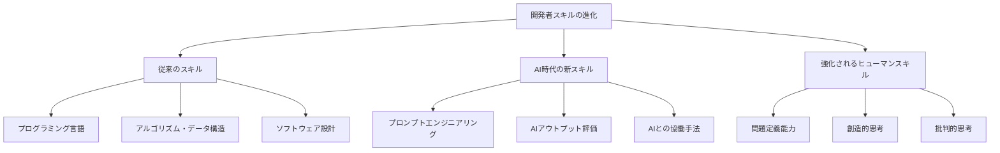
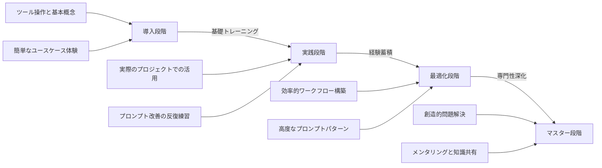

# 開発者のスキル育成

## AI 時代の開発者スキル

AI 駆動開発の時代において、開発者に求められるスキルセットは大きく変化しています。コーディング能力だけでなく、AI ツールを効果的に活用し、AI と共創できる能力が重要になってきました。

本章では、AI 時代における開発者スキルの育成方法と、組織としてのアプローチについて解説します。

## 求められるスキルセットの変化

### 従来のスキルの位置づけ

AI ツールの登場により、従来の開発スキルの重要性が変わってきています。

**再評価される従来スキル**:

- **アーキテクチャ設計能力**: システム全体の設計や構造化は依然として人間の強み
- **アルゴリズム的思考**: 問題をステップに分解し論理的に考える能力
- **ドメイン知識**: 特定業界や領域の深い理解と知見
- **デバッグとトラブルシューティング**: 複雑な問題の原因特定と解決
- **パフォーマンス最適化**: システムの効率性を高めるための専門知識

**重要性が変化するスキル**:

- **ボイラープレートコード作成**: AI が大部分を自動化
- **基本的な CRUD 操作実装**: テンプレート的な実装は AI が担当
- **単純なバグ修正**: パターン化された修正は AI が対応可能
- **定型的なドキュメント作成**: 基本的な文書化は AI がサポート

### AI 時代に求められる新スキル

AI と効果的に協働するために必要な新しいスキルセットが登場しています。

**プロンプトエンジニアリングスキル**:

- **意図の明確な表現**: 求める結果を明確に指示する能力
- **コンテキスト設計**: 必要な情報を適切に提供する能力
- **反復的改善**: フィードバックを基にプロンプトを洗練する能力
- **制約条件の設定**: 特定の要件や制限を効果的に伝える能力

**AI アウトプット評価能力**:

- **品質判断**: AI 生成コードの品質と正確性を評価する能力
- **エラー検出**: ハルシネーション（幻覚）や論理的矛盾を見抜く能力
- **セキュリティ評価**: 生成コードのセキュリティリスクを特定する能力
- **最適化の余地認識**: 改善が必要な点を特定する能力

**AI との効果的な協働スキル**:

- **タスク分解**: AI に適した部分と人間が行うべき部分を切り分ける能力
- **ワークフロー最適化**: AI との効率的な作業フローを構築する能力
- **コード統合**: AI 生成コードと既存コードベースを適切に統合する能力
- **進化する機能活用**: 常に進化する AI 機能を把握し活用する能力

### 強化されるヒューマンスキル

AI ツールが普及する中、人間ならではの能力の価値がより高まっています。

**問題定義とビジョン設定**:

- **ニーズの抽出**: ビジネス要件から本質的な問題を特定する能力
- **目標の明確化**: プロジェクトのビジョンと目標を具体化する能力
- **制約の理解**: 技術的・ビジネス的制約を把握する能力
- **優先順位付け**: 複数の要件間の優先順位を適切に設定する能力

**創造的思考**:

- **革新的アプローチ**: 従来の枠組みを超えた発想
- **多角的視点**: 問題を異なる視点から捉える能力
- **ユーザー共感**: エンドユーザーのニーズと感情を理解する能力
- **将来予測**: 技術とビジネスの発展を見据えた思考

**批判的思考と判断力**:

- **分析的評価**: 提案や解決策を客観的に評価する能力
- **トレードオフ判断**: 複数の選択肢の利点と欠点を比較検討する能力
- **倫理的判断**: 技術的決定の倫理的影響を考慮する能力
- **リスク評価**: 技術的・ビジネス的リスクを適切に評価する能力

## 開発者スキル育成の実践的アプローチ

### 段階的スキルアップモデル

AI 駆動開発のスキルは一度に身につくものではなく、段階的に習得していくことが重要です。

**スキル習得の 4 段階**:

1. **導入段階**: AI ツールの基本操作と可能性の理解
2. **実践段階**: 日常的な開発タスクでの AI 活用
3. **最適化段階**: AI との協働プロセスの効率化と洗練
4. **マスター段階**: AI を活用した創造的問題解決と他者への指導

**段階別育成フォーカス**:

### 実践的なトレーニングプログラム

効果的なスキル育成には、理論と実践を組み合わせたトレーニングが不可欠です。

**トレーニング構成要素**:

1. **基礎知識の習得**:

   - AI 技術の基本概念理解
   - 各 AI ツールの特性と適用領域
   - プロンプトエンジニアリングの基本原則

2. **ハンズオン実習**:

   - 実際のプロジェクトに近い課題での演習
   - 段階的な難易度のチャレンジ
   - ペアプログラミング形式の協働演習

3. **振り返りと改善**:
   - 成果物の評価とフィードバック
   - プロンプトとアプローチの改善ディスカッション
   - ベストプラクティスの共有

**トレーニング実施例**:

- **ブートキャンプ形式**: 2-3 日間の集中トレーニング
- **ランチ&ラーン**: 短時間の定期的な学習セッション
- **オンライン自己学習**: 自分のペースで進められるオンラインコース
- **プロジェクトベース学習**: 実際のプロジェクトでの実践を通じた学習

### メンターシップとコーチング

経験者から学ぶメンターシップはスキル習得を加速します。

**効果的なメンターシップのポイント**:

- **マッチング**: スキルレベルと目標に合ったメンター選定
- **定期的なセッション**: 継続的なフィードバックと指導
- **実践的な課題設定**: 実務に即した挑戦的課題の提供
- **振り返りの促進**: 成功と失敗からの学びを引き出す対話

**メンタリング手法例**:

- **ペアプロンプティング**: メンターとメンティが AI プロンプト作成を一緒に行う
- **コードレビュー+**: AI 生成コードの評価と改善を共同で行う
- **逆メンタリング**: 新しい視点や技術で若手がベテランを指導する機会も設ける

### 継続的学習の文化とインフラ

スキル育成を持続させるには、組織的な学習文化と環境が重要です。

**学習文化の構築**:

- **探求と実験の奨励**: 新しいアプローチや技術の試行を評価する文化
- **失敗からの学習**: 失敗を非難せず学びとして共有する姿勢
- **知識共有の習慣**: 学んだことを積極的に共有する習慣づけ
- **継続的な専門能力開発**: 学習を業務の一部として位置づける

**学習インフラの整備**:

- **ナレッジリポジトリ**: 効果的なプロンプトやベストプラクティスの収集
- **コミュニティプラットフォーム**: 質問や発見を共有する場
- **学習リソースライブラリ**: 書籍、コース、記事などのキュレーション
- **実験用環境**: リスクなく新しい技術を試せる環境の提供

## 実践的スキル開発プログラムの設計

### AI ベーシックスキルトレーニング

AI ツールを使い始める開発者向けの基本スキルトレーニングです。

**対象**: AI ツールの活用をこれから始める開発者

**プログラム構成**:

1. **AI ツールの基本**:

   - AI 駆動開発ツールの種類と特徴
   - Cursor、GitHub Copilot、ChatGPT などの基本操作
   - それぞれのツールの強みと弱み

2. **プロンプトエンジニアリング入門**:

   - 明確で効果的なプロンプトの書き方
   - コンテキスト提供の重要性と方法
   - 基本的なプロンプトパターン

3. **AI との基本的な協働**:
   - コード生成の基本ワークフロー
   - 生成結果の評価と修正
   - エラー対応と問題解決

**実施形式**:

- 1 日間のワークショップ
- 実際のツール操作を含む実践的セッション
- 基本的な課題に対するハンズオン演習

### AI 活用実践トレーニング

基本を理解した開発者がより効果的に AI ツールを実務で活用するためのトレーニングです。

**対象**: AI 基本スキルを習得し、実践での活用を深めたい開発者

**プログラム構成**:

1. **ユースケース別 AI 活用法**:

   - 新機能実装での AI 活用
   - テスト作成と品質保証
   - リファクタリングとコード最適化
   - デバッグと問題解決

2. **高度なプロンプト技術**:

   - ステップバイステップ指示
   - 制約とガイドラインの設定
   - フィードバックループの構築
   - 言語・フレームワーク固有のプロンプト調整

3. **効率的ワークフローの構築**:
   - 開発環境とのシームレスな統合
   - 反復的改善プロセスの確立
   - チームでの協働パターン
   - 生産性最大化のためのショートカットとテクニック

**実施形式**:

- 2 日間の実践ワークショップ
- 実際のプロジェクトに近い環境での演習
- チーム単位での協働演習とフィードバック

### AI マスタークラス

AI ツールを最大限に活用し、組織内の AI 活用をリードできる人材を育成するための上級トレーニングです。

**対象**: AI 活用の経験を積み、組織内の AI 活用をリードしたい開発者

**プログラム構成**:

1. **戦略的 AI 活用**:

   - 大規模プロジェクトでの AI 活用戦略
   - 複雑な問題の分解と AI 活用計画
   - AI 活用の費用対効果最大化

2. **AI 活用のリーダーシップ**:

   - チームへの AI 活用指導方法
   - ベストプラクティスの体系化
   - 継続的改善文化の醸成

3. **AI 活用の革新と探求**:
   - 最新 AI 技術のキャッチアップと評価
   - 実験的アプローチと結果共有
   - カスタム AI ソリューションの検討

**実施形式**:

- 上級者限定の集中ワークショップ
- 実際のプロジェクト課題を使った実践
- アクションプランの策定と実行支援

### 役割別特化トレーニング

組織内の役割に応じた特化型トレーニングで、それぞれの立場で AI を最大限活用できるようにします。

**フロントエンド開発者向け**:

- UI コンポーネント生成の最適化
- ユーザーインタラクション設計での AI 活用
- アクセシビリティとレスポンシブデザインの強化

**バックエンド開発者向け**:

- API デザインとデータモデリングでの AI 活用
- セキュリティを考慮したコード生成
- パフォーマンス最適化とスケーラビリティ設計

**DevOps・SRE 向け**:

- インフラストラクチャコードの自動生成
- 自動テストとモニタリングの強化
- 障害診断と復旧プロセスの最適化

## 効果測定と継続的改善

### スキル評価フレームワーク

開発者の AI 活用スキルを客観的に評価する仕組みを構築します。

**評価領域**:

1. **技術的スキル**:

   - プロンプト設計能力
   - AI 生成コード評価能力
   - ツール活用の幅と深さ

2. **プロセススキル**:

   - AI との効率的ワークフロー構築
   - 問題解決における AI 活用戦略
   - 継続的な学習と改善

3. **協働スキル**:
   - 知識共有と指導能力
   - チームでの AI 活用促進
   - フィードバックの提供と受容

**評価方法**:

- **実技評価**: 特定のプログラミング課題を AI と協働で解決
- **プロジェクト審査**: 実務プロジェクトでの AI 活用度と効果
- **ピアレビュー**: 同僚からのフィードバック
- **自己評価**: 自身のスキルレベルの振り返り

### 効果測定指標の設定

スキル育成プログラムの効果を定量的・定性的に測定します。

**定量的指標**:

- **生産性向上**: AI 活用前後の開発速度の変化
- **品質向上**: バグ発生率やリファクタリング効率の変化
- **学習速度**: 新技術やフレームワークの習得時間の短縮

**定性的指標**:

- **開発者満足度**: AI ツール活用に関する満足度調査
- **自信と自己効力感**: 複雑な問題に取り組む自信の変化
- **創造性とイノベーション**: 新しいアプローチや解決策の創出

### スキルマップとキャリアパス

AI 駆動開発スキルを組織のキャリアパスに組み込みます。

**スキルマップの構築**:

- **レベル定義**: 初級から専門家までの明確なスキルレベル設定
- **成長経路**: スキル向上のための推奨学習パス
- **必要経験**: 各レベルに求められる実践経験

**キャリアパスの設計**:

- **AI 開発スペシャリスト**: AI ツールを駆使した専門開発者
- **AI 活用コーチ**: チームの AI 活用を支援する専門家
- **AI イノベーションリード**: 新たな AI 活用方法を開拓する先駆者

## 組織的アプローチと成功事例

### 学習する組織の構築

AI ツールと開発手法の急速な進化に対応するため、継続的に学習する組織文化を構築します。

**推進施策**:

- **学習時間の確保**: 業務時間内に学習に取り組める時間の確保
- **実験の奨励**: 新しいアプローチやツールを試す「実験の自由」の提供
- **知識共有の仕組み**: 定期的な共有セッションやナレッジベースの整備
- **失敗からの学び**: 失敗を責めず学びとして共有する文化の醸成

### 成功事例：テック企業の AI スキル変革

ある中規模テック企業が実施した AI スキル育成プログラムの事例です。

**背景**:

- 200 人規模の開発チーム
- 競争激化する市場での開発速度向上が課題
- 開発者の世代間スキルギャップの存在

**アプローチ**:

- 3 段階スキル育成プログラムの導入
- AI チャンピオンチームの結成と全社展開
- 毎週金曜日半日の AI 学習時間の制度化
- 四半期ごとの AI ハッカソン開催

**成果**:

- 6 ヶ月でプロジェクト納期が平均 20%短縮
- ジュニア開発者の生産性が 40%向上
- チーム間のナレッジ共有が活性化
- 開発者満足度と定着率の向上

### 成功事例：金融機関のレガシー開発者変革

レガシーシステムを多く抱える金融機関の開発者スキル変革事例です。

**背景**:

- 長年レガシーシステムを維持してきたベテラン開発者チーム
- 新技術への抵抗感と不安
- モダナイゼーションプロジェクトの推進必要性

**アプローチ**:

- ベテラン開発者の知識を活かした AI 導入アプローチ
- メンタル面でのサポートを重視したトレーニング
- 小さな成功体験の積み重ねによる自信構築
- ペアプログラミング方式での若手とベテランの協働促進

**成果**:

- 当初 60%あった AI 技術への抵抗感が 15%まで低下
- レガシーコードの近代化プロジェクトが予定より 3 ヶ月早く完了
- 世代間の知識移転が加速
- 「第二のキャリア」として AI 駆動開発に意欲を見出すベテランが増加

## まとめ

AI 駆動開発の時代において、開発者のスキル育成は組織の競争力を左右する重要な要素です。AI と効果的に協働するスキルを身につけることで、開発者は単純作業から解放され、より創造的で価値の高い仕事に集中できるようになります。

効果的なスキル育成には、以下のポイントが重要です：

1. **バランスのとれたスキルセット**: 技術的スキルとヒューマンスキルの両方をバランスよく育成
2. **段階的アプローチ**: 基礎から応用へと段階的に学習を進める構造化されたプログラム
3. **実践重視の学習**: 実際のプロジェクトや課題に基づいた実践的な学習体験
4. **継続的学習文化**: 常に進化する AI 技術に対応するための学習する組織文化
5. **個人の強みを活かすアプローチ**: 各開発者の経験や強みを活かした個別化された育成

AI ツールはテクノロジーの一部ですが、それを使いこなす人材の育成こそが、真の競争優位性と持続可能なイノベーションの源泉となります。AI と人間がそれぞれの強みを活かして協働できる環境を整えることで、開発者個人の成長と組織全体の成功を同時に実現することができるでしょう。
