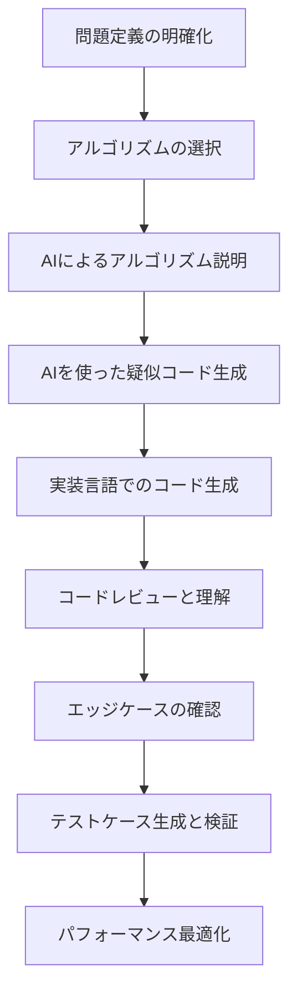
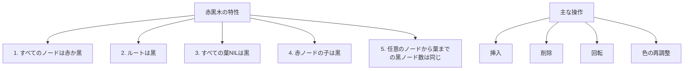

# 難解アルゴリズムの実装支援

アルゴリズムは、プログラミングの中核であり、効率的なソフトウェア開発には欠かせません。しかし、複雑なアルゴリズムの理解と実装は、経験豊富なエンジニアでも困難を伴うことがあります。AI 駆動開発によって、難解なアルゴリズムの実装が大きく改善されています。

## 難解アルゴリズムとは

「難解アルゴリズム」とは、理解や実装が難しいアルゴリズムのことです。具体的には以下のようなものが含まれます：

- **グラフ理論のアルゴリズム**: 最短経路問題、最小全域木、ネットワークフロー
- **動的計画法**: 最適化問題を解くための再帰的な手法
- **複雑なソートアルゴリズム**: クイックソート、マージソート、ヒープソートなど
- **木構造のアルゴリズム**: 平衡木、B 木、赤黒木
- **機械学習アルゴリズム**: 行列計算、勾配降下法、バックプロパゲーション
- **暗号化アルゴリズム**: RSA、AES、楕円曲線暗号
- **幾何学アルゴリズム**: 凸包、点包含、線分交差

これらのアルゴリズムは、効率的なアプリケーション開発において重要ですが、理解から実装まで時間がかかります。

## AI による難解アルゴリズム実装支援の利点

AI 駆動開発を活用することで、難解アルゴリズムの実装において以下のような利点があります：

1. **理解の促進**: AI が複雑なアルゴリズムを分かりやすく説明
2. **実装時間の短縮**: 基本的な実装コードを自動生成
3. **エラー防止**: よくある実装ミスを事前に回避
4. **最適化のヒント**: パフォーマンス向上のためのアドバイス提供
5. **学習効果**: 実装を通じたアルゴリズム理解の深化

## 実践例：AI による難解アルゴリズム実装支援

### 例 1: ダイクストラ法の実装

最短経路問題を解くダイクストラ法は、グラフ理論の基本的なアルゴリズムですが、実装は複雑です。AI を活用した実装例を見てみましょう。

```python
# ダイクストラ法の実装例（AIによる支援）
import heapq

def dijkstra(graph, start):
    # 距離の初期化
    distances = {node: float('infinity') for node in graph}
    distances[start] = 0
    # 優先度付きキュー
    priority_queue = [(0, start)]
    # 最短経路を記録
    shortest_paths = {start: []}

    while priority_queue:
        current_distance, current_node = heapq.heappop(priority_queue)

        # すでに処理済みの場合はスキップ
        if current_distance > distances[current_node]:
            continue

        # 隣接ノードを探索
        for neighbor, weight in graph[current_node].items():
            distance = current_distance + weight

            # より短い経路が見つかった場合
            if distance < distances[neighbor]:
                distances[neighbor] = distance
                # 経路を更新
                shortest_paths[neighbor] = shortest_paths[current_node] + [current_node]
                heapq.heappush(priority_queue, (distance, neighbor))

    return distances, shortest_paths

# 使用例
graph = {
    'A': {'B': 5, 'C': 1},
    'B': {'A': 5, 'D': 2, 'E': 1},
    'C': {'A': 1, 'D': 9, 'F': 2},
    'D': {'B': 2, 'C': 9, 'E': 4, 'F': 6},
    'E': {'B': 1, 'D': 4, 'F': 3},
    'F': {'C': 2, 'D': 6, 'E': 3}
}

distances, paths = dijkstra(graph, 'A')
print("最短距離:", distances)
print("最短経路:", paths)
```

このコードは単に AI に「ダイクストラ法を実装してください」と指示するだけで生成できます。さらに詳細な説明や最適化も依頼可能です。

### 例 2: クイックソートアルゴリズム

クイックソートは高速なソートアルゴリズムですが、実装が少し複雑です。AI を活用した説明と実装：

```java
// クイックソートのJava実装
public class QuickSort {

    public static void quickSort(int[] arr, int low, int high) {
        if (low < high) {
            // パーティションのインデックスを取得
            int pi = partition(arr, low, high);

            // パーティションより小さい要素をソート
            quickSort(arr, low, pi - 1);

            // パーティションより大きい要素をソート
            quickSort(arr, pi + 1, high);
        }
    }

    private static int partition(int[] arr, int low, int high) {
        // ピボットとして配列の最後の要素を選択
        int pivot = arr[high];

        // 小さい要素のインデックス
        int i = (low - 1);

        for (int j = low; j < high; j++) {
            // 現在の要素がピボット以下の場合
            if (arr[j] <= pivot) {
                i++;

                // arr[i]とarr[j]を交換
                int temp = arr[i];
                arr[i] = arr[j];
                arr[j] = temp;
            }
        }

        // arr[i+1]とarr[high](またはピボット)を交換
        int temp = arr[i + 1];
        arr[i + 1] = arr[high];
        arr[high] = temp;

        return i + 1;
    }

    // 配列を出力するヘルパーメソッド
    public static void printArray(int[] arr) {
        for (int i : arr) {
            System.out.print(i + " ");
        }
        System.out.println();
    }

    // テスト用のメインメソッド
    public static void main(String[] args) {
        int[] arr = {10, 7, 8, 9, 1, 5};
        System.out.println("ソート前の配列:");
        printArray(arr);

        quickSort(arr, 0, arr.length - 1);

        System.out.println("ソート後の配列:");
        printArray(arr);
    }
}
```

## アルゴリズム理解のための効果的なプロンプト

AI 駆動開発で難解アルゴリズムに取り組む際の効果的なプロンプト例を紹介します：

### 基本的な理解のためのプロンプト

```
次のアルゴリズムについて説明してください：
- アルゴリズム名: A*探索アルゴリズム
- 用途: 経路探索
- 知りたい内容:
  1. 基本的な原理
  2. 使用される主なデータ構造
  3. 時間計算量と空間計算量
  4. ダイクストラ法との違い
```

### 実装支援のためのプロンプト

```
以下のアルゴリズムの実装をPythonで示してください：
- アルゴリズム: フロイド・ワーシャル法
- 用途: 全点対最短経路問題
- 実装要件:
  1. 隣接行列で表現されたグラフを入力とすること
  2. 各頂点間の最短距離を返すこと
  3. 実装の各ステップに説明コメントを付けること
  4. 計算量を最適化すること
```

### デバッグと最適化のためのプロンプト

```
以下の赤黒木の実装コードを確認し、バグと非効率な部分を指摘してください：

[問題のあるコードをここに貼り付け]

特に以下の点について確認をお願いします：
1. 回転操作の実装が正しいか
2. 色の再調整が適切に行われているか
3. 挿入操作のエッジケースが適切に処理されているか
4. パフォーマンスを向上させる方法
```

## 難解アルゴリズムの理解から実装までのプロセス

AI を活用したアルゴリズム実装のプロセスを図解します：



## 実際の複雑なアルゴリズム例：Red-Black Tree

赤黒木は、自己バランス二分探索木で、多くのプログラミング言語の実装で使用されています。非常に複雑ですが、AI の支援で理解しやすくなります。



## 実践的な例：機械学習アルゴリズムの実装

機械学習の基本的なアルゴリズムである線形回帰を AI の支援で実装してみましょう：

```python
# 線形回帰のシンプルな実装
import numpy as np
import matplotlib.pyplot as plt

class LinearRegression:
    def __init__(self, learning_rate=0.01, n_iterations=1000):
        self.learning_rate = learning_rate
        self.n_iterations = n_iterations
        self.weights = None
        self.bias = None
        self.cost_history = []

    def fit(self, X, y):
        # サンプル数と特徴数を取得
        n_samples, n_features = X.shape

        # 重みとバイアスを初期化
        self.weights = np.zeros(n_features)
        self.bias = 0

        # 勾配降下法
        for _ in range(self.n_iterations):
            # 予測値を計算
            y_predicted = np.dot(X, self.weights) + self.bias

            # 勾配を計算
            dw = (1/n_samples) * np.dot(X.T, (y_predicted - y))
            db = (1/n_samples) * np.sum(y_predicted - y)

            # 重みとバイアスを更新
            self.weights -= self.learning_rate * dw
            self.bias -= self.learning_rate * db

            # コスト（MSE）を計算
            cost = (1/n_samples) * np.sum((y_predicted - y)**2)
            self.cost_history.append(cost)

    def predict(self, X):
        return np.dot(X, self.weights) + self.bias

# 使用例
X = np.array([[1], [2], [3], [4], [5]])
y = np.array([2, 4, 6, 8, 10])

model = LinearRegression(learning_rate=0.01, n_iterations=1000)
model.fit(X, y)

# 学習曲線をプロット
plt.figure(figsize=(10, 6))
plt.plot(range(len(model.cost_history)), model.cost_history)
plt.title('学習曲線')
plt.xlabel('イテレーション')
plt.ylabel('コスト')
plt.grid(True)

# 予測と実測値をプロット
y_pred = model.predict(X)
plt.figure(figsize=(10, 6))
plt.scatter(X, y, color='blue', label='実測値')
plt.plot(X, y_pred, color='red', label='予測値')
plt.title('線形回帰モデル')
plt.xlabel('X')
plt.ylabel('Y')
plt.legend()
plt.grid(True)

print(f'重み: {model.weights}, バイアス: {model.bias}')
```

## 難解アルゴリズムに取り組む際の AI 活用ヒント

1. **段階的な理解**: まず基本的な説明から始め、徐々に詳細を深めていきましょう。

2. **可視化の活用**: アルゴリズムの動作を図や表で可視化してもらうことで理解が深まります。

3. **パターン認識**: 類似問題のパターンを AI に示してもらい、応用力を高めましょう。

4. **実装の差分確認**: 異なる言語やアプローチでの実装を比較して、多角的に理解を深めましょう。

5. **エッジケースの検討**: AI に極端なケースや限界条件での動作を説明してもらいましょう。

6. **計算量の最適化**: 時間・空間計算量を理解し、トレードオフを考慮した実装を検討しましょう。

7. **インタラクティブな質問**: 理解できない部分を具体的に質問し、対話的に学習を進めましょう。

## 実践的な例：画像処理アルゴリズム

画像処理に使われる畳み込み演算は、実装が複雑ですが、AI の支援で理解しやすくなります：

```python
# 簡易版の2D畳み込み実装
import numpy as np
from PIL import Image, ImageFilter

def convolve2d(image, kernel):
    # 画像とカーネルの形状を取得
    i_height, i_width = image.shape
    k_height, k_width = kernel.shape

    # パディングの計算
    pad_height = k_height // 2
    pad_width = k_width // 2

    # 出力画像の初期化
    output = np.zeros_like(image)

    # パディングされた画像を作成
    padded_image = np.pad(image, ((pad_height, pad_height), (pad_width, pad_width)), mode='constant')

    # 畳み込み演算
    for i in range(i_height):
        for j in range(i_width):
            # カーネルと画像の対応する部分の要素ごとの積の合計を計算
            output[i, j] = np.sum(kernel * padded_image[i:i+k_height, j:j+k_width])

    return output

# エッジ検出カーネルの例
edge_kernel = np.array([
    [-1, -1, -1],
    [-1,  8, -1],
    [-1, -1, -1]
])

# 使用例（グレースケール画像を想定）
# image = np.array(Image.open('example.jpg').convert('L'))
# filtered_image = convolve2d(image, edge_kernel)
# Image.fromarray(filtered_image.astype(np.uint8)).save('edge_detected.jpg')
```

## まとめ

AI 駆動開発は、難解アルゴリズムの理解と実装を大幅に効率化します。AI は単にコードを生成するだけでなく、アルゴリズムの本質的な理解を助け、最適化のヒントを提供し、デバッグを支援します。

難解なアルゴリズムに取り組む際は、AI をパートナーとして活用することで、次のような効果が期待できます：

1. 学習時間の短縮
2. より深い理解の促進
3. 実装ミスの低減
4. アルゴリズム選択の最適化
5. 応用力の向上

次のステップとして、自分の開発プロジェクトで実際に難しいアルゴリズムに直面したとき、AI を活用して取り組んでみましょう。理解と実装のプロセスがどのように変わるか、実感することができるでしょう。
